# Swarm setup for a new project: N-iteration loops, graph flow, and metric gates

This guide is the concrete operator playbook for using pi-swarm in a new project when you want a bounded optimization loop:

- define a project-specific metric/quality gate;
- create a task graph that runs **N explicit iterations**;
- record each candidate run with evidence;
- carry active evidence-backed memory into the next iteration;
- review the loop in the dashboard/watcher.

V1 intentionally has **no daemon and no native graph cycles**. A loop is either:

1. an explicit iteration session (`swarm_iteration_*` tools) driven step-by-step; or
2. a task graph with the loop **unrolled** into `N` iteration nodes.

Use option 2 when you want swarm agents to coordinate work through task graph assignments.

---

## 0. Install/load swarm in the target project

From the target project:

```bash
pi install -l /absolute/path/to/pi-graph-agents
pi --model gpt-5.4-mini --provider openai
```

Inside pi, initialize/check swarm:

```text
/swarm init
/swarm status
```

Recommended first artifacts in the target project:

```text
.pi/swarm/evidence/              # run artifacts/evidence
.pi/swarm/agents/*.override.md   # optional custom per-agent instructions
```

---

## 1. Define the metric gate first

Before creating the loop graph, define the metric contract. This is the quality gate. Swarm does not hard-code `accuracy`, `latency`, `cost`, or any metric name.

Example: maximize a project-defined `quality_score`, require a summary and patch for accepted runs.

```text
Call swarm_metric_define with:
{
  id: "project-quality-v1",
  title: "Project quality score",
  primaryMetric: {
    id: "quality_score",
    direction: "maximize",
    valueType: "number",
    source: {
      type: "artifact",
      artifactPath: ".pi/swarm/evidence/latest/metrics.json",
      jsonPath: "$.quality_score"
    },
    minimumMeaningfulChange: 0.01
  },
  evidenceRequired: [
    ".pi/swarm/evidence/latest/summary.md",
    ".pi/swarm/evidence/latest/change.patch",
    ".pi/swarm/evidence/latest/metrics.json"
  ],
  validityRules: [
    "run must be done",
    "verdict must be pass or approved",
    "evidence refs must exist and match recorded SHA-256 digests"
  ]
}
```

What this gates:

- `swarm_run_record` binds each run to the current metric contract version and captures evidence digests.
- `swarm_iteration_record` rejects failed/running/cross-contract/stale-version/wrong-type runs from winning.
- `swarm_memory_propose`/`swarm_memory_accept` only promote claims backed by valid evidence.
- `swarm_iteration_context` revalidates active memories before carrying them forward.

---

## 2. Record a baseline run

Run the current project state once and write evidence:

```text
.pi/swarm/evidence/baseline/summary.md
.pi/swarm/evidence/baseline/metrics.json
```

Then record it:

```text
Call swarm_run_record with:
{
  runId: "baseline-001",
  metricContractId: "project-quality-v1",
  status: "done",
  verdict: "pass",
  metrics: { "quality_score": 0.60 },
  inputs: { "kind": "baseline" },
  evidenceRefs: [
    ".pi/swarm/evidence/baseline/summary.md",
    ".pi/swarm/evidence/baseline/metrics.json"
  ]
}
```

Then create the iteration session:

```text
Call swarm_iteration_create with:
{
  id: "project-quality-loop-001",
  metricContractId: "project-quality-v1",
  baselineRunId: "baseline-001",
  goal: "Improve project quality_score over N bounded iterations",
  scope: { "kind": "project", "id": "my-project" }
}
```

---

## 3. Two ways to run N iterations

### Option A — explicit tool loop, no task graph

For `i = 1..N`:

1. `swarm_iteration_context(iterationId)` — retrieve previous best + active memories + `memoryPolicyRef`.
2. Agent makes a candidate change.
3. Agent/tester writes evidence under `.pi/swarm/evidence/iter-XX/`.
4. `swarm_run_record(runId="iter-XX", ...)`.
5. `swarm_iteration_record(iterationId, runId="iter-XX", label="...")`.
6. If there is a reusable lesson, `swarm_memory_propose`; reviewer/orchestrator may `swarm_memory_accept`.
7. `swarm_iteration_status(includeContext=true)` or dashboard review.

This is simplest when one orchestrator/agent is driving the loop manually.

### Option B — graph-driven bounded loop (`N` unrolled iterations)

Use this when you want planner/implementer/tester/reviewer agents to coordinate through a swarm graph.

Because V1 has no graph cycles, create fixed nodes for each iteration:

```text
iter01_context -> iter01_implement -> iter01_metric_gate -> iter01_memory_review -> iter02_context -> ... -> final_review
```

For N=3, the shape is:

```mermaid
flowchart LR
  start([baseline/session exists]) --> c1[iter01_context]
  c1 --> i1[iter01_implement]
  i1 --> g1[iter01_metric_gate]
  g1 --> m1[iter01_memory_review]
  m1 --> c2[iter02_context]
  c2 --> i2[iter02_implement]
  i2 --> g2[iter02_metric_gate]
  g2 --> m2[iter02_memory_review]
  m2 --> c3[iter03_context]
  c3 --> i3[iter03_implement]
  i3 --> g3[iter03_metric_gate]
  g3 --> m3[iter03_memory_review]
  m3 --> final[final_review]
```



Recommended roles per iteration:

| Node | Role | Required behavior |
|---|---|---|
| `iterXX_context` | planner | Call/read `swarm_iteration_context`; summarize best run + active memories + metric target for implementer. |
| `iterXX_implement` | implementer | Apply one bounded candidate change; write evidence draft/change patch. |
| `iterXX_metric_gate` | tester | Run eval/validation; write `metrics.json` + `summary.md`; call `swarm_run_record`; call `swarm_iteration_record`; outcome `passed` only if run is eligible under the metric contract. |
| `iterXX_memory_review` | reviewer | Propose/accept memory only if the run passed/approved and the lesson is reusable with evidence. |
| `final_review` | reviewer | Compare iterations, report best run/improvement, risks, accepted/rejected memories. |

---

## 4. Example graph for N=2

Create a custom graph with explicit nodes. The exact tool call can be made from pi using `swarm_create_task`.

```text
Call swarm_create_task with:
{
  taskId: "project-quality-loop-graph-001",
  title: "Project quality optimization loop (N=2)",
  goal: "Run two bounded candidate iterations against project-quality-v1 and report best improvement.",
  workflow: "custom",
  allowedFiles: [
    "src/**",
    "tests/**",
    ".pi/swarm/evidence/**"
  ],
  acceptanceCriteria: [
    "Each iteration records a run against project-quality-v1.",
    "Metric gate rejects ineligible failed/running/stale-version/wrong-type runs.",
    "Memory proposals require file-backed evidence and reviewer/orchestrator acceptance.",
    "Final report names bestRunId, improvement, meaningful flag, and accepted memories."
  ],
  start: "iter01_context",
  nodes: {
    "iter01_context": {
      "role": "planner",
      "outcome": "context_ready",
      "writeArtifacts": ["artifacts/iter01-context.md"]
    },
    "iter01_implement": {
      "role": "implementer",
      "outcome": "candidate_ready",
      "writeArtifacts": ["artifacts/iter01-change.md"]
    },
    "iter01_metric_gate": {
      "role": "tester",
      "outcome": "passed",
      "writeArtifacts": ["artifacts/iter01-metric-gate.md"]
    },
    "iter01_memory_review": {
      "role": "reviewer",
      "outcome": "memory_reviewed",
      "writeArtifacts": ["artifacts/iter01-memory.md"]
    },

    "iter02_context": {
      "role": "planner",
      "outcome": "context_ready",
      "writeArtifacts": ["artifacts/iter02-context.md"]
    },
    "iter02_implement": {
      "role": "implementer",
      "outcome": "candidate_ready",
      "writeArtifacts": ["artifacts/iter02-change.md"]
    },
    "iter02_metric_gate": {
      "role": "tester",
      "outcome": "passed",
      "writeArtifacts": ["artifacts/iter02-metric-gate.md"]
    },
    "iter02_memory_review": {
      "role": "reviewer",
      "outcome": "memory_reviewed",
      "writeArtifacts": ["artifacts/iter02-memory.md"]
    },

    "final_review": {
      "role": "reviewer",
      "outcome": "approved",
      "terminal": true,
      "writeArtifacts": ["artifacts/final-review.md"]
    }
  },
  edges: [
    { "from": "iter01_context", "to": "iter01_implement", "when": "context_ready" },
    { "from": "iter01_implement", "to": "iter01_metric_gate", "when": "candidate_ready" },
    { "from": "iter01_metric_gate", "to": "iter01_memory_review", "when": "passed" },
    { "from": "iter01_memory_review", "to": "iter02_context", "when": "memory_reviewed" },

    { "from": "iter02_context", "to": "iter02_implement", "when": "context_ready" },
    { "from": "iter02_implement", "to": "iter02_metric_gate", "when": "candidate_ready" },
    { "from": "iter02_metric_gate", "to": "iter02_memory_review", "when": "passed" },
    { "from": "iter02_memory_review", "to": "final_review", "when": "memory_reviewed" }
  ],
  validationCommands: [
    "swarm_iteration_status(includeContext=true)",
    "scripts/swarm_dashboard.sh --cwd . --task project-quality-loop-graph-001 --out dashboard.html"
  ]
}
```

To run more iterations, generate the same four-node block for `iter03`, `iter04`, ... and connect `iterNN_memory_review -> iter(N+1)_context`.

---

## 5. Metric gate node contract

The `iterXX_metric_gate` tester node is the enforcement point for graph execution.

It should do all of this before marking the node `done`:

1. Run the project's eval/test command.
2. Write evidence:

```text
.pi/swarm/evidence/iter-XX/summary.md
.pi/swarm/evidence/iter-XX/metrics.json
.pi/swarm/evidence/iter-XX/change.patch
```

3. Call `swarm_run_record`:

```text
{
  runId: "iter-XX",
  metricContractId: "project-quality-v1",
  status: "done",
  verdict: "pass",
  metrics: { "quality_score": 0.67 },
  inputs: { "iteration": "XX" },
  evidenceRefs: [
    ".pi/swarm/evidence/iter-XX/summary.md",
    ".pi/swarm/evidence/iter-XX/metrics.json",
    ".pi/swarm/evidence/iter-XX/change.patch"
  ],
  taskId: "project-quality-loop-graph-001",
  nodeId: "iterXX_metric_gate"
}
```

4. Call `swarm_iteration_record`:

```text
{
  iterationId: "project-quality-loop-001",
  runId: "iter-XX",
  label: "candidate-XX"
}
```

5. Inspect `swarm_iteration_status`:

- If the run was ineligible, mark the graph node `failed` or `blocked`.
- If eligible but not better, it can still be `done` with outcome `passed` if the goal is exploration; the final reviewer decides best run.
- If the graph requires improvement every iteration, only set outcome `passed` when `meaningful=true` or the metric delta meets your threshold.

Do not fake metric success in `swarm_update_task`; the authoritative metric state is the run + iteration files.

---

## 6. Memory read/write in the graph

### Read memory

At every `iterXX_context` node:

```text
Call swarm_iteration_context with iterationId="project-quality-loop-001".
Read memoryPolicyRef (docs/swarm-memory.md), best run, active memories, and excludedMemories.
Write artifacts/iterXX-context.md summarizing what the implementer should apply or avoid.
```

### Propose/accept memory

At every `iterXX_memory_review` node:

1. Read the run's evidence and metric delta.
2. If there is no reusable lesson, write "no memory proposed".
3. If there is a reusable lesson, call `swarm_memory_propose` with `sourceRunId` and evidence refs.
4. Reviewer/orchestrator may call `swarm_memory_accept` only if the evidence gate passes.

Good memory claim:

```text
When validating negative tool-call paths, prefer interactive tmux transcript capture or file-backed state assertions because single-shot pi -p may hide tool errors in final stdout.
```

Bad memory claim:

```text
Use better prompts.
```

---

## 7. Reviewing progress

```bash
scripts/swarm_dashboard.sh --cwd . --task project-quality-loop-graph-001 --out dashboard.html
open dashboard.html
```

Use:

```bash
scripts/swarm_iteration_watch.sh --cwd . --once
scripts/swarm_iteration_watch.sh --cwd . --format markdown --out review.md
```

The dashboard shows:

- task graph nodes and parallel branches;
- metric improvement per iteration;
- agent conversation grouped by task/node/conversation;
- memory/evidence status;
- raw inspectors.

---

## 8. What V1 does not do automatically

V1 does **not** automatically:

- choose the metric for your project;
- decide how many iterations to run;
- create graph cycles;
- accept memory without reviewer/orchestrator approval;
- promote evidence-free claims;
- run a daemon optimizer.

You must choose `N`, unroll the graph or repeat explicit iteration calls, and enforce your project's metric gate through the metric contract + run recording + iteration recording.
