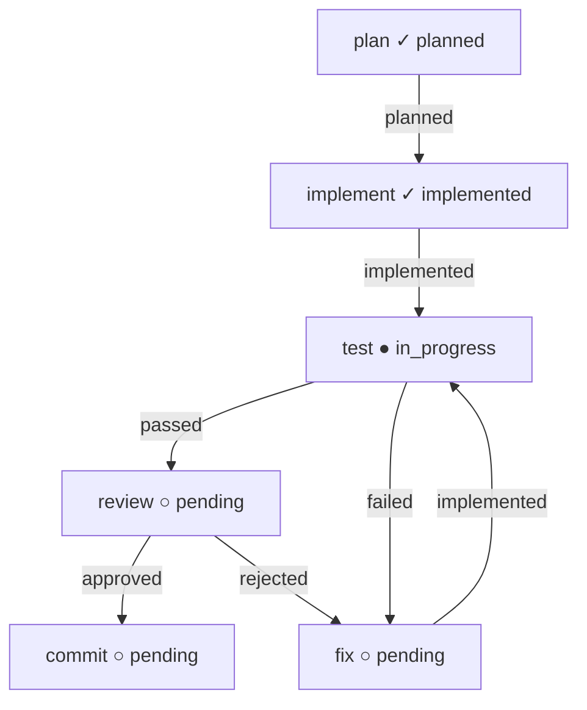

# Swarm Task Graph Design

This document proposes the next architecture layer for `pi-swarm`: task management and workflow orchestration. The current swarm already has agents, tmux transport, mailbox messaging, lifecycle traces, acknowledgements, reconcile/dead-letter handling, idempotency, and runtime status. What is missing is a durable model for **what work exists**, **who owns each piece**, **which node is ready next**, and **what evidence proves completion**.

> **Implementation status.** This is the original design doc; the graph layer is now **implemented** as a subset of it. The implemented graph tools are `swarm_create_task`, `swarm_assign_task`, `swarm_update_task`, `swarm_task_message`, `swarm_task_status`, `swarm_validate_graph`, `swarm_print_graph`, and `swarm_next_nodes`, plus engine-enforced closure (`computeTaskStatus`), the `swarm_reconcile` task sweep, PM auto-notify, the session/read-safe orchestrator mailbox pump, and the `/swarm graph` slash command. Current runtime behavior is documented in [`docs/swarm.md`](./swarm.md) ("Task graph and closure").
>
> **Not implemented (still design proposals).** There is no `swarm_write_task_artifact` tool — artifacts are written by agents with their normal file tools and tracked through `swarm_update_task(artifact=...)`. There are no `swarm_claim_file_lock` / `swarm_release_file_lock` tools — advisory `editLocks` are maintained internally on `task.json` only. The destructive tools `swarm_stop_agent`, `swarm_gc_agents`, and `swarm_release_agent_task` remain **deferred** (use `swarm_reconcile` + admin `swarm_prune` meanwhile). Graph validation/printing ships as tools + `/swarm graph`, **not** as standalone `scripts/*.js`.

## Problem

Current primitives answer only part of the coordination problem:

| Existing primitive | Answers |
| --- | --- |
| `.pi/swarm/agents/<agent-id>.md` | Who is this agent? What role/protocol should it follow? |
| `.pi/swarm/mailboxes/<agent-id>.jsonl` | What messages were sent to this agent? |
| `.pi/swarm/swarm-state.json.messages` | What is the lifecycle state of each message? |
| `.pi/swarm/traces/events.jsonl` | What happened in the swarm runtime? |
| `swarm_agent_status` | Is an agent alive/idle/busy/tool-running/stopped? |

Missing answers:

- What task is the team working on?
- What files are in scope?
- What are the acceptance criteria?
- Which workflow node is ready, assigned, blocked, or done?
- Which agent owns each node?
- What artifacts/evidence prove the node is complete?
- Which gates must pass before commit?

Without this layer, orchestration depends too much on long prompts from the human/orchestrator. Agents can communicate, but they do not yet have a shared task graph to organize around.

For terminal workflow closure, the graph also needs an **autonomous closer**. A terminal orchestrator-owned node such as `commit` must not require the human PM to notice a reviewer mailbox message and manually poke the final node. The runtime now auto-closes a ready **orchestrator-owned graph-terminal node** inside the same locked update that made it reachable, so a path like `review --approved--> commit` can finish without a separate human intervention turn.

## Design goals

1. Reduce prompt bloat: agents should receive a task id/node id and discover the rest from durable files.
2. Keep the system inspectable: all state should be local files under `.pi/swarm/`.
3. Separate LLM-readable context from machine-updated state.
4. Preserve tmux/file-based architecture for now; do not introduce a daemon yet.
5. Make review/test/commit gates explicit.
6. Support small incremental workflows first, then larger graph automation later.

## Recommended file model

Use a hybrid format:

| Concern | Format | Reason |
| --- | --- | --- |
| Agent identity/protocol | Markdown | Best for LLM + human reading. |
| Task brief | Markdown | Natural for goals, context, scope, acceptance criteria. |
| Mutable task state | JSON | Easy atomic update, lock, query, validate. |
| Reusable workflow graph | YAML later; embedded JSON graph for V1 | YAML is best for hand-authored templates, but V1 should not depend on a YAML parser until workflow loading is implemented. |
| Append-only events | JSONL | Traceable, stream-friendly, easy grep/tail. |
| Reports/evidence | Markdown/log files | Easy review and durable artifacts. |

Proposed layout:

```text
.pi/swarm/
  agents/
    <agent-id>.md

  workflows/                 # optional in V1; introduced when YAML parsing lands
    feature-dev.yaml
    bugfix.yaml
    docs-review.yaml

  tasks/
    <task-id>/
      task.md
      task.json
      events.jsonl
      artifacts/
        plan.md
        implementation-report.md
        review.md
        test-report.md
        final-summary.md
        typecheck.log
        uat.log

  swarm-state.json
  swarm-state.lock/
  mailboxes/
  traces/
```

## Agent identity cards

Keep `.pi/swarm/agents/<agent-id>.md`, but make the work loop mandatory and task-aware.

Template additions:

```md
## Mandatory Swarm Work Loop

On each turn:

1. Read your identity card if you have not already done so.
2. Check your mailbox with `swarm_check_mailbox`.
3. For each message requiring ack:
   - ack `seen` after reading,
   - ack `processing` before doing work,
   - ack `done` or `failed` when finished.
4. If assigned a task node, read:
   - `.pi/swarm/tasks/<task-id>/task.md`
   - `.pi/swarm/tasks/<task-id>/task.json`
   - relevant prior artifacts.
5. Work only within the task scope and allowed files.
6. Write/update required artifacts.
7. Send a result message to the sender/orchestrator.
8. Return to idle.

Do not ask the human to relay inter-agent messages. Use swarm tools.
```

### Reloading identity into a living agent

An operator can push new instructions to an already-assigned, running agent without restarting it: edit (or create) the editable override at `.pi/swarm/agents/<agent-id>.override.md`, then run `swarm_reload_identity` (tool) or `/swarm identity reload <agent-id> [note]` (command). The reload regenerates the **effective** identity (generated card + override) onto `<agent-id>.md`, bumps `identityVersion`/`identityHash`/`identityLoadedAt`, and — if the agent's tmux pane is alive — injects a `[PI-SWARM IDENTITY RELOAD]` instruction telling the agent to re-read its identity and follow any new instructions immediately. Injection is best-effort: a dead pane never fails the reload (it is traced and reported `injected: false`; the new identity then takes effect on the next `session_start`). Because the override file is only ever read (never written by generation), operator edits survive every regeneration. See [docs/swarm.md](./swarm.md#identity-override--reload) for the override format and provenance fields.

## Task brief: `task.md`

`task.md` is the LLM-readable brief. It should be stable enough that every role can read it without needing a long prompt.

Example:

```md
# Task: Add runtime status tracking

Task ID: `task-20260802-runtime-status`
Workflow: `feature-dev`
Owner: `orchestrator`

## Goal

Add runtime/liveness/status tracking to the swarm extension so the orchestrator can inspect whether agents are starting, busy, idle, tool-running, stopped, and tmux-alive.

## Background

The swarm already supports spawn, mailbox, ACK, reconcile, dead-letter, idempotency, and traces. It needs a first-class status view.

## Scope

Allowed files:

- `extensions/swarm/index.ts`
- `scripts/swarm_uat.sh`
- `docs/swarm.md`

Out of scope:

- Mini server/daemon.
- Cross-host swarm.
- Major transport rewrite.

## Acceptance Criteria

- `SwarmAgent` has runtime fields.
- Lifecycle events update state.
- `swarm_agent_status` exists.
- Typecheck passes.
- At least one real spawned agent validates status transitions.
- Reviewer approves.
- Orchestrator commits.

## Validation Commands

```bash
NODE_PATH=$(npm root -g) npx tsc --noEmit --module nodenext --moduleResolution nodenext --skipLibCheck --target es2022 --lib es2022 extensions/swarm/index.ts
```

## Required Evidence

- Diff summary.
- Typecheck output.
- Trace events.
- Reviewer report.
- Commit hash, if committed.
```

## Task state: `task.json`

`task.json` is the machine-readable state file. It should be updated only under a lock.

Example:

```json
{
  "version": 1,
  "taskId": "task-20260802-runtime-status",
  "title": "Add runtime status tracking",
  "status": "in_progress",
  "priority": "normal",
  "createdAt": "2026-08-02T15:30:00.000Z",
  "updatedAt": "2026-08-02T15:45:00.000Z",
  "owner": "orchestrator",
  "workflow": "feature-dev",
  "allowedFiles": [
    "extensions/swarm/index.ts",
    "scripts/swarm_uat.sh",
    "docs/swarm.md"
  ],
  "start": "plan",
  "currentNodes": ["test"],
  "sharedContext": {
    "summary": "We are adding runtime/liveness/status tracking to the swarm extension.",
    "decisions": [
      {
        "id": "decision-001",
        "by": "orchestrator",
        "at": "2026-08-02T15:31:00.000Z",
        "text": "Keep the implementation file-based and tmux-backed; do not introduce a daemon for this task."
      }
    ],
    "openQuestions": [],
    "risks": [
      {
        "id": "risk-001",
        "by": "reviewer-01",
        "severity": "high",
        "text": "File locks are advisory until enforcement hooks are implemented.",
        "status": "accepted"
      }
    ]
  },
  "nodes": {
    "plan": {
      "status": "done",
      "outcome": "planned",
      "role": "planner",
      "assignee": "planner-01",
      "dependsOn": [],
      "readArtifacts": [],
      "writeArtifacts": ["artifacts/plan.md"],
      "messageIds": ["msg-plan-001"],
      "attempts": 1,
      "maxAttempts": 1
    },
    "implement": {
      "status": "done",
      "outcome": "implemented",
      "role": "implementer",
      "assignee": "implementer-01",
      "dependsOn": ["plan"],
      "allowedFiles": ["extensions/swarm/index.ts"],
      "readArtifacts": ["artifacts/plan.md"],
      "writeArtifacts": ["artifacts/implementation-report.md"],
      "messageIds": ["msg-impl-001"],
      "attempts": 1,
      "maxAttempts": 3
    },
    "test": {
      "status": "in_progress",
      "outcome": null,
      "role": "tester",
      "assignee": "tester-01",
      "dependsOn": ["implement"],
      "readArtifacts": ["artifacts/implementation-report.md"],
      "writeArtifacts": ["artifacts/test-report.md"],
      "messageIds": ["msg-test-001"],
      "attempts": 1,
      "maxAttempts": 3
    },
    "fix": {
      "status": "pending",
      "outcome": null,
      "role": "implementer",
      "assigneePolicy": "same_as:implement",
      "dependsOn": ["test"],
      "allowedFilesFrom": "implement",
      "readArtifacts": ["artifacts/test-report.md"],
      "writeArtifacts": ["artifacts/fix-report.md"],
      "messageIds": [],
      "attempts": 0,
      "maxAttempts": 3
    },
    "review": {
      "status": "pending",
      "outcome": null,
      "role": "reviewer",
      "assignee": "reviewer-01",
      "dependsOn": ["test"],
      "readArtifacts": ["artifacts/implementation-report.md", "artifacts/test-report.md"],
      "writeArtifacts": ["artifacts/review.md"],
      "messageIds": [],
      "attempts": 0,
      "maxAttempts": 2
    },
    "commit": {
      "status": "pending",
      "outcome": null,
      "role": "orchestrator",
      "assignee": "orchestrator",
      "dependsOn": ["review"],
      "terminal": true,
      "writeArtifacts": ["artifacts/final-summary.md"],
      "messageIds": []
    }
  },
  "edges": [
    { "from": "plan", "to": "implement", "when": "planned" },
    { "from": "implement", "to": "test", "when": "implemented" },
    { "from": "test", "to": "review", "when": "passed" },
    { "from": "test", "to": "fix", "when": "failed", "rework": true },
    { "from": "fix", "to": "test", "when": "implemented", "rework": true },
    { "from": "review", "to": "commit", "when": "approved" },
    { "from": "review", "to": "fix", "when": "rejected", "rework": true }
  ],
  "handoffs": [
    {
      "fromNode": "implement",
      "toNode": "test",
      "fromAgent": "implementer-01",
      "toAgent": "tester-01",
      "messageId": "msg-test-001",
      "status": "acked"
    }
  ],
  "gates": {
    "reviewApproved": {
      "status": "open",
      "by": null,
      "artifact": null
    },
    "testsPassed": {
      "status": "open",
      "by": null,
      "artifact": null
    }
  },
  "editLocks": {},
  "evidence": {
    "typecheck": {
      "status": "passed",
      "command": "NODE_PATH=$(npm root -g) npx tsc --noEmit ...",
      "artifact": "artifacts/typecheck.log"
    }
  }
}
```

## Status model

Task statuses:

```text
draft
ready
in_progress
blocked
reviewing
validating
done
failed
cancelled
```

Node statuses:

```text
pending
ready
assigned
in_progress
blocked
done
failed
skipped
```

Gate statuses:

```text
open
passed
failed
waived
```

Node outcome values are branch signals and should be separate from node lifecycle status:

```text
planned
implemented
passed
failed
approved
rejected
changes_requested
needs_clarification
environment_blocked
lock_conflict
skipped
```

Examples:

- Tester ran validation successfully but the feature failed: `status=done`, `outcome=failed`.
- Tester could not run validation because the environment is broken: `status=blocked`, `outcome=needs_clarification` or `environment_blocked`.
- Reviewer completed review and rejects the diff: `status=done`, `outcome=rejected` or `changes_requested`.

### Assignment idempotency & supersede

Assignment (`swarm_assign_task`) is **idempotent per task/node/assignee/attempt**: an exact retry of the same assignment reuses the existing message (no duplicate, `message.idempotent_reuse` trace) and the node records the canonical current assignment as `node.assignmentMessageId`. When a new assignment supersedes prior open ones for the same task/node (e.g. a reassign after stale-status repair bumped the attempt), the older still-open assignment messages are stamped `superseded` and their `response.status` becomes `waived` (`message.superseded` trace) — so they are excluded from `response_missing` nagging and reuse blocking without special-case reconcile code. `node.messageIds[]` keeps the full audit history; `assignmentMessageId` is the single completable current assignment.

**Retries do not require a duplicate response.** `swarm_ack_message` rejects a `done`/`processing` ack on a superseded assignment with `ASSIGNMENT_SUPERSEDED` (it points at the current assignment), so an implementer replying to an old assignment cannot double-complete. A `failed` ack is always allowed (informational); the orchestrator can override with `waive=true` to accept a superseded assignment as `waived`. `requiresResponse` semantics remain intact on the current assignment.

### Stale & reassignment cleanup

**Reassign semantics.** When a node is reassigned, the harness clears the prior owner's state so it cannot pollute the new assignment: a fresh `swarm_assign_task` deletes any prior `node.staleAt` (`task.stale.cleared` trace; `swarm_update_task` also clears it on active re-entry to `assigned`/`in_progress`/`ready`); the old assignment message is superseded + waived (excluded from `response_missing` and reuse blocking); the old assignee's `activeTaskIds` is released. The shutdown/settle dying-agent scan only claims a node while the agent is its **canonical** owner — it skips nodes where `node.assignee !== agentId`, where the canonical `assignmentMessageId` is missing/superseded, or where that canonical message is addressed to a different agent. Thus an old owner that shuts down or settles after a reassign is not reported as still holding the node and does not stamp `staleAt` onto the new owner. `staleAt` is advisory only; `swarm_reconcile` may re-stamp it if the new owner actually goes idle.

## Shared task state

Task state is the common workspace for all agents assigned to the graph. It is not just a node-status map. It should include durable, concise facts that help downstream agents understand what happened before them without rereading every message.

Recommended shared sections:

| Section | Purpose |
| --- | --- |
| `sharedContext.summary` | Short task/team memory. |
| `sharedContext.decisions[]` | Durable decisions with `id`, `by`, `at`, `text`. |
| `sharedContext.openQuestions[]` | Questions that block or influence work. |
| `sharedContext.risks[]` | Known risks, severity, mitigation status. |
| `nodes` | Work units and their lifecycle/outcome/ownership. |
| `edges` | Transition rules between nodes. |
| `handoffs` | Durable record of node-to-node/agent-to-agent transfers. |
| `editLocks` | Advisory file-edit ownership. |
| `evidence` | Pointers to validation/review artifacts. |

Rules:

1. Agents should update `sharedContext` only with durable facts, not chatty commentary.
2. Free-form discussion belongs in mailbox messages and task artifacts.
3. `task.json` should remain compact; large output goes under `artifacts/`.
4. Updates must be scoped: an agent may update its assigned node, write declared artifacts, and add evidence/risks/questions related to that node. Cross-node changes require orchestrator authority or a dedicated graph tool transition.
5. Downstream agents should read prior node artifacts plus `sharedContext` before acting.

**Metric / run / memory V1 linkage.** The file-backed metric/run/memory layer (`.pi/swarm/metrics/`, `runs/runs.jsonl`, `memory/memory.jsonl`) is separate from the task graph and changes **no graph behavior**. Run records may optionally link to a task via `taskId`/`nodeId`; when a run is tied to a graph, callers should also stamp `sharedContext`/`evidence`, but `runs.jsonl` remains the authoritative metric/evidence store. Memory promotion is evidence-gated (source run must be `pass`/`approved` with existing, readable evidence refs and a reconstructable git commit or diff) and never advances a node. See `docs/swarm.md` (Metric / run / memory V1) and the `swarm_metric_designer` skill.

**Iteration loop V1 linkage.** An iteration session (`.pi/swarm/iterations/<id>.json`) is a thin coordinator over existing runs/memories and adds **no graph behavior** — no daemon, no native graph cycles, no new `rework` edges. A session links to a task transitively through its runs (which already carry `taskId`/`nodeId`); the "loop" is a sequence of explicit tool calls (`swarm_iteration_create`/`record`/`status`/`context`), not a runtime cycle. Best/improvement is derived generically from the metric contract `direction` and never hard-codes a metric. See `docs/swarm.md` (Iteration loop V1).

## Ownership and overlap prevention

The task graph prevents agents from stepping on each other through three layers.

### 1. Role scope

The role identity card says what the agent may do generally. Example: a reviewer reviews and reports; it does not edit unless explicitly assigned an edit node.

### 2. Node scope

A node names the exact `assignee`, role, files, and artifacts. Tools should reject updates when the current swarm agent id (from `PI_SWARM_AGENT_ID`, exposed internally by `currentAgentId()`) is not the node assignee, unless the current agent is the orchestrator or an override is explicitly allowed.

Example rejection:

```text
Invalid task update: node implement is assigned to dev-01, but current agent is reviewer-01. Reviewers may write review artifacts, not implementation node state.
```

### 3. Advisory edit locks

Before editing, developer/fixer nodes should claim `editLocks` for their allowed files. In V1 this is cooperative, not enforced by pi core edit/write tools. Review/test/commit gates should at least warn if an implementation modified files without a matching node assignment and edit lock. A later enforcement hook can turn this warning into a hard block.

## Workflow templates

Workflow templates should eventually be YAML because they are reusable graph definitions, not mutable runtime state. For V1, however, task creation should not require a YAML parser. `swarm_create_task` should either synthesize a built-in `feature-dev` graph or accept an explicit JSON `nodes` override and persist the resulting graph into `task.json`. YAML parsing can land in a later commit with an explicit dependency.

Example `.pi/swarm/workflows/feature-dev.yaml`:

```yaml
id: feature-dev
description: Standard feature development workflow

roles:
  orchestrator:
    responsibility: Own task graph, assign work, decide commit.
  planner:
    responsibility: Clarify approach and split work.
  implementer:
    responsibility: Make scoped code changes.
  reviewer:
    responsibility: Review diff, check correctness and maintainability.
  tester:
    responsibility: Run validation and collect evidence.

nodes:
  plan:
    role: planner
    prompt: |
      Read task.md. Produce a concise implementation plan.
      Do not edit files.
    outputs:
      - artifacts/plan.md

  implement:
    role: implementer
    dependsOn:
      - plan
    prompt: |
      Read task.md and artifacts/plan.md.
      Implement only allowed files.
      Run required validation.
      Write artifacts/implementation-report.md.
    outputs:
      - artifacts/implementation-report.md

  review:
    role: reviewer
    dependsOn:
      - implement
    prompt: |
      Review git diff and implementation report.
      Do not edit files.
      Write artifacts/review.md with APPROVED or BLOCKED.
    outputs:
      - artifacts/review.md

  test:
    role: tester
    dependsOn:
      - implement
    prompt: |
      Run validation commands from task.md.
      Capture logs and write artifacts/test-report.md.
    outputs:
      - artifacts/test-report.md

  commit:
    role: orchestrator
    dependsOn:
      - review
      - test
    gate:
      review: APPROVED
      tests: passed
    prompt: |
      Commit only scoped files with a focused commit message.
```

## Tool surface and automatic resource management

Do not expose every internal resource operation as a normal worker tool. Too many tools confuse agents and invite unsafe calls. V1 should prefer **high-level task tools** plus internal helper functions. Resource management should happen automatically inside task lifecycle operations, with manual destructive controls reserved for the orchestrator/admin.

### Worker core tools

Worker agents should normally need only:

```text
swarm_agent_identity
swarm_check_mailbox
swarm_ack_message
swarm_task_status
swarm_update_task
swarm_write_task_artifact
swarm_task_message
```

These let workers receive work, acknowledge it, inspect assigned state, write evidence, and ask task-scoped clarifying questions.

### Orchestrator task tools

The orchestrator should use high-level graph operations:

```text
swarm_create_task
swarm_assign_task
swarm_task_status
swarm_update_task
swarm_print_graph
swarm_validate_graph
swarm_next_nodes
```

`swarm_assign_task` should encapsulate role lookup, reuse, optional spawn, assignment state update, task message send, and active-task bookkeeping. The orchestrator should not need to manually chain low-level find/spawn/send/update operations for normal task flow.

### Admin/resource controls

Admin controls should be orchestrator-only and not part of the normal worker toolbox:

```text
swarm_spawn_agent
swarm_list_agents
swarm_reconcile
swarm_agent_status
swarm_message_status
swarm_dead_letters
swarm_trace
swarm_capture_agent_pane
```

`swarm_send_message` remains the low-level messaging primitive used by orchestrators and by `swarm_task_message`; normal task workers should prefer `swarm_task_message` once task tools exist, so task metadata and handoffs are recorded consistently.

`swarm_reconcile` is the recovery entrypoint for both mail and tasks: it retries failed/queued message injections, dead-letters expired/max-attempt messages, surfaces `ack_missing`, AND sweeps every `task.json` for closure drift + stale/nudge signals (mark-only; `mark=true` repairs status drift). It never auto-fails a node.

Destructive controls such as `swarm_stop_agent` and `swarm_gc_agents` are **deferred** (see [Validation and cleanup implications](#validation-and-cleanup-implications)); use `swarm_reconcile` and the admin `swarm_prune` (dry-run first) until they ship.

## New high-level tools

### `swarm_create_task`

Creates `.pi/swarm/tasks/<task-id>/` with `task.md`, `task.json`, `events.jsonl`, and `artifacts/`.

Input fields:

- `title`
- `goal`
- `workflow`
- `allowedFiles`
- `acceptanceCriteria`
- `validationCommands`
- `priority?`
- `taskId?`: optional explicit id; otherwise generate `task-<timestamp>-<slug>` and normalize with the existing safe-id rules.
- `nodes?`: optional JSON node graph override. If omitted in V1, synthesize the built-in `feature-dev` graph.

### `swarm_task_status`

Reads `task.json` and summarizes task/node/gate state.

Input fields:

- `taskId`
- `includeArtifacts?`
- `runtime?`: include liveness/message warnings using swarm state.

### `swarm_assign_task`

Assigns a workflow node to an agent and sends a structured swarm message. It should reuse an existing idle role agent by default and spawn only when necessary or explicitly requested.

Input fields:

- `taskId`
- `nodeId`
- `agentId?`: exact existing agent to use.
- `reusePolicy?`: `prefer_idle_existing` by default.
- `autoSpawn?`: allow spawning when no reusable agent exists.
- `spawnIsolated?`: force an isolated ephemeral agent for this node.
- `replyTarget?`: where the assignee should send completion/clarification messages.

Behavior:

1. Resolve/validate the assignee using `agentId` or the reuse policy.
2. Update `task.json.nodes[nodeId].assignee`.
3. Set node status to `assigned`.
4. Add task id to assignee `activeTaskIds`.
5. Send `swarm_send_message` with `taskId`, `nodeId`, and a shared `conversationId` (response-required: `requiresResponse=true`, so the assignee must send a result and ack `done` with `resultMessageId` before the assignment is considered satisfied).
6. Store message id on the node.
7. Trace `task.assign`.

### `swarm_update_task`

Lets an agent update node status and attach notes/artifacts.

Input fields:

- `taskId`
- `nodeId`
- `status`
- `note?`
- `artifact?`
- `gateUpdates?`
- `sharedContextUpdates?`: append decisions, risks, open questions, or compact summary updates related to the assigned node.

### `swarm_claim_file_lock`

Claims task-scoped file locks before editing. In V1 these locks are **advisory/cooperative**: pi core edit/write tools do not enforce them. Enforcement comes from agent protocol, review gates, and later optional `tool_call` hooks.

Input fields:

- `taskId`
- `nodeId`
- `files`
- `ttlMs?`
- `forceReclaimExpired?`: if true, reclaim expired advisory edit locks during claim.

### `swarm_release_file_lock`

Releases task-scoped file locks.

Input fields:

- `taskId`
- `nodeId`
- `files?`

### `swarm_write_task_artifact`

Writes a task artifact and traces it.

Input fields:

- `taskId`
- `relativePath`
- `content`

### Internal `findReusableAgent` helper

Do not register `swarm_find_agent` as a public worker tool in V1. Implement agent lookup as an internal helper used by `swarm_assign_task` and optionally exposed later only to orchestrator/debug contexts.

Internal inputs:

- `roleKind?`
- `capabilities?`
- `requireIdle?`
- `requireTmuxAlive?`
- `includeBusy?`

Internal result should still be traceable with `agent.find`, but normal agents should not have to choose peers manually. An agent owing any unverified `requiresResponse` message is `response_missing` and is skipped by reuse until it replies and acks `done` with valid result ids.

### `swarm_task_message`

Sends task-scoped discussion or handoff messages. This is a wrapper around `swarm_send_message` that records handoffs and attaches task metadata.

Input fields:

- `taskId`
- `fromNode`
- `to`
- `subject`
- `body`
- `toNode?`
- `artifactRefs?`
- `replyExpected?`: when not `false`, the message is sent `requiresResponse=true`, so the recipient must reply and ack `done` with `resultMessageId`.

### `swarm_validate_graph`

Validates task/workflow structure and runtime consistency. It should be available both as an extension tool and a script for CI-style review.

Input fields:

- `taskId` or `path`
- `runtime?`: include agent/message/liveness checks when true.

### `swarm_print_graph`

Prints a task graph in text, Mermaid, or JSON summary form.

Input fields:

- `taskId` or `path`
- `format`: `text`, `mermaid`, or `json`.

### `swarm_next_nodes`

Computes ready nodes based on node statuses, outcomes, dependencies, gates, and edge rules.

Input fields:

- `taskId`
- `autoAssign?`: if true, assign ready nodes using explicit policies where unambiguous.

## V1 locking and atomicity

For V1, use the existing global `.pi/swarm/swarm-state.lock/` mutex for task mutations too. This is coarser than per-task locks but avoids cross-lock deadlocks when `swarm_assign_task` must update task state and send a swarm message in one operation. A later version can generalize to per-task locks with a strict global-first lock ordering.

All hot JSON writes should use temp-file plus rename semantics. This applies to new `task.json` writes and should be back-ported to `swarm-state.json` when task tools are implemented. Plain `writeFile` risks torn/corrupt JSON on crash.

Avoid the naming collision between a lock directory and logical file locks. Use `editLocks` for advisory file-edit claims inside `task.json`; reserve `*.lock/` names for filesystem mutex directories.

## TaskNode field reference

Core node fields:

| Field | Meaning |
| --- | --- |
| `status` | Lifecycle status: pending/ready/assigned/in_progress/blocked/done/failed/skipped. |
| `outcome` | Branch signal emitted when work completes, e.g. passed/failed/approved/rejected. |
| `role` | Required role. |
| `assignee` | Explicit assigned agent id. |
| `assigneePolicy` | Optional policy such as `same_as:implement` used by `swarm_next_nodes` suggestions. |
| `dependsOn` | AND-join dependencies. |
| `allowedFiles` | Files this node may edit. |
| `allowedFilesFrom` | Copy allowed-file scope from another node, useful for `fix`. |
| `readArtifacts` | Artifacts the agent should inspect. |
| `writeArtifacts` | Artifacts the agent should produce. |
| `messageIds` | Assignment/handoff messages associated with this node. |
| `attempts` / `maxAttempts` | Loop control for rework cycles. |
| `terminal` | Marks a graph terminal node. |
| `lastActivityAt` | Optional node-level timestamp updated by task tools; agent heartbeat remains sourced from `swarm_agent_status`. |

## Edge field reference

Core edge fields:

| Field | Meaning |
| --- | --- |
| `from` | Source node id. |
| `to` | Target node id. |
| `when` | Required source-node outcome that activates this edge. |
| `rework` | Allows intentional cycles such as `test -> fix -> test`. |
| `parallel` | Allows multiple edges with the same `from`/`when` to activate concurrently. Defaults false. |
| `handoff` | Optional handoff metadata for assignment messages. |
| `handoff.toRole` | Suggested role for the target node. |
| `handoff.assigneePolicy` | Suggested policy such as `same_as:implement`. |
| `handoff.message` | Short assignment/handoff message template. |

Validation should reject edge references to missing nodes, duplicate non-parallel `from`/`when` transitions, and unmarked cycles.

## Source of truth and transitions

Nodes and gates must not duplicate each other semantically. Recommended rule:

- `node.status` is the lifecycle of the work unit.
- `gates.<gate>.status` is the authoritative commit/release blocker.

For example, review node `done` means the reviewer finished writing a review artifact; `gates.reviewApproved=passed|failed` says whether the review approves commit.

If a newly-ready node is both:
- orchestrator-owned (`inferRoleKind(nodeId, node.role) === "orchestrator"`), and
- graph-terminal (`terminal:true` or no outgoing edges),

then the engine may auto-close it to `done` immediately instead of waiting for a separate PM/manual task update. This is specifically to avoid a dead-end where all worker/reviewer agents are idle and the task still remains `in_progress` only because the pseudo-orchestrator final node has no executor.

Dependency semantics are AND-join by default: a node becomes ready only when all `dependsOn` nodes are `done` and no relevant gate is failed.

Failure propagation for V1:

- `failed` node blocks dependent nodes.
- `rejected` or `changes_requested` review outcome should re-open the implementation node by setting it back to `ready` or assigning a follow-up implementation node.
- `skipped` only satisfies dependencies if the workflow explicitly marks the dependency optional.
- `cancelled` makes the task terminal unless waived by orchestrator.

`swarm_update_task` should enforce basic transitions, for example `pending -> assigned -> in_progress -> done|failed|blocked`; terminal states should not regress without an orchestrator override.

## Orchestrator-directed replies

The runtime now registers `orchestrator` as a routable pseudo-agent with its own mailbox. Child agents can call `swarm_send_message(to="orchestrator")` without hitting `Unknown swarm agent`; `ensureOrchestrator()` lazily creates/refreshes the record (also on `session_start` for the orchestrator's own session). Because the orchestrator has no dedicated swarm tmux pane, delivery to it is **mailbox-only**: the message is appended to `.pi/swarm/mailboxes/orchestrator.jsonl`, kept in lifecycle status `queued`, and surfaced by an orchestrator auto-pump (`pumpOrchestratorMailbox`, on `session_start`/`agent_settled`/interval) in addition to `swarm_check_mailbox` / `swarm_agent_status`. It is not treated as a tmux injection failure, and `swarm_reconcile` reports such messages as `awaiting_mailbox_pickup` rather than retrying injection.

**The auto-pump is session-safe and read-safe.** It tracks "already surfaced" **per process** (`st.orchestratorPumpSessions`, keyed by `process.pid`), so each orchestrator-context process surfaces each notification once — a second orchestrator lane or a validation `pi -p` run cannot starve the primary PM session. It does **not** key on `PI_SESSION_ID` (a child `pi -p` spawned from an agent's bash inherits the parent's `PI_SESSION_ID`, which would reintroduce starvation), and it never reads the shared `st.delivered.orchestrator` ledger — that set is written by `swarm_check_mailbox(markDelivered=true)` and `swarm_ack_message`, so neither a manual mailbox read nor an explicit ack can pre-empt a later pump surface. The surfaced set is bounded (`PUMP_SESSION_ID_CAP`) and stale dead processes are pruned (`PUMP_SESSION_TTL_MS`, 1h); recent work is bounded by `PUMP_SCAN_WINDOW`. The `mailbox.orchestrator_pump` trace carries `cid` (pid) and `sid` (`PI_SESSION_ID`) for attribution. The repeatable proof is section 12 of `scripts/swarm_task_uat.sh` (two distinct orchestrator sessions each surface one notification; `check_mailbox(markDelivered)` does not pre-empt a later pump surface). The pump splits decision from delivery: the **surfacing decision** (per-pid set update + `mailbox.orchestrator_pump` trace) is ctx-free file IO and runs in **every** orchestrator session including `pi -p` UAT runs (the `session_start` one-shot is awaited so it completes before a print-mode turn exits); the **TUI delivery** (`pi.sendMessage`/`ctx.isIdle()`) is mode-gated to the live interactive orchestrator session and is a no-op in print mode. The 5s polling **interval** is tui-only — its long-lived captured ctx is the real source of the `This extension ctx is stale after session replacement or reload` error — and on any ctx error the pump stops itself cleanly (traced `mailbox.orchestrator_pump_error`) instead of retrying into a stale ctx. **Reload contract:** extension code is not hot-applied to a running orchestrator session — `/reload` (or restart) is required to load an edited pump; the pump is multi-process-safe (pid-keyed), and on `/reload` (new pid) it re-surfaces recent un-acked notifications (bounded by the scan window) as the recovery path for a stale session, while already-acked messages are not re-surfaced.

**PM auto-notify on closure/settle.** The orchestrator must not have to poll to learn a node closed or a worker settled idle with open work. When `swarm_update_task` transitions a node into a closure-ish status (`done`/`failed`/`blocked`) — i.e. a genuine transition, not every update — it enqueues a concise mailbox report to `orchestrator` (taskId/nodeId, prev→new, outcome, assignee, artifact, task status, next-ready nodes), and emits the stronger `task <id> closed (<status>)` variant when the task itself goes terminal (`done`/`failed`/`cancelled`). When a worker's `agent_settled` fires while it still holds open assignment(s), the engine enqueues an `agent <id> settled idle with open assignment(s)` nudge to `orchestrator`. Both are mailbox-only to `orchestrator`, `requiresAck=false`, and the settle nudge is cooldown-guarded per agent via persisted `lastSettleNotifyAt` so repeated settles in a window don't multiply (loop-safe: it targets the mailbox-only orchestrator, never the worker, and mutates no node status). This is engine behavior, not prompt convention.

Historically the runtime rejected unknown recipients, so earlier reviewers could not reliably reply to `orchestrator`. That gap is closed; task design can simply reply to `orchestrator`, or assign a real coordinator agent id as the reply target per task if preferred.

## Agent reuse and role pools

`swarm_spawn_agent` is a low-level primitive. It intentionally creates a new tmux window for a new agent id because one pane per agent is easy to inspect, capture, and debug. Task graph orchestration should not call it blindly for every node.

Default task assignment should prefer a long-lived, already-running agent that matches the node role/capabilities and is idle. Spawn a new agent only when reuse is impossible or explicit isolation is desired.

Recommended long-lived role pool:

```text
planner-01
implementer-01
tester-01
reviewer-01
observer-01
```

Ephemeral agents are still useful for isolated validation, adversarial review, or experiments, but they should be the exception. Otherwise the tmux session grows unbounded and the team loses continuity.

### Agent metadata needed for reuse

Current `SwarmAgent.role` is a free-text role card. That is useful for humans/LLMs but weak for matching. Task graph V1 should add or derive structured metadata:

```json
{
  "id": "reviewer-01",
  "role": "Review implementation diffs and report blockers.",
  "roleKind": "reviewer",
  "capabilities": ["review", "typescript", "docs"],
  "activeTaskIds": [],
  "maxConcurrentTasks": 1
}
```

`roleKind` should match graph node roles such as `planner`, `implementer`, `tester`, `reviewer`, and `observer`. `capabilities` refine matching when multiple agents have the same role kind. `health` is the same persisted/derived health concept exposed by `swarm_agent_status` (`healthy`, `degraded`, `unhealthy`); `tmuxAlive` remains a live check of the target pane. `inferRoleKind(id, role)` is **id-first**: a strong role keyword in the agent id (e.g. `implementer-02`) wins over incidental words in the role text (e.g. "coordinate with tester/reviewer"), then the combined id+role text is used as a fallback; this avoids misclassification where a worker's role prose mentions another role. `roleKind` is re-derived on each `ensureAgentDefaults` unless explicitly pinned at spawn (`roleKindExplicit`), so classification self-heals when inference improves; `swarm_spawn_agent` accepts an optional `roleKind` to pin the override.

### Reuse policy

When assigning a node, use this order:

1. If `agentId` is provided, validate and use that exact existing agent.
2. Otherwise find agents where:
   - `roleKind` matches the node role,
   - required capabilities are present,
   - `runtimeStatus` is `idle`,
   - `health` is `healthy`,
   - `tmuxAlive` is true,
   - active task count is below `maxConcurrentTasks`.
3. If one match exists, assign to it.
4. If multiple matches exist, choose the least-loaded agent or return choices to the orchestrator.
5. If no match exists and `autoSpawn=true`, call `swarm_spawn_agent` once to create a new long-lived role agent.
6. If no match exists and `autoSpawn=false`, return a corrective error such as `NO_AVAILABLE_AGENT` with suggested existing candidates or spawn parameters.

### Internal agent lookup helper

Agent lookup should be an internal helper used by `swarm_assign_task`, not a default public worker tool. The implementation can expose it later only to orchestrator/debug contexts if needed.

```text
findReusableAgent(...)
```

Internal inputs:

- `roleKind?`
- `capabilities?`
- `requireIdle?`
- `requireTmuxAlive?`
- `includeBusy?`

Example internal result:

```json
{
  "matches": [
    {
      "agentId": "reviewer-01",
      "roleKind": "reviewer",
      "runtimeStatus": "idle",
      "health": "healthy",
      "tmuxAlive": true,
      "activeTaskIds": []
    }
  ],
  "recommended": "reviewer-01"
}
```

### `swarm_assign_task` reuse parameters

`swarm_assign_task` should support reuse directly:

```json
{
  "taskId": "task-x",
  "nodeId": "review",
  "agentId": null,
  "reusePolicy": "prefer_idle_existing",
  "autoSpawn": true,
  "spawnIsolated": false
}
```

Important semantics:

- `swarm_send_message(to=<existing-agent-id>)` already delivers to that agent's existing tmux pane.
- `swarm_spawn_agent` should be used only when there is no suitable reusable agent or when `spawnIsolated=true`.
- Reassignment to an existing agent should update `activeTaskIds`/node state and send a task message, not create a new tmux window.
- Assignment completion should remove the task from `activeTaskIds`.

### Automatic lifecycle hooks

Resource bookkeeping happens as part of task operations (all engine-enforced in V1):

- `swarm_create_task`, `swarm_assign_task`, and `swarm_update_task` each recompute task status inside the same locked write via `applyTaskStatus`/`computeTaskStatus`. Closure is a deterministic consequence of the last node transition — there is no polling loop and no mini server.
- `swarm_assign_task` resolves/reuses/spawns the assignee and adds the task/node to `activeTaskIds`.
- `swarm_update_task` removes finished node assignments from `activeTaskIds` when status reaches `done`, `failed`, `blocked`, or `skipped`; terminal task transitions (`done`/`failed`/`cancelled`) release every agent's `activeTaskIds` pointer for that task and clear advisory `editLocks`.
- Orchestrator `force` + `cancelTask=true` marks a task `cancelled` (sticky; releases all assignments).
- `session_shutdown` of an agent that still owns `assigned`/`in_progress` nodes stamps `node.staleAt` and nudges the orchestrator (mailbox-only) instead of orphaning the nodes.
- `swarm_reconcile` now sweeps `tasksDir` in addition to the mailbox: it reports stored-vs-derived status drift, surfaces stale/nudge signals (dead assignee, tmux-dead pane, dead-lettered assignment, `in_progress` past the stale/nudge thresholds, `ack_missing`), and stamps advisory `node.staleAt`. Mark-only by default; pass `mark=true` to also persist the recomputed `task.status`. It never auto-fails a node.
- `/swarm status` and `swarm_task_status(runtime=true)` emit a structured PM rollup (per-task status/current/next/unacked, agent counts, closure line) so graph health is readable from tool output without capturing panes.

Do not auto-kill tmux windows in V1. Reconcile/status may mark stale/idle/eligible resources and surface warnings, but destructive cleanup requires an orchestrator/admin action.

### Task closure rules (`computeTaskStatus`)

`computeTaskStatus(task)` is a pure, no-I/O function that derives the authoritative task status from node states:

- any node `failed` → task `failed`;
- every graph-terminal node (`terminal:true` or no outgoing edge) is `done`/`skipped` (and none failed) → task `done`;
- otherwise, if **every** active (non-terminal, non-pending) node is `blocked` (and at least one exists) → task `blocked` (resumable — a node leaving `blocked` returns the task to `in_progress`/`done`);
- otherwise, if any node has started (`assigned`/`in_progress`/`blocked`/`done`/`failed`/`skipped`) → `in_progress`;
- otherwise → `ready`.

`cancelled` is orchestrator-explicit and sticky: `applyTaskStatus` preserves an existing `cancelled` and never re-derives over it. Stored-vs-derived drift is surfaced by `swarm_reconcile` and the closure block of `swarm_task_status(runtime=true)` rather than silently repaired.

### Stale / nudge ladder (advisory, no daemon)

- **nudge** — `assigned`/`in_progress` node whose assignment message is delivered-but-unacked past the 5-min `ack_missing` window, or `in_progress` with no `lastActivityAt` bump past ~30 min. Reconcile traces `task.nudge` and surfaces the node in actions/PM summary.
- **stale** — `in_progress` past 24h, or the assignee is `stopped`/`unhealthy`/tmux-dead/missing while the node is active. Reconcile stamps `node.staleAt` and traces `task.stale.reconcile`; nothing is released or failed.
- **blocked** — the existing `status=blocked` node path (resumable; releases `activeTaskIds`/`editLocks`).
- **fail/reassign** — `maxAttempts` (guarded) or orchestrator force-fail → `failed`, which recomputes closure.

Reminder re-injection of reminder messages is intentionally **deferred** (kept reconcile idempotent and storm-free); the PM summary + `swarm_task_status` make these signals visible without re-injection.

### Validation and cleanup implications

Agent reuse adds validation checks:

- warn if a node assignment would exceed `maxConcurrentTasks`;
- warn if a role has no reusable agent and `autoSpawn=false`;
- flag stale `activeTaskIds` when a task is terminal;
- ensure an existing agent's tmux target is alive before assignment;
- warn when `task.status` is terminal but the task still appears in some agent's `activeTaskIds`.

The following destructive/resource tools are **deferred** (referenced today only as warnings / manual reconcile). They are intentionally not first-class worker tools in V1:

- `swarm_stop_agent`: stop one long-lived or ephemeral agent safely; default should refuse active tasks unless `force=true`.
- `swarm_gc_agents`: list/stop stale ephemeral agents and clean stale active-task pointers; default should be `dryRun=true`.
- `swarm_release_agent_task`: remove an active task assignment after done/failed/cancelled when automatic release needs repair.

Until those land, use `swarm_reconcile` (mark-only, or `mark=true` to repair drift) plus `swarm_prune` (admin/orchestrator dry-run-first cleanup) to surface and recover these conditions.

## Graph start, edges, and branching

Every workflow instance must have an explicit start node:

```json
{
  "start": "plan",
  "currentNodes": ["plan"]
}
```

Graph execution begins when the human/orchestrator creates a task and assigns the start node. V1 is orchestrator-driven; no daemon automatically starts work.

`currentNodes` is a cached/derived convenience field, not the source of truth. The authoritative state is the per-node `status`, `outcome`, gates, and edges. `swarm_next_nodes` should recompute ready/current nodes and refresh `currentNodes` under lock. It is an array because multiple branches may be ready concurrently in later workflows.

Edges define branch rules. The `when` field matches the source node's `outcome`, not necessarily its lifecycle `status`. Branch conditions belong on edges, not duplicated as `condition` fields on nodes.

```json
{
  "from": "test",
  "to": "fix",
  "when": "failed",
  "rework": true,
  "handoff": {
    "toRole": "implementer",
    "assigneePolicy": "same_as:implement",
    "message": "Tests failed. Read artifacts/test-report.md and fix within allowed files."
  }
}
```

Happy path:

```text
plan -> implement -> test --passed--> review --approved--> commit
```

Failure/rework path:

```text
plan -> implement -> test --failed--> fix -> test
                         review --rejected-> fix -> test
```

A cycle is allowed only when all cycle-forming edges are marked `rework: true` and at least one node in the loop has `maxAttempts` to avoid infinite loops.

## Failure routing

Different failures have different owners:

| Situation | Node status | Node outcome | Next owner |
| --- | --- | --- | --- |
| Tests ran and feature failed | `done` | `failed` | Implementer/fix node |
| Tester could not run due environment | `blocked` | `environment_blocked` | Orchestrator |
| Reviewer completed review but rejects diff | `done` | `rejected` or `changes_requested` | Implementer/fix node |
| Developer cannot proceed due unclear requirement | `blocked` | `needs_clarification` | Orchestrator/planner |
| Agent died or stopped responding | node unchanged/stale | n/a | Orchestrator/reconcile |
| Assignment message dead-lettered | node `assigned` stale | n/a | Orchestrator/reconcile |
| File lock conflict | `blocked` or unchanged | `lock_conflict` | Orchestrator |

The important distinction is: a node can successfully complete its work and still produce a failing outcome. Example: tester node `status=done, outcome=failed` means the tester did its job and the feature needs a fix.

## Dev/tester/reviewer communication

Use two channels:

### Structured task state

Durable facts go through task tools:

- `swarm_update_task`: status/outcome/gate/evidence updates.
- `swarm_write_task_artifact`: reports and logs.
- `swarm_task_status`: current state; may include liveness warnings when requested.
- `swarm_validate_graph`: runtime consistency and liveness/dead-letter checks when `runtime=true`.
- `swarm_next_nodes`: ready next work.

This is the source of truth.

### Mailbox task messages

Clarifications and handoffs go through a task-aware wrapper around swarm messages:

```text
swarm_task_message
```

It should wrap `swarm_send_message` and automatically attach:

- `taskId`
- `fromNode`
- `toNode?`
- `conversationId`
- `replyTarget`
- `artifactRefs[]`

Example flow after test failure:

1. Tester writes `artifacts/test-report.md`.
2. Tester updates node `test` with `status=done, outcome=failed`.
3. Orchestrator or `swarm_next_nodes` activates `fix`.
4. `swarm_assign_task` sends `fix` to the implementer with the test report artifact reference.
5. Developer may ask tester clarification via `swarm_task_message`, but the graph advances only after `swarm_update_task` changes node state.

Mailbox chat never replaces task state. It explains, asks, or hands off; `task.json` records durable truth.

## Graph validation and printing

A graph should be reviewable before and during execution. Provide both a script and, later, extension tools.

### Script

Validation and printing ship as **extension tools** (`swarm_validate_graph`, `swarm_print_graph`) and the **`/swarm graph <task-id> [text|mermaid|json]`** slash command (which writes the render to `.pi/swarm/traces/graphs/`), not as standalone `scripts/*.js`. The earlier plan to add `scripts/swarm_graph_validate.js` / `swarm_graph_print.js` was superseded by those tools. You can still point the tools directly at a `task.json`:

```text
swarm_validate_graph(path=<task-dir>/task.json, runtime=true)
swarm_print_graph(path=<task-dir>/task.json, format=text|mermaid|json)
/swarm graph <task-id> mermaid
```

Example text output:

```text
Task: task-add-task-graph — Add task graph orchestration
Status: in_progress
Start: plan
Current: test

Nodes:
  ✓ plan        planner-01    done         outcome=planned
  ✓ implement   dev-01        done         outcome=implemented
  ● test        tester-01     in_progress
  ○ fix         dev-01        pending
  ○ review      reviewer-01   pending
  ○ commit      orchestrator  pending

Edges:
  plan      --planned-----> implement
  implement --implemented-> test
  test      --passed------> review
  test      --failed------> fix      [rework]
  fix       --implemented-> test     [rework]
  review    --approved----> commit
  review    --rejected----> fix      [rework]

Artifacts:
  ✓ artifacts/plan.md
  ✓ artifacts/implementation-report.md
  ○ artifacts/test-report.md
  ○ artifacts/review.md

Validation:
  ✓ all edge sources exist
  ✓ all edge targets exist
  ✓ start node exists
  ✓ terminal node reachable
  ⚠ cycle detected: test -> fix -> test, allowed because rework=true
```

Example Mermaid output:



### Validation checks

Structural:

- `taskId`, `start`, and all node ids are valid safe ids.
- `start` exists.
- every `edge.from` and `edge.to` exists.
- every `dependsOn` target exists.
- every non-optional node is reachable from `start`.
- at least one terminal node is reachable.
- branch conditions are not ambiguous; do not allow two edges from the same node with the same `when` unless explicitly marked parallel.
- cycles are rejected unless cycle-forming edges are marked `rework: true`.

Role/agent:

- assigned agents exist in `swarm-state.json.agents`, except pseudo-agent `orchestrator` if enabled.
- assigned agent role matches node role or an override is recorded.
- no stopped/dead agent is assigned a ready/in-progress node without a warning.
- no node assignment exceeds the agent's `maxConcurrentTasks` without an orchestrator override.
- no terminal task leaves stale `activeTaskIds` without a cleanup warning.

Scope/artifact:

- all `allowedFiles`, `readArtifacts`, and `writeArtifacts` stay inside the project/task directories as appropriate.
- artifact paths cannot use `../` path traversal.
- required artifacts for completed nodes exist.
- active nodes do not hold conflicting `editLocks`.

Runtime:

- assigned message ids exist in message lifecycle state.
- messages requiring ack are `acked` before node is considered fully handled.
- stale in-progress nodes are flagged using node `lastActivityAt` plus assignee liveness from `swarm_agent_status`.
- tmux liveness is checked before assignment when `requireTmuxAlive` or `reusePolicy=prefer_idle_existing` is used.
- gates that are `passed` or `failed` point to evidence artifacts.

### Extension tools later

- `swarm_validate_graph`: run validation and return structured warnings/errors.
- `swarm_print_graph`: return text/Mermaid view.
- `swarm_next_nodes`: compute ready nodes and suggested assignments.

## Execution scenarios

These scenarios should become UAT fixtures once task tools are implemented. Each scenario should write a run directory under `.pi/swarm-uat/runs/<run-id>/` with the task directory copy, graph printout, validation output, trace, mailbox snippets, artifacts, and tmux captures.

### Scenario 1: happy-path feature development

Goal: prove the graph can move through plan, implementation, test, review, and commit gates.

Flow:

```text
create_task -> assign plan -> plan done/planned
            -> assign implement -> implement done/implemented
            -> assign test -> test done/passed
            -> assign review -> review done/approved + gate reviewApproved passed
            -> commit ready/done
```

Expected evidence:

- graph print shows only happy-path nodes activated.
- `artifacts/plan.md`, `implementation-report.md`, `test-report.md`, `review.md`, and `final-summary.md` exist.
- assignment messages are acked.
- `swarm_task_status` reports task `done`.
- trace has `task.create`, `task.assign`, `task.update`, `task.artifact.write`, and `task.gate.passed`.

### Scenario 2: test failure and fix loop

Goal: prove branch routing from tester failure back to developer.

Flow:

```text
implement done/implemented
  -> test done/failed
  -> fix ready/assigned to same implementer
  -> fix done/implemented
  -> test done/passed
  -> review
```

Expected evidence:

- first test report says failed.
- fix report references first test report.
- second test report says passed.
- graph print marks `test -> fix -> test` as allowed rework.
- `fix.attempts` increments and does not exceed `maxAttempts`.

### Scenario 3: review rejected and rework

Goal: prove reviewer can block without editing and route work back to developer.

Flow:

```text
test passed -> review done/rejected -> fix -> test -> review done/approved
```

Expected evidence:

- review artifact contains `BLOCKED` with findings.
- gate `reviewApproved` is `failed` or open until the second review.
- commit node is not ready while review is rejected.
- follow-up fix assignment cites `artifacts/review.md`.

### Scenario 4: agent unavailable/dead-letter

Goal: prove assignment failure does not silently stall the graph.

Flow:

```text
assign test to stopped/missing tester -> message failed/dead_letter -> reconcile -> node blocked or reassigned
```

Expected evidence:

- `swarm_reconcile` reports retry/dead-letter action.
- `swarm_task_status` warns assignment agent not alive or message dead-lettered.
- orchestrator can reassign the node to another tester.

### Scenario 5: bad tool call recovery

Goal: prove agents are redirected when they call task tools incorrectly.

Flow examples:

- agent tries to update a node assigned to another agent.
- agent uses invalid transition `pending -> done` without assignment.
- agent writes artifact path `../outside.md`.
- agent omits required `outcome` for a branching node.

Expected evidence:

- tool returns structured validation error with `errorCode`, `message`, `expected`, `received`, and `suggestedNextCall`.
- no state mutation occurs.
- agent retries with corrected parameters.
- trace records `task.tool.invalid` and then successful corrected call.

## Tool-call validation and corrective responses

As the swarm gains more tools, parameter descriptions are not enough. Tools should validate input semantically and return corrective, machine-readable errors that help the LLM recover.

### Validation layers

1. **Schema validation**: Typebox checks required parameter shape.
2. **Normalization**: safe-id normalization for agent ids/task ids/node ids; path normalization for artifacts/files.
3. **Existence checks**: task exists, node exists, agent exists, artifact exists when required.
4. **Ownership checks**: current agent may only update assigned node or allowed shared sections.
5. **Transition checks**: status/outcome changes follow allowed lifecycle and graph semantics.
6. **Scope checks**: allowed files/artifacts remain in project/task directories.
7. **Runtime checks**: target agent alive, assignment message not dead-lettered, stale locks/heartbeats surfaced.

### Error response contract

When a tool call is invalid, prefer throwing an error that includes a compact JSON block in the message. The throw marks the tool result as an error for pi, while the JSON gives the agent enough information to self-correct.

Template:

```json
{
  "ok": false,
  "errorCode": "TASK_NODE_NOT_ASSIGNED_TO_AGENT",
  "message": "Node implement is assigned to dev-01, but current agent is reviewer-01.",
  "taskId": "task-x",
  "nodeId": "implement",
  "expected": {
    "assignee": "dev-01",
    "allowedAction": "reviewer may update node review or send a task message"
  },
  "received": {
    "agentId": "reviewer-01",
    "requestedStatus": "done"
  },
  "suggestedNextCall": {
    "tool": "swarm_update_task",
    "params": {
      "taskId": "task-x",
      "nodeId": "review",
      "status": "done",
      "outcome": "approved",
      "artifact": "artifacts/review.md"
    }
  },
  "doc": "docs/swarm-task-graph.md#tool-call-validation-and-corrective-responses"
}
```

### Common error codes

| Code | Meaning | Suggested recovery |
| --- | --- | --- |
| `TASK_NOT_FOUND` | Unknown task id. | Call `swarm_task_status` without id/list tasks, or ask orchestrator for task id. |
| `TASK_NODE_NOT_FOUND` | Unknown node id for task. | Call `swarm_print_graph` or `swarm_task_status`. |
| `AGENT_NOT_FOUND` | Assignee/reply target is not registered. | Spawn/reuse a valid agent or configure pseudo-agent `orchestrator`. |
| `NO_AVAILABLE_AGENT` | No registered agent satisfies role/capability/idle/liveness constraints. | Relax reuse constraints, choose a busy agent explicitly, or call `swarm_spawn_agent`/enable `autoSpawn`. |
| `NODE_NOT_READY` | Dependencies/gates do not allow assignment yet. | Call `swarm_next_nodes` and assign one of the ready nodes. |
| `NODE_ASSIGNEE_MISMATCH` | Current agent is not node assignee. | Update your assigned node or send a task message to the assignee. |
| `INVALID_TRANSITION` | Requested status/outcome transition is not allowed. | Follow lifecycle sequence or use orchestrator override. |
| `OUTCOME_REQUIRED` | Node has outgoing branches but no outcome was supplied. | Retry with a valid `outcome` matching an edge `when`. |
| `NO_EDGE_FOR_OUTCOME` | Outcome has no matching next edge. | Use a valid outcome or update workflow. |
| `PATH_OUTSIDE_TASK` | Artifact path escapes task artifacts directory. | Use `artifacts/<name>.md` or another allowed relative artifact path. |
| `FILE_OUT_OF_SCOPE` | Agent/node tried to claim/edit a file outside allowed files. | Restrict to node `allowedFiles` or ask orchestrator to expand scope. |
| `EDIT_LOCK_HELD` | Another active node holds the advisory edit lock. | Wait, ask orchestrator, or use stale-lock reclaim if expired. |
| `MESSAGE_DEAD_LETTERED` | Assignment/handoff message failed permanently. | Reassign node or reconcile/requeue. |

### Corrective prompting in tool descriptions

Each task tool should include prompt guidelines that tell the agent what to do after errors. Example:

```text
If `swarm_update_task` returns `OUTCOME_REQUIRED`, retry the same node update with an outcome matching one of the outgoing edges shown in the error. If it returns `NODE_ASSIGNEE_MISMATCH`, do not force the update; send a task message to the assigned agent or ask orchestrator.
```

### No mutation on invalid call

Validation should happen before any write. If validation fails, the tool must not partially update task state, append artifacts, or send messages. Trace the invalid attempt as `task.tool.invalid` with the error code and sanitized parameters.

## Orchestrator-driven graph loop

Version 1 should not implement a daemon. The orchestrator should drive the graph through tools:

```text
1. swarm_create_task
2. spawn/reuse agents for required roles
3. assign all ready nodes with no unmet dependencies
4. wait for message ACKs and task node updates
5. assign newly ready dependent nodes
6. require review/test gates before commit
7. write final artifact and commit scoped files
```

Pseudo-code:

```text
while task not terminal:
  task = swarm_task_status(taskId)
  readyNodes = swarm_next_nodes(taskId)
  for node in readyNodes:
    agent = chooseAgent(node.role)
    swarm_assign_task(taskId, node.id, agent)

  inspect ACKs and node statuses
  if gates failed:
    mark task blocked/failed
  if all terminal gates passed:
    commit/report
```

## Prompt architecture

Use three prompt layers.

### Layer 1: global swarm system protocol

Injected for every swarm agent:

```text
You are running inside pi-swarm, a tmux-backed multi-agent system.
Read your identity card. Communicate with peers using swarm tools. Acknowledge task messages. Work only on assigned task scope. Write required artifacts. Never ask the human to relay inter-agent messages.
```

### Layer 2: role identity

Read from `.pi/swarm/agents/<agent-id>.md`.

Examples:

- orchestrator owns graph and commits.
- implementer edits allowed files and writes implementation reports.
- reviewer reviews diff, does not edit files unless explicitly assigned.
- tester runs validation and captures evidence.

### Layer 3: task/node assignment

Delivered via mailbox:

```text
You are assigned task <task-id>, node <node-id>.
Read task.md, task.json, and prior artifacts. Follow your role protocol and update the task when done.
```

This replaces long ad hoc prompts.

## Minimal-prompt UAT

Add `scripts/swarm_task_uat.sh` later.

Pass criteria:

1. A task directory is created.
2. `swarm_validate_graph` reports no blocking structural errors.
3. `swarm_print_graph` produces readable text and Mermaid output.
4. Planner writes `artifacts/plan.md`.
5. Implementer writes `artifacts/implementation-report.md`.
6. Reviewer writes `artifacts/review.md` with `APPROVED` or `BLOCKED`.
7. Tester writes `artifacts/test-report.md`.
8. Every assigned message requiring ack reaches `acked` or `failed`.
9. `task.json` nodes progress through assigned/in_progress/done and include branch `outcome` values where needed.
10. Failure/rework scenarios route back to the correct owner.
11. Bad tool calls return structured corrective errors without mutating state.
12. Trace contains `task.create`, `task.assign`, `task.update`, `task.artifact.write`, `task.tool.invalid`, `task.gate.*`, and `task.lock.*`.
13. Orchestrator prompting is measurably short: assignment messages include task metadata instead of restating the whole task brief.

## Incremental implementation plan

### Commit 1: docs/spec

- Add this design doc.
- Add default workflow YAML template.
- Update swarm docs to link to task graph design.

### Commit 2: task create/status tools

- Add task path helpers and types.
- Add TaskState/TaskNode/Gate TypeScript types.
- Add structured agent reuse fields (`roleKind`, `capabilities`, `activeTaskIds`, `maxConcurrentTasks`) with backward-compatible defaults for existing agents.
- Add internal `findReusableAgent` helper, not a public worker tool.
- Add path helpers for `.pi/swarm/tasks/<task-id>/`.
- Add `swarm_create_task`.
- Add `swarm_task_status`.
- Use temp-file + rename for `task.json`; back-port atomic writes to `swarm-state.json`.
- Use the existing global lock for V1 task mutations.
- Trace `task.create`, `task.status.read`, and `agent.find`.

### Commit 3: graph validation and printing

- Add `swarm_validate_graph` and `swarm_print_graph`.
- Add script entrypoints for validating/printing task JSON.
- Validate structure, roles/agents, paths/artifacts, runtime message references, and allowed rework cycles.
- Emit text and Mermaid graph views.

### Commit 4: assign/update and task messaging

- Add `swarm_assign_task` as the high-level automatic resource-management entrypoint: reuse idle matching agents, optionally spawn, update assignment state, send task message, and record active task ids.
- Add `swarm_update_task` with automatic active-task release on node terminal states.
- Add `swarm_task_message` for task-scoped chat/handoffs.
- Include `taskId`/`nodeId`/`replyTarget` in message headers/details.
- Store assignment message ids in task state.
- Enforce basic node/gate transition rules.
- Keep gates as the authoritative commit blockers.
- Return structured corrective errors for invalid calls and trace `task.tool.invalid`.

### Commit 5: artifacts and file locks

- Add `swarm_write_task_artifact`.
- Add `swarm_claim_file_lock`.
- Add `swarm_release_file_lock`.
- Make locks advisory/cooperative in docs and tool descriptions.
- Enforce stale lock expiry using the existing lock stale timeout.

### Commit 6: prompt/identity hardening

- Add mandatory task-aware work loop to identity cards.
- Add global swarm protocol to `before_agent_start`.
- Ensure child agents know to use task tools.

### Commit 7: task graph UAT

- Add `scripts/swarm_task_uat.sh`.
- Validate with `glm-5.1` and provider `zai-coding-cn` by default for new work.
- Cover happy path, test failure/fix loop, review rejected/rework loop, agent unavailable/dead-letter, and bad tool-call recovery.
- Assert task graph state, graph print output, validation output, artifacts, message ACKs, and traces.

## Task-graph iteration proposal loop (V1.5)

> Distinct from the **metric-contract iteration loop V1** (`swarm_iteration_*`, which optimizes runs against a metric contract). This V1.5 layer is a **task-graph** wrapper: after a loop-enabled task closes terminal-done, it collects improvement proposals from a fixed agent pool and lets the orchestrator record the next-iteration plan.

### What it is

An **opt-in** post-iteration wrapper. When a task carries an enabled `loop` config and reaches terminal **done** completion, the engine:

1. kicks off a **proposal round** — sends `requiresResponse` proposal requests to a fixed agent pool;
2. pauses in `collecting_proposals` / `awaiting_plan` for the orchestrator to synthesize;
3. records the next plan to a file-backed artifact + loop history;
4. optionally **best-effort refreshes** configured agents (`tmux /new` + identity reload).

It is metadata only: it does **not** change node routing, branch logic, closure rules, or readiness. Tasks without `loop` config behave exactly as before. There is **no daemon, no automatic graph cycle, and no per-iteration agent spawning** — the next iteration is a new task the orchestrator creates after reading the prior `next-plan.md`.

### Opt-in config (`task.json`)

```json
{
  "loop": {
    "enabled": true,
    "proposalAgents": ["planner-a", "implementer-b"],
    "refreshAgents": ["planner-a"],
    "maxRounds": 2
  }
}
```

- `enabled` must be `true` (absent/false = no behavior change).
- `proposalAgents` is the **fixed** pool queried after each terminal-done close.
- `refreshAgents` are best-effort refreshed after a plan is recorded.
- `maxRounds` is a defensive cap (V1.5 is one round per task; a new task starts a fresh round).

Set it at creation via `swarm_create_task(loop: {...})`, or by editing `task.json` before close.

### File-backed state

```text
.pi/swarm/loops/<taskId>.json                 # mutable loop state (phase, round, proposals, plan, refresh)
.pi/swarm/loops/<taskId>/history.jsonl        # append-only audit trail (round_start, plan_recorded, refresh_done)
.pi/swarm/loops/<taskId>/round-<n>.json        # round snapshot
.pi/swarm/tasks/<taskId>/artifacts/proposals-round-<n>.md   # human-readable proposal table
.pi/swarm/tasks/<taskId>/artifacts/next-plan.md              # synthesized next-iteration plan
```

Loop `phase` transitions: `idle → collecting_proposals → awaiting_plan → planned` (with a transient `refreshing`).

### Runtime flow

1. **Terminal-done close hook** — inside `swarm_update_task`, when a loop-enabled task becomes terminal **done**, `kickoffLoopIfEnabled` runs as a post-close side effect (atomic with the close; failures are traced, never thrown). It is a strict no-op when `loop` is absent/disabled, the task is not `done`, an active round already exists, or `maxRounds` is reached.
2. **Proposal fanout** — one `requiresResponse`+`requiresAck` message per configured proposal agent (`conversationId = task:<taskId>:loop:<round>`), with a deterministic idempotency key. Unknown agents are recorded as `skipped` (never throw). Mailbox-only recipients (e.g. agents with no tmux pane) are delivered mailbox-only.
3. **Orchestrator nudge** — immediately after fanout, an informational, mailbox-only, no-ack message is sent to the orchestrator stating the round started, the proposal agents / message ids / statuses, and the instruction to inspect `swarm_loop_status` then call `swarm_loop_plan` before the next iteration. (There is no event hook for "all replies received", so this nudge is necessary; it is sent for loop-enabled tasks only.)
4. **Orchestrator synthesis pause** — the orchestrator reads `swarm_loop_status` (read-only), which reports `proposalState` = `collecting_proposals` (replies outstanding) → `ready_to_plan` (replies in) → `planned`, then records the plan.
5. **Plan recording** — `swarm_loop_plan` (the only write tool) writes `artifacts/next-plan.md`, advances loop state to `planned`, appends `history.jsonl`.
6. **Best-effort refresh (internal)** — as part of `swarm_loop_plan`, for each `refreshAgent`: a `tmux /new` context reset for live panes, then identity reload+injection. Failures are captured per-agent into `refreshResults` and **never corrupt loop state**.

### Tools and commands

- `swarm_loop_status(taskId)` — **read-only**: config snapshot, current phase/round, `proposalState` (`collecting_proposals` → `ready_to_plan` → `planned`), per-proposal request/ack/response/reply state, plan artifact path, refresh results, history path. Reports `disabled` vs `enabled-not-started` vs the live summary.
- `swarm_loop_plan(taskId, summary, nextSteps?, artifact?, refresh?)` — the only write tool: records the plan, writes `next-plan.md`, advances to `planned`, appends history, and best-effort refreshes configured agents (tmux `/new` + identity reload). `refresh` defaults to true when `refreshAgents` are configured; failures are recorded and never corrupt loop state. Agent refresh is an internal side effect of `swarm_loop_plan`, not a separate public tool.
- `/swarm loop status <task-id>` and `/swarm loop plan <task-id> <summary…>` — command equivalents.

### Non-goals

- No automatic infinite-loop runner or watcher process.
- No default change for tasks without `loop` config.
- No per-iteration agent spawning (fixed pool only).
- No auto-solving the next plan from proposals without orchestrator input.

## Recommendation

Adopt the hybrid model:

```text
Markdown for meaning.
JSON for mutable state.
YAML for reusable graph templates.
JSONL for events.
```

This keeps the swarm transparent to humans while giving tools a reliable state model. It is the smallest step from the current working prototype toward a more natural swarm where agents coordinate around durable tasks instead of long orchestrator prompts.
