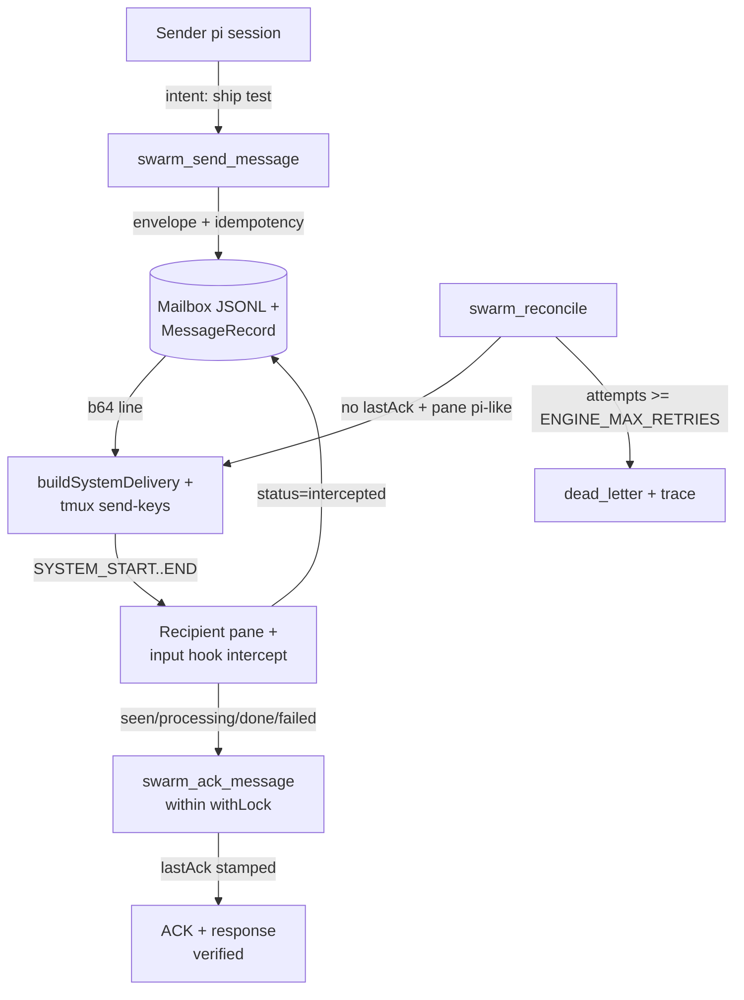
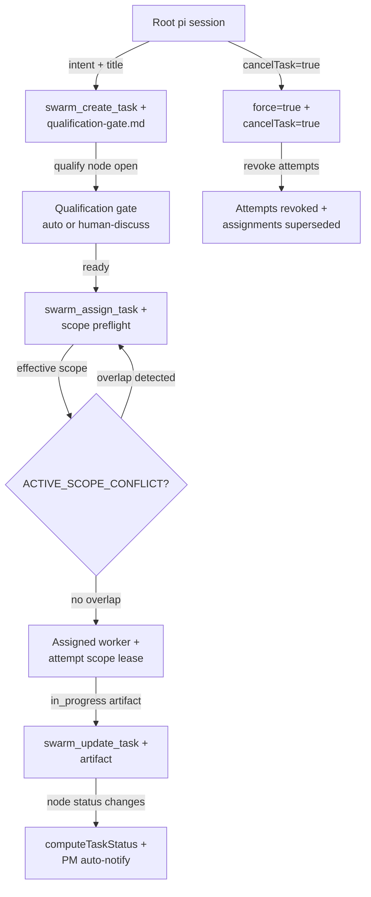
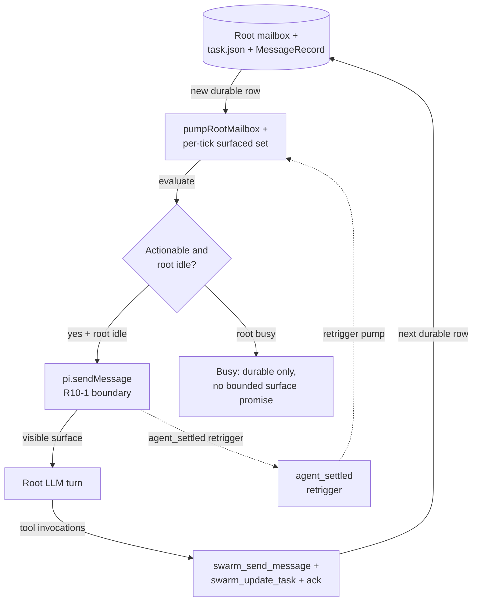
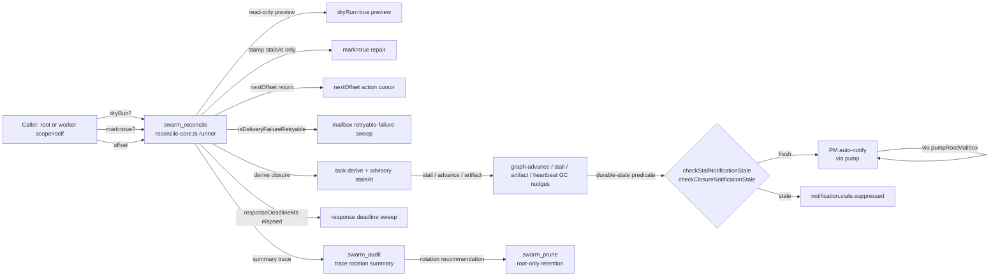
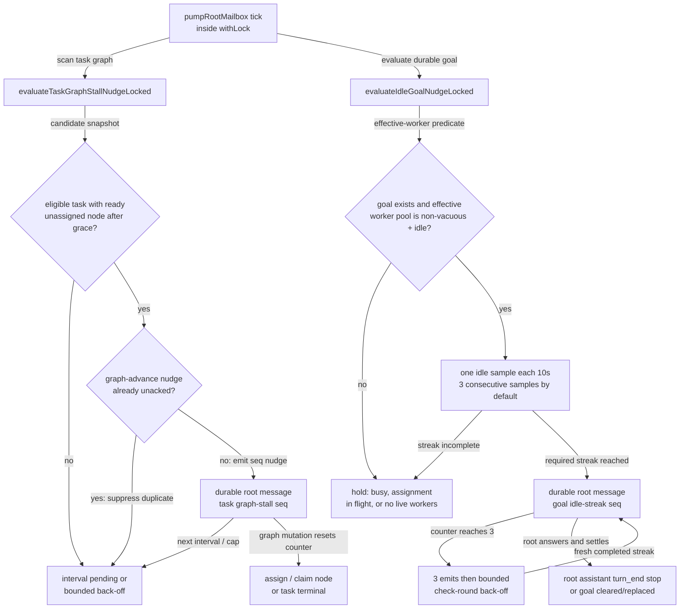

# Swarm runtime flows

> **Purpose.** Show the live message / task / pump / reconcile paths through
> swarm with **clickable, payload-backed edges**. Five diagrams cover the core
> message, task, root-pump, reconcile, and recovery-nudge paths. The page is the entry point
> for review sessions; open it in the local interactive workbench and click
> any node or edge to inspect the actual `SwarmMessage` envelope,
> `MessageRecord` snapshot, `task.json` excerpt, scope-conflict error, pump-tick
> surfaced set, busy-suppression trace, or reconcile result.

> **Tool-count baseline (35).** Verified against `extensions/swarm/src/tools/`:
> agents 19, messages 5, tasks 9, gc 1, audit 1. See `tools.md` for the inventory.

## Conventions

- **`R10-1 boundary`** — the real `pi.sendMessage`/`ctx.abort` boundary where
  swarm crosses from durable mailbox state into the visible surface. The
  per-tick surfaced set deduplicates at this boundary, not at internal helpers.
- **`R15 P0`** — the busy-suppression truth: while the root is mid-turn the
  pump drops a message from the surface plan. No time-bound surface is
  promised for any worker result arriving mid-turn.
- **`withLock`** — every state mutation that the diagrams show happens inside
  the swarm lock; the diagrams do not picture nested locks.
- **Node IDs in the Mermaid source are bare identifiers** (e.g. `sender`,
  `mailbox_jsonl`, `recipient_pane`); the human label is in brackets after
  the id. Interactions map edges by `from`, `to`, and the **visible label
  between the pipes** — labels are whitespace-normalized.

---

## Message lifecycle


```mermaid-interactions
{
  "items": [
    {
      "id": "envelope-send",
      "title": "SwarmMessage envelope",
      "target": {
        "kind": "edge",
        "from": "sender",
        "to": "send_tool",
        "label": "intent: ship test"
      },
      "content": {
        "type": "json",
        "path": "payloads/envelope-swarm-message.json"
      }
    },
    {
      "id": "envelope-durable",
      "title": "Durable append + idempotency",
      "target": {
        "kind": "edge",
        "from": "send_tool",
        "to": "durable",
        "label": "envelope + idempotency"
      },
      "content": {
        "type": "json",
        "path": "payloads/envelope-swarm-message.json"
      }
    },
    {
      "id": "build-system-delivery",
      "title": "buildSystemDelivery on-wire base64",
      "target": {
        "kind": "edge",
        "from": "durable",
        "to": "delivery",
        "label": "b64 line"
      },
      "content": {
        "type": "text",
        "path": "payloads/envelope-on-wire.txt"
      }
    },
    {
      "id": "system-marker-on-wire",
      "title": "SYSTEM_START .. SYSTEM_END delivered to recipient",
      "target": {
        "kind": "edge",
        "from": "delivery",
        "to": "recipient",
        "label": "SYSTEM_START..END"
      },
      "content": {
        "type": "text",
        "path": "payloads/envelope-on-wire.txt"
      }
    },
    {
      "id": "intercepted-status",
      "title": "Input hook stamps intercepted durable state",
      "target": {
        "kind": "edge",
        "from": "recipient",
        "to": "durable",
        "label": "status=intercepted"
      },
      "content": {
        "type": "json",
        "path": "payloads/lifecycle-record.json"
      }
    },
    {
      "id": "ack-tool-call",
      "title": "Recipient ACK lifecycle call",
      "target": {
        "kind": "edge",
        "from": "recipient",
        "to": "ack",
        "label": "seen/processing/done/failed"
      },
      "content": {
        "type": "markdown",
        "path": "payloads/ack-tool-result.md"
      }
    },
    {
      "id": "ack-stamp",
      "title": "lastAck durable record",
      "target": {
        "kind": "edge",
        "from": "ack",
        "to": "verified",
        "label": "lastAck stamped"
      },
      "content": {
        "type": "json",
        "path": "payloads/lifecycle-record.json"
      }
    },
    {
      "id": "reconcile-reinject",
      "title": "Retry only unacknowledged delivery failures",
      "target": {
        "kind": "edge",
        "from": "reconcile",
        "to": "delivery",
        "label": "no lastAck + pane pi-like"
      },
      "content": {
        "type": "markdown",
        "path": "payloads/ack-tool-result.md"
      }
    },
    {
      "id": "dead-letter",
      "title": "Retry budget exhausted",
      "target": {
        "kind": "edge",
        "from": "reconcile",
        "to": "dead_letter",
        "label": "attempts >= ENGINE_MAX_RETRIES"
      },
      "content": {
        "type": "json",
        "path": "payloads/dead-letter-trace.json"
      }
    }
  ]
}
```

---

## Task graph lifecycle


```mermaid-interactions
{
  "items": [
    {
      "id": "create-task",
      "title": "Create task + qualification artifact",
      "target": {
        "kind": "edge",
        "from": "root",
        "to": "create",
        "label": "intent + title"
      },
      "content": {
        "type": "markdown",
        "path": "payloads/qualification-gate.md"
      }
    },
    {
      "id": "qualify-open",
      "title": "Qualification gate opened",
      "target": {
        "kind": "edge",
        "from": "create",
        "to": "qualify",
        "label": "qualify node open"
      },
      "content": {
        "type": "markdown",
        "path": "payloads/qualification-gate.md"
      }
    },
    {
      "id": "qualify-ready",
      "title": "Qualified implementation may be assigned",
      "target": {
        "kind": "edge",
        "from": "qualify",
        "to": "assign",
        "label": "ready"
      },
      "content": {
        "type": "json",
        "path": "payloads/task-graph.json"
      }
    },
    {
      "id": "scope-preflight-eval",
      "title": "Effective scope evaluation",
      "target": {
        "kind": "edge",
        "from": "assign",
        "to": "scope",
        "label": "effective scope"
      },
      "content": {
        "type": "json",
        "path": "payloads/task-graph.json"
      }
    },
    {
      "id": "scope-conflict",
      "title": "Atomic ACTIVE_SCOPE_CONFLICT rejection",
      "target": {
        "kind": "edge",
        "from": "scope",
        "to": "assign",
        "label": "overlap detected"
      },
      "content": {
        "type": "json",
        "path": "payloads/scope-conflict.json"
      }
    },
    {
      "id": "scope-clear",
      "title": "No overlap: worker gets stamped attempt lease",
      "target": {
        "kind": "edge",
        "from": "scope",
        "to": "worker",
        "label": "no overlap"
      },
      "content": {
        "type": "json",
        "path": "payloads/task-graph.json"
      }
    },
    {
      "id": "assignment-update",
      "title": "Worker progress and artifact update",
      "target": {
        "kind": "edge",
        "from": "worker",
        "to": "update",
        "label": "in_progress artifact"
      },
      "content": {
        "type": "json",
        "path": "payloads/task-graph.json"
      }
    },
    {
      "id": "closure-derived",
      "title": "Closure derives from terminal node state",
      "target": {
        "kind": "edge",
        "from": "update",
        "to": "closure",
        "label": "node status changes"
      },
      "content": {
        "type": "json",
        "path": "payloads/task-graph.json"
      }
    },
    {
      "id": "cancel-task",
      "title": "Root-only cancellation",
      "target": {
        "kind": "edge",
        "from": "root",
        "to": "cancel",
        "label": "cancelTask=true"
      },
      "content": {
        "type": "markdown",
        "path": "payloads/qualification-gate.md"
      }
    },
    {
      "id": "cancel-revoke",
      "title": "Cancellation revokes attempts",
      "target": {
        "kind": "edge",
        "from": "cancel",
        "to": "cancelled",
        "label": "revoke attempts"
      },
      "content": {
        "type": "json",
        "path": "payloads/task-graph.json"
      }
    }
  ]
}
```

---

## Root PM pump


```mermaid-interactions
{
  "items": [
    {
      "id": "durable-to-pump",
      "title": "Durable state is the pump input",
      "target": {
        "kind": "edge",
        "from": "durable",
        "to": "pump",
        "label": "new durable row"
      },
      "content": {
        "type": "json",
        "path": "payloads/pump-tick.json"
      }
    },
    {
      "id": "pump-actionable",
      "title": "Actionable/root-idle evaluation",
      "target": {
        "kind": "edge",
        "from": "pump",
        "to": "actionable",
        "label": "evaluate"
      },
      "content": {
        "type": "json",
        "path": "payloads/pump-tick.json"
      }
    },
    {
      "id": "root-idle",
      "title": "Actionable and idle -> queue acceptance",
      "target": {
        "kind": "edge",
        "from": "actionable",
        "to": "pi_send",
        "label": "yes + root idle"
      },
      "content": {
        "type": "json",
        "path": "payloads/pump-tick.json"
      }
    },
    {
      "id": "root-busy",
      "title": "Busy root: no bounded visible surface promise",
      "target": {
        "kind": "edge",
        "from": "actionable",
        "to": "busy_drop",
        "label": "root busy"
      },
      "content": {
        "type": "json",
        "path": "payloads/busy-suppression-trace.json"
      }
    },
    {
      "id": "surface-r10-boundary",
      "title": "R10-1 pi.sendMessage boundary",
      "target": {
        "kind": "edge",
        "from": "pi_send",
        "to": "llm_turn",
        "label": "visible surface"
      },
      "content": {
        "type": "json",
        "path": "payloads/pump-tick.json"
      }
    },
    {
      "id": "llm-tool-calls",
      "title": "Root acts through swarm tools",
      "target": {
        "kind": "edge",
        "from": "llm_turn",
        "to": "tool_calls",
        "label": "tool invocations"
      },
      "content": {
        "type": "markdown",
        "path": "payloads/ack-tool-result.md"
      }
    },
    {
      "id": "tool-loopback",
      "title": "Tool call creates the next durable state",
      "target": {
        "kind": "edge",
        "from": "tool_calls",
        "to": "durable",
        "label": "next durable row"
      },
      "content": {
        "type": "json",
        "path": "payloads/envelope-swarm-message.json"
      }
    },
    {
      "id": "agent-settled",
      "title": "agent_settled signal",
      "target": {
        "kind": "edge",
        "from": "pi_send",
        "to": "settled",
        "label": "agent_settled retrigger"
      },
      "content": {
        "type": "json",
        "path": "payloads/pump-tick.json"
      }
    },
    {
      "id": "pump-retrigger",
      "title": "Settled signal triggers next pump pass",
      "target": {
        "kind": "edge",
        "from": "settled",
        "to": "pump",
        "label": "retrigger pump"
      },
      "content": {
        "type": "json",
        "path": "payloads/pump-tick.json"
      }
    }
  ]
}
```

---

## Reconcile & GC


```mermaid-interactions
{
  "items": [
    {
      "id": "caller-dryrun",
      "title": "Caller path: dryRun",
      "target": { "kind": "edge", "from": "caller", "to": "runner", "label": "dryRun?" },
      "content": { "type": "markdown", "path": "payloads/ack-tool-result.md" }
    },
    {
      "id": "caller-mark",
      "title": "Caller path: mark=true (root-only)",
      "target": { "kind": "edge", "from": "caller", "to": "runner", "label": "mark=true?" },
      "content": { "type": "json", "path": "payloads/reconcile-result.json" }
    },
    {
      "id": "caller-offset",
      "title": "Caller path: offset cursor",
      "target": { "kind": "edge", "from": "caller", "to": "runner", "label": "offset" },
      "content": { "type": "json", "path": "payloads/reconcile-result.json" }
    },
    {
      "id": "dryrun-preview",
      "title": "dryRun preview (no mutation)",
      "target": { "kind": "edge", "from": "runner", "to": "dryrun", "label": "read-only preview" },
      "content": { "type": "json", "path": "payloads/reconcile-result.json" }
    },
    {
      "id": "mark-stamp",
      "title": "mark=true: stamp staleAt advisory",
      "target": { "kind": "edge", "from": "runner", "to": "mark", "label": "stamp staleAt only" },
      "content": { "type": "json", "path": "payloads/reconcile-result.json" }
    },
    {
      "id": "offset-return",
      "title": "nextOffset action cursor",
      "target": { "kind": "edge", "from": "runner", "to": "offset", "label": "nextOffset return" },
      "content": { "type": "json", "path": "payloads/reconcile-result.json" }
    },
    {
      "id": "mailbox-retry",
      "title": "Mailbox retryable-failure sweep",
      "target": { "kind": "edge", "from": "runner", "to": "mailbox_sweep", "label": "isDeliveryFailureRetryable" },
      "content": { "type": "json", "path": "payloads/reconcile-result.json" }
    },
    {
      "id": "task-derive",
      "title": "Task derive + advisory staleAt",
      "target": { "kind": "edge", "from": "runner", "to": "task_sweep", "label": "derive closure" },
      "content": { "type": "json", "path": "payloads/reconcile-result.json" }
    },
    {
      "id": "deadline-sweep",
      "title": "Response deadline sweep",
      "target": { "kind": "edge", "from": "runner", "to": "deadline_sweep", "label": "responseDeadlineMs elapsed" },
      "content": { "type": "json", "path": "payloads/reconcile-result.json" }
    },
    {
      "id": "nudge-trigger",
      "title": "Graph-advance / stall / artifact nudges",
      "target": { "kind": "edge", "from": "task_sweep", "to": "gc_nudge", "label": "stall / advance / artifact" },
      "content": { "type": "json", "path": "payloads/reconcile-result.json" }
    },
    {
      "id": "stale-predicate",
      "title": "Durable-state predicate gate",
      "target": { "kind": "edge", "from": "gc_nudge", "to": "stale_check", "label": "durable-state predicate" },
      "content": { "type": "json", "path": "payloads/pump-tick.json" }
    },
    {
      "id": "notify-fresh",
      "title": "Fresh -> PM auto-notify via pump",
      "target": { "kind": "edge", "from": "stale_check", "to": "root_notify", "label": "fresh" },
      "content": { "type": "json", "path": "payloads/settled-open-assign-trace.json" }
    },
    {
      "id": "notify-stale",
      "title": "Stale -> notification.stale.suppressed",
      "target": { "kind": "edge", "from": "stale_check", "to": "suppress", "label": "stale" },
      "content": { "type": "json", "path": "payloads/pump-tick.json" }
    },
    {
      "id": "audit-summary",
      "title": "Trace rotation summary",
      "target": { "kind": "edge", "from": "runner", "to": "audit", "label": "summary trace" },
      "content": { "type": "json", "path": "payloads/reconcile-result.json" }
    },
    {
      "id": "prune-followup",
      "title": "Rotation recommendation -> prune",
      "target": { "kind": "edge", "from": "audit", "to": "prune", "label": "rotation recommendation" },
      "content": { "type": "markdown", "path": "payloads/ack-tool-result.md" }
    }
  ]
}
```

---

## Task-graph stall nudge & swarm goal floor

Both nudge families run from the root pump under the swarm lock, but they
answer different questions and keep separate counters. The **task-stall** path
is goal-independent and reads eligible task graphs. The **goal floor** requires
a durable goal and is intentionally task-state-independent: it samples the
live worker pool only. A task-stall message is suppressed when an unacknowledged
graph-advance nudge already covers the same ready, unassigned node.


```mermaid-interactions
{
  "items": [
    {
      "id": "nudge-pump-overview",
      "title": "Pump decision snapshot",
      "target": { "kind": "node", "id": "pump" },
      "content": { "type": "json", "path": "payloads/nudge-predicate-snapshot.json" }
    },
    {
      "id": "task-candidate",
      "title": "Task-stall predicate snapshot",
      "target": { "kind": "edge", "from": "task_eval", "to": "task_gate", "label": "candidate snapshot" },
      "content": { "type": "json", "path": "payloads/nudge-predicate-snapshot.json" }
    },
    {
      "id": "task-emit",
      "title": "Per-task stall nudge record",
      "target": { "kind": "edge", "from": "advance_gate", "to": "task_emit", "label": "no: emit seq nudge" },
      "content": { "type": "json", "path": "payloads/task-stall-nudge.json" }
    },
    {
      "id": "task-resolve",
      "title": "Task-stall reset and graph-advance suppression",
      "target": { "kind": "edge", "from": "task_emit", "to": "task_resolve", "label": "graph mutation resets counter" },
      "content": { "type": "markdown", "path": "payloads/nudge-resolution.md" }
    },
    {
      "id": "goal-predicate",
      "title": "Goal-floor live-worker predicate",
      "target": { "kind": "edge", "from": "goal_eval", "to": "goal_gate", "label": "effective-worker predicate" },
      "content": { "type": "json", "path": "payloads/nudge-predicate-snapshot.json" }
    },
    {
      "id": "goal-emit",
      "title": "Goal idle-check streak and nudge",
      "target": { "kind": "edge", "from": "idle_checks", "to": "goal_emit", "label": "required streak reached" },
      "content": { "type": "json", "path": "payloads/goal-idle-nudge.json" }
    },
    {
      "id": "goal-resolve",
      "title": "Goal-floor reset and suppression rules",
      "target": { "kind": "edge", "from": "goal_emit", "to": "goal_resolve", "label": "root answers and settles" },
      "content": { "type": "markdown", "path": "payloads/nudge-resolution.md" }
    }
  ]
}
```
