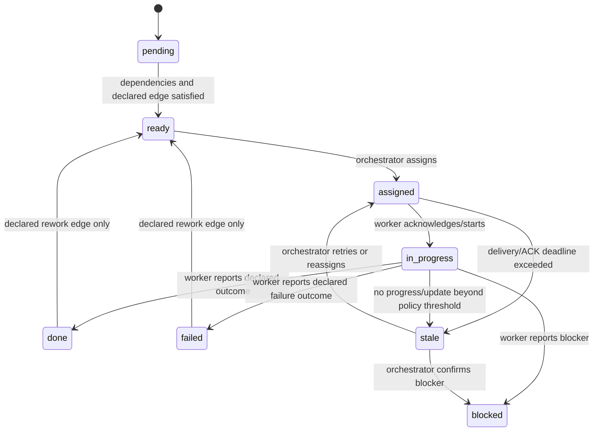

# Swarm Reliability & Recovery Roadmap

> **Status:** proposal for review — no item below changes runtime behavior by itself.
>
> **Purpose:** document failure handling, authority boundaries, and prioritized hardening work for the file-backed swarm task-graph harness.

## Operating model

Swarm should be a durable coordination harness, not an autonomous project manager:

```text
Durable task graph + durable mailbox + event-driven detection
+ bounded reminders + orchestrator recovery authority
```

### Responsibilities

| Actor | Owns |
|---|---|
| Worker | Executes its assigned node, reports progress/blockers, writes declared artifacts, sends result, and updates node status/outcome. |
| Orchestrator | Chooses assignment, retry, reassign, cancellation, and final task closure. |
| Harness | Persists coordination state, validates transitions/authority, detects protocol or liveness drift, executes declared graph edges, and sends bounded nudges. |

The harness must **not infer semantic completion** from an idle pane, a running process, or a changed file.

---

## Current recovery behavior

### Cases raised for review

| Situation | Current handling | Nudge target | Gap / intended direction |
|---|---|---|---|
| New task is created but start node is never assigned | `swarm_create_task` stores the graph and returns the start node as ready. | None guaranteed for a fresh `ready` task. | Add an initial-ready-node nudge to orchestrator. |
| A later graph node becomes ready but remains unassigned | Graph advance reconciliation can create an action-required orchestrator message for a ready, unassigned node in an in-progress task. | Orchestrator | Do not auto-assign or auto-spawn by default. |
| Node is assigned but the worker/pane is not running | Assignment remains durable in mailbox; delivery is recorded as queued/failed. A later worker session may pull pending mailbox work. | Orchestrator sees assignment result; worker sees it when it starts. | Add clearer recovery/attention output; do not silently reassign. |
| Worker has not ACKed delivered work | Reconcile can mark `ack_missing` and boundedly re-inject a delivered-but-unacked message. | Worker, then orchestrator via status/reconcile. | No daemon runs reconcile forever; bounded reminders need a consistent policy. |
| Worker ACKs processing but settles without a result | `agent_settled` detects missing required response records, marks the agent `response_missing`, blocks reuse, and notifies orchestrator. | Orchestrator | Failed-first-delivery followed by later ACK currently has a tracking defect; see active repair. |
| Worker is idle/settled with an open assignment and no node update | `agent_settled` sends a cooldown-limited informational notification to orchestrator. | Orchestrator | Add one bounded, action-oriented reminder to worker before escalation. |
| A node is in progress for too long | `swarm_reconcile` reports advisory `task_node_nudge` after 30 minutes and `stale` after 24 hours. It does not auto-fail a node. | Tool caller / orchestrator | Surface this in one attention-oriented task view. |
| Agent process/pane dies with open work | State retains assignment and task source of truth; lifecycle/reconcile warnings expose it. | Orchestrator | Define explicit retry/reassign/cancel recovery semantics. |
| A declared rework edge should run | Existing graph currently does not correctly re-arm a failed terminal source/target cycle. | Orchestrator currently must force-reset. | Active repair must execute declared rework transitions automatically. |

### Existing time bounds

| Signal | Current threshold / bound |
|---|---|
| Missing assignment ACK | 5 minutes (`ACK_MISSING_MS`) |
| Re-injection cooldown | 5 minutes (`REINJECT_AFTER_MS`) |
| Maximum re-injections | 2 (`MAX_REINJECTS`) |
| Settled-open-assignment notification cooldown | 2 minutes (`SETTLE_NOTIFY_COOLDOWN_MS`) |
| Advisory in-progress node nudge | 30 minutes (`TASK_NUDGE_MS`) |
| Advisory stale node marker | 24 hours (`TASK_STALE_MS`) |

These values should become a consistent policy rather than independently chosen per code path.

---

## Active repair task

Task: [`fix-delivery-and-rework-recovery`](../../.pi/swarm/tasks/fix-delivery-and-rework-recovery/task.md)

### 1. Failed-first delivery later received

Problem sequence:

```text
assignment injection fails
→ message recorded as failed
→ worker later starts and ACKs processing
→ worker settles without a verified result
→ orchestrator is not reliably surfaced a response-missing recovery action
```

Target behavior:

```text
failed_delivery + later ACK processing
→ received / response-pending-verification
→ worker settles without verified result
→ agent is response_missing and orchestrator receives recovery nudge
```

Requirements:

- Preserve the original failed-delivery audit evidence.
- Do not confuse a received-and-working message with one that was never delivered.
- Maintain at-least-once delivery and idempotency.
- Do not auto-close or auto-reassign the task node.

### 2. Declared rework edge activation

Problem sequence:

```text
test fails
→ declared edge: test --failed--> fix [rework]
→ fix incorrectly remains pending
→ orchestrator must force-reset nodes
```

Target behavior:

```text
test fails with outcome=failed
→ declared rework edge satisfies fix dependencies
→ fix becomes ready and assignable
→ fix completes with outcome=implemented
→ declared rework edge re-enters test as ready
```

Requirements:

- Only a declared `rework: true` edge may re-enter a terminal node.
- Re-entry clears prior execution outcome/assignment state while retaining durable event history.
- Graph transitions remain derived from `task.json`; no autonomous completion/failure is invented.

---

## Proposed lifecycle model

### Node lifecycle



`stale` is an advisory recovery condition, not an automatic assertion that work failed.

### Assignment/message lifecycle

```text
queued
  → injected | mailbox_delivered | failed_delivery
  → acked_seen
  → acked_processing
  → response_pending_verification
  → response_verified + acked_done
```

Transport can be at-least-once. An agent must treat `messageId` as an idempotency key and must not repeat work merely because the same assignment is re-injected.

---

## Automation boundaries

### Safe automation: detect and preserve

The harness should automatically persist and surface:

- ready but unassigned nodes;
- failed/queued delivery;
- unacknowledged delivered messages;
- missing result responses;
- agent settled with open assignments;
- node inactivity/staleness;
- worker shutdown with active work;
- declared graph/rework transitions.

### Safe automation: bounded reminders

Recommended escalation sequence:

1. Detect assigned/in-progress node with ACKed processing and no required action past threshold.
2. Send one worker reminder with explicit options:
   - mark `done` with outcome and evidence;
   - mark `blocked` with reason;
   - send progress/heartbeat if still working.
3. After a second bounded threshold, mark advisory stale / response missing and notify orchestrator.
4. Never send unbounded reminders; deduplicate by semantic key and enforce cooldown/caps.

Suggested dedupe keys:

```text
task:<taskId>:node:<nodeId>:nudge:assign
task:<taskId>:node:<nodeId>:nudge:progress
message:<messageId>:nudge:ack-missing
message:<messageId>:nudge:response-missing
```

### Unsafe automation: keep orchestrator authority

The harness should not automatically:

- mark a node `done` because a worker is idle;
- mark a node `failed` because a pane died;
- reassign work to a second worker without superseding the first lease;
- spawn a new worker without an explicit task/pool policy;
- declare a task complete from runtime signals alone;
- allow a second live orchestrator to mutate graph/task state without a durable leader fence;
- let slash-command admin paths bypass the same orchestrator-only gates used by validated tools.

---

## Reliability concerns and proposed follow-up work

### P0 — authority and stale-write safety

#### 1. Enforce RBAC for `force=true` — **Phase 1: COMPLETE**

**Risk:** a non-orchestrator can potentially use `swarm_update_task(force=true)` to bypass assignee and lifecycle restrictions.

**Required policy:** `force` must only be accepted for the orchestrator (or an explicitly provisioned admin capability). The server-side current identity must be checked; client parameters are not authority.

**Phase 1 implementation:** `isOrchestratorAuthority()` (orchestrator-only) is checked server-side in `swarm_update_task` before any mutation. `force=true` from a non-orchestrator is rejected with `FORCE_FORBIDDEN`; `cancelTask=true` is rejected with `CANCEL_FORBIDDEN` (and requires `force=true` even for the orchestrator). Covered by `extensions/swarm/rbac-initial-ready.test.mjs`.

**Acceptance criteria:**

- Worker `force=true` attempt is rejected and traced. ✔
- Orchestrator force transition is accepted only where documented. ✔
- Normal assignee transitions remain unchanged. ✔

#### 2. Add assignment leases / attempt identity — **COMPLETE**

**Risk:** after reassign or rework, a previous worker can submit a late update and overwrite the current attempt.

**Implemented:** [`assignment-attempt-lease-fencing`](../../.pi/swarm/tasks/assignment-attempt-lease-fencing/task.md) adds a durable opaque attempt token in assignment contracts, an append-only per-node attempt history, and handler-bound stale-write fencing. Duplicate delivery/retry preserves the active attempt; genuine reassignment/rework produces a fresh attempt. Independent tests, review, and default-config tmux/Pi UAT passed; evidence is in that task's artifacts.

**Proposal:** each assignment receives a durable attempt/lease identity:

```text
taskId + nodeId + attemptNumber + leaseId + assignmentMessageId
```

Every worker node update/result must include or be associated with the active lease. Superseded leases reject mutation but retain an audit event.

**Acceptance criteria:** late result from an old worker cannot complete, fail, or overwrite a re-assigned node.

#### 3. State/lock crash consistency

**Risk:** file-backed mailbox, state, task, artifact, and edit-lock changes can be interrupted mid-operation.

**Work:** test stale locks, process kill during writes, malformed/partial state recovery, concurrent task updates, and artifact-written/task-update-failed paths.

**Acceptance criteria:** reconcile can identify and repair defined drift without fabricating task outcomes.

---

### P1 — recovery and execution correctness

#### 4. Initial-ready-node nudge — **Phase 1: COMPLETE**

**Gap:** a newly created task can remain `ready` forever because current graph-advance nudges focus on in-progress tasks.

**Proposal:** when a task's start node is ready and unassigned beyond a short creation grace period, send an idempotent action-required message to orchestrator:

```text
Task <id> exists but start node <id> remains unassigned.
Assign, pause, or cancel it.
```

It must not auto-assign or auto-spawn.

**Phase 1 implementation:** `reconcileInitialReadyLocked` runs on the orchestrator pump. After `TASK_INITIAL_READY_GRACE_MS` (1 min) a ready+unassigned start node is nudged once with an exact `swarm_assign_task` call. Idempotent per `task:{taskId}:nudge:initial-ready`; bounded by `NOTIFY_DEFAULT_MAX_NUDGES` / `NOTIFY_DEFAULT_COOLDOWN_MS`; auto-clears when the node is assigned. It never assigns or spawns. Covered by `extensions/swarm/rbac-initial-ready.test.mjs`.

#### 5. Bounded worker completion reminder — **COMPLETE**

**Gap:** worker can finish implementation but forget status/result protocol.

**Proposal:** after confirmed receipt/processing and no task progress, send a single bounded worker reminder; escalate to orchestrator only if it remains unresolved.

The reminder must never claim the work is finished and must never set node state itself.

**Implemented** (see `docs/swarm/operations.md` → Recovery attention and bounded worker reminder):
pure durable attention derivation (`deriveNodeAttention` in `src/taskgraph.ts`), orchestrator-gated
read-only `/swarm attention`, one-per-attempt `/swarm remind` (idempotency-key fenced, crash-safe,
no ack/response debt), `runtime=true` attention warnings, and a report-only `reminder_eligible`
reconcile action. Reconcile never sends. Covered by `extensions/swarm/attention-reminder.test.mjs`.

#### 6. Cancellation and supersession semantics — **COMPLETE**

Define precisely what cancellation means:

| Node state | Cancel behavior |
|---|---|
| pending / ready | mark skipped/cancelled under task cancellation policy |
| assigned / in progress | revoke/supersede active lease, release agent and edit locks, send cancellation signal |
| in-flight mailbox message | mark superseded/cancelled so later receipt cannot start obsolete work |
| late result after cancellation | reject as stale, retain audit evidence |

A worker should ACK cancellation. Cancellation must not leave it authorized to continue editing.

**Phase 2 implementation (issue 3):** `swarm_update_task(force=true, cancelTask=true)` is the
single orchestrator-only cancellation surface — no new `swarm_cancel_task` tool. On cancel the
handler:

1. Marks `task.status = "cancelled"` (sticky terminal).
2. Iterates every node: revokes the active attempt (`attempt.status = "cancelled"`), transitions
the node to `cancelled` (skipping already-terminal nodes so real work is never un-done), and
calls `releaseNodeAssignment` to clear the assignee's `activeTaskIds` + any advisory edit lock on that node.
3. Calls `supersedeTaskAssignmentMessages` to mark every per-node `assignmentMessageId` and all
task-scoped `handoffs[kind=assign]` entries as superseded (waiving response debt). A record already
superseded by reassignment retains its original supersession reason as canonical audit history.
4. Sends informational cancellation notices (requiresAck:false, requiresResponse:false) to every
pre-cancel active assignee.
5. Returns the task-close PM auto-notify (now treats `cancelled` as closure-ish so the PM mailbox
surfaces it).

Late updates are rejected at the handler boundary:

- `swarm_update_task` checks `isTaskOrNodeCancelled` BEFORE attempt fencing; rejects with
  `TASK_CANCELLED` or `NODE_CANCELLED`. Even an orchestrator `force=true` cannot revive a cancelled
  task — re-open is a separately-designed policy, not in this PR.
- `swarm_ack_message` already rejects progress ACKs on superseded assignment records with
  `ASSIGNMENT_SUPERSEDED` (orchestrator may pass `waive=true`).
- Late `swarm_send_message(replyTo=superseded)` is non-actionable (the message is waived; the
  recipient check in `swarm_ack_message` already blocks it).

Helper: `isTaskOrNodeCancelled(task, nodeId?)` (in `taskgraph.ts`) — used by the handler boundary
and exposed for tests/UI. Constants: `CANCELLATION_REASON = "task_cancellation"` is the stable
audit key stamped on `message.superseded.supersededBy` and `trace` events.

Coverage: `extensions/swarm/cancellation.test.mjs` (**42 assertions across 14 real-handler
failure-injection scenarios** — cancel during assigned/in-progress, late non-assignee mutation,
late result/ACK, reassignment and historical-handoff supersession, duplicate delivery, audit
persistence, resource + edit-lock release, legacy compatibility). Independent test/review and
fresh default-config tmux/Pi UAT evidence are stored in
[`cancellation-and-supersession-semantics`](../../.pi/swarm/tasks/cancellation-and-supersession-semantics/artifacts/).

#### 7. Retry vs reassign distinction

| Action | Meaning |
|---|---|
| Delivery retry | Same message/lease, bounded transport retry to same worker. |
| Worker reminder | Same lease, asks current worker for protocol completion/progress. |
| Reassign | Old lease is superseded; a new attempt and worker are explicitly selected by orchestrator. |

Automatic delivery retry is reasonable. Automatic reassign is not, unless a task explicitly opts into it.

#### 8. File edit ownership / conflict policy — **COMPLETE** (`file-ownership-parallel-conflict-policy-v2`)

`allowedFiles` documents scope but does not prevent two parallel nodes from editing the same file.

**Implemented (see `docs/swarm-task-graph.md` "File-scope ownership and parallel conflict policy"):** `swarm_assign_task` runs an atomic ownership preflight under the swarm lock. The candidate node's effective write scope (node `allowedFiles` -> `allowedFilesFrom` inheritance -> task default, stamped on the attempt lease) is compared against every active attempt lease across all tasks with a conservative deterministic glob predicate (no filesystem enumeration). Overlap fails with the stable code `ACTIVE_SCOPE_CONFLICT` before any mutation (task.json / swarm-state.json / mailboxes untouched). Leases are attempt-fenced and release auditable (`releasedAt`/`releaseReason`) on terminal, reassign, rework reopen, and cancellation. Legacy tasks stay readable; reconcile reports advisory `task_node_ownership_legacy` drift. No new public tools, no auto-takeover, no multi-orchestrator policy. Originally proposed edit-lock table superseded by the attempt-lease-scoped design above.

---

### P2 — operational clarity and scalability

#### 9. Lifecycle-notification fencing and stale-event suppression

**Observed failure:** an `agent_settled` notification can be emitted or delivered after the
orchestrator has stopped/pruned that worker and released or reassigned its node. The historical
notification then incorrectly says that the old worker still holds open work.

**Required policy:** lifecycle events are advisory observations, never task authority. Before a
settled/open-assignment notification is persisted or delivered, validate its observation against
current durable state under the swarm lock. The notification must carry the relevant assignment
attempt identity (where present), and must be suppressed or marked obsolete when that attempt/node
has since been released, superseded, cancelled, reassigned, or the agent has been stopped. Pending
notifications must receive the same fence immediately before delivery/retry; no obsolete notice may
be reinjected merely because it was queued earlier.

**Requirements:**

- Do not infer work status from pane/process idleness; this changes notification correctness only.
- Use task JSON, attempt history, agent state, and mailbox state as durable evidence; no pane state
  can make an old assignment appear current.
- Preserve append-only audit/trace evidence of the original observation and its suppression or
  obsolescence reason without creating response debt.
- Do not auto-close, fail, reassign, or mutate a node's semantic execution state.
- Cover stop/release, reassignment, cancellation, rework, queued-delivery race, and legacy
  assignment-without-attempt cases with failure-injection tests.

**Acceptance criteria:** after a worker is stopped/released, a later `agent_settled` event cannot
claim it owns the released node; a stale queued event cannot notify the orchestrator as actionable;
a current worker/attempt notification continues to work exactly once within existing bounded
nudge policy.

**Implemented:** [`lifecycle-notification-fencing`](../../.pi/swarm/tasks/lifecycle-notification-fencing/task.md) adds two pure predicate helpers in `taskgraph.ts`
(`checkStallNotificationStale` for sites 1–5, 8, 9 and `checkClosureNotificationStale` for sites 6, 7)
that run inside each emitter's existing `withLock` block. Stale notifications emit a
`notification.stale.suppressed` trace event carrying `site`, `taskId`, `nodeId`, `reason`, and
`evidence`; legitimate non-final closure notifications and cancellation notifies for active assignees
are NOT suppressed (narrow predicate per Rev 4 / ReRev-C1). Node pointers, `node.assignee`, and
`activeAttemptId` are not mutated by the fence. Independent test file
`extensions/swarm/lifecycle-fencing.test.mjs` covers all 9 sites with real emitter invocation;
regression sweep across `attempt-fencing`, `cancellation`, `multi-orchestrator`,
`attention-reminder`, `state-corruption`, `tool-gating`, `smoke`, and `tsc --noEmit` is clean.

#### 10. Separate liveness dimensions

Do not equate an alive tmux pane with progress.

| Dimension | Question |
|---|---|
| Transport liveness | Is tmux/pi process reachable? |
| Protocol liveness | Are heartbeat, ACK, tools, or session events arriving? |
| Work liveness | Has the assigned node supplied required progress/result evidence within policy? |

Expose these separately in task and agent status.

#### 11. Unified attention view

Operators should not need to infer required action from raw state across several tools.

Add an attention-first command/view, for example:

```text
/swarm-tasks attention
```

It should prioritize:

```text
- initial node unassigned
- delivery unavailable
- awaiting ACK
- response missing
- worker idle with open node
- stale node
- ready rework target
- safe recovery action suggestions
```

This should synthesize state; it must not silently mutate state.

#### 12. Multi-orchestrator authority

**Decision:** strict-reject multiple live orchestrators.

- A second live orchestrator pid is rejected with `ORCHESTRATOR_LEADER_DENIED`.
- The current leader lives in `SwarmState.orchestratorLeader`.
- `ORCHESTRATOR_LEADER_STALE_MS` is the leadership blind-spot bound and is deliberately kept equal
  to `LOCK_STALE_MS` for this issue.
- Gated task/command paths must refresh the leader heartbeat inside the existing lock before mutating
  authority-sensitive state.
- Slash-command helpers that mutate stop/release surfaces must also check orchestrator identity before
  entering their mutable branch.

This keeps the policy simple: one live PM, one durable leader record, one rejected second leader.

#### 13. Provider/pool preflight

Observed failure class: provider/model configuration error reaches spawn, is poorly classified, and leaves graph work stalled.

Preflight before spawn/assignment should verify:

```text
provider configured
model available
provider-model compatibility
credential availability
pool slot health/cooldown
tmux availability
```

Failures should be classified and return an actionable recovery/fallback recommendation.

#### 14. Message/backpressure policy

Multiple events (`session_start`, `agent_settled`, reconcile, graph advance, delivery retry, periodic PM pump) can produce duplicate notifications.

Create one shared nudge policy for:

- semantic dedupe key;
- first notification timestamp;
- cooldown;
- retry cap;
- escalation target;
- acknowledgement/auto-clear condition.

---

## Tool-surface direction

Keep a small role-based core and move diagnostics/admin operations behind commands or gated tools.

| Audience | Preferred operations |
|---|---|
| Worker | Check mailbox, send/reply, update assigned task. |
| Orchestrator | Create task, inspect status/next nodes, assign, update, reconcile. |
| Admin/debug | Agent lifecycle/pool, raw tmux input, traces, GC, low-level recovery. |

Recovery operations should use explicit semantics instead of generic dangerous forced mutation. Candidate command-only actions:

```text
/swarm retry-assignment <task> <node>
/swarm reassign <task> <node> <agent>
/swarm reopen <task> <node> --reason <text>
/swarm mark-blocked <task> <node> --reason <text>
```

These do not necessarily require new public model tools; they can compile down to validated internal task actions.

---

## Node contract recommendations

A graph edge alone does not make handoff reliable. Each node should declare:

```text
role
input artifacts
output artifact(s)
completion evidence
allowed files
attempt/lease policy
timeout / stale threshold
retry or rework policy
```

This makes it possible to distinguish actual work completion from an agent merely becoming idle.

---

## Recommended implementation order

1. Complete active task: delivery recovery and declared rework routing.
2. Enforce `force=true` RBAC server-side.
3. Add initial-ready-node nudge and bounded worker completion reminder.
4. Add assignment lease/attempt token and stale-result rejection.
5. Define cancellation/supersession semantics.
6. Add file edit locks or overlap prevention for parallel nodes.
7. Build attention-first operator view and reduce exposed tool surface.
8. Add provider/pool preflight and actionable fallback classification.
9. Harden crash recovery and decide/enforce multi-orchestrator policy.

---

## Review decisions requested

Before implementing the follow-up items, confirm these policy choices:

1. Should only `orchestrator` be allowed to use forced graph transitions, or should named admin roles exist?
2. Should worker completion reminders be enabled by default, and what timeout/cap is acceptable?
3. Are multiple concurrent orchestrators a supported deployment mode? **Answered (Issue 8): No.** Strict-reject is enforced: `SwarmState.orchestratorLeader` records the live leader; a second live pid is rejected with `ORCHESTRATOR_LEADER_DENIED` on all orchestrator-authoritative tool and command paths (`multi-orchestrator-policy`).
4. Should parallel file overlap be rejected by default, or merely warned?
5. Which cancellation guarantee is required: best-effort stop, or lease revocation with stale-result rejection?
6. Should recovery actions be model-callable tools, orchestrator-only tools, or slash commands only?
