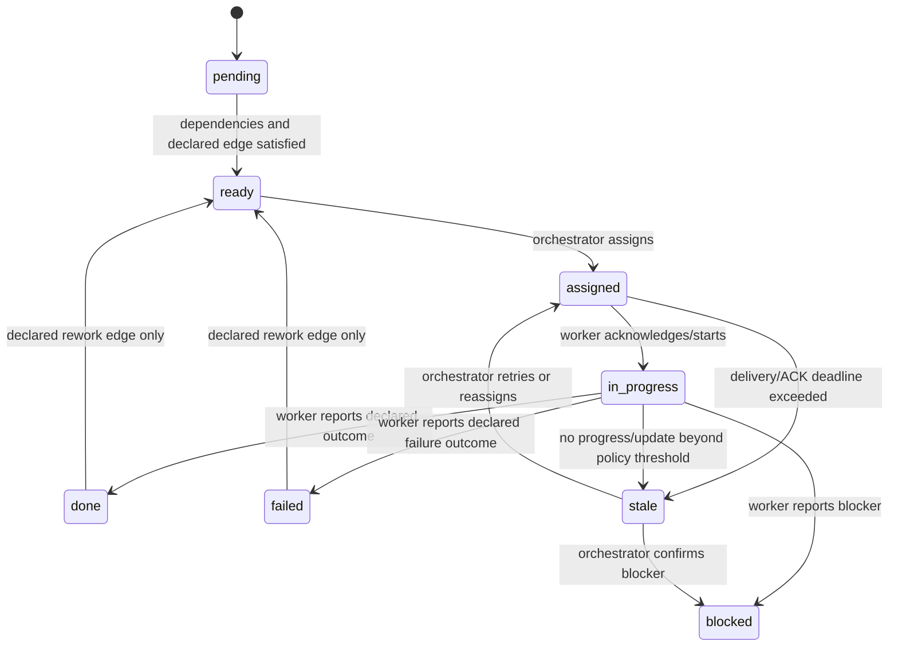

# Swarm Reliability & Recovery Roadmap

> **Status:** proposal for review — no item below changes runtime behavior by itself.
>
> **Purpose:** document failure handling, authority boundaries, and prioritized hardening work for the file-backed swarm task-graph harness.

## Operating model

Swarm should be a durable coordination harness, not an autonomous project manager:

```text
Durable task graph + durable mailbox + event-driven detection
+ bounded reminders + orchestrator recovery authority
```

### Responsibilities

| Actor | Owns |
|---|---|
| Worker | Executes its assigned node, reports progress/blockers, writes declared artifacts, sends result, and updates node status/outcome. |
| Orchestrator | Chooses assignment, retry, reassign, cancellation, and final task closure. |
| Harness | Persists coordination state, validates transitions/authority, detects protocol or liveness drift, executes declared graph edges, and sends bounded nudges. |

The harness must **not infer semantic completion** from an idle pane, a running process, or a changed file.

---

## Current recovery behavior

### Cases raised for review

| Situation | Current handling | Nudge target | Gap / intended direction |
|---|---|---|---|
| New task is created but start node is never assigned | `swarm_create_task` stores the graph and returns the start node as ready. | None guaranteed for a fresh `ready` task. | Add an initial-ready-node nudge to orchestrator. |
| A later graph node becomes ready but remains unassigned | Graph advance reconciliation can create an action-required orchestrator message for a ready, unassigned node in an in-progress task. | Orchestrator | Do not auto-assign or auto-spawn by default. |
| Node is assigned but the worker/pane is not running | Assignment remains durable in mailbox; delivery is recorded as queued/failed. A later worker session may pull pending mailbox work. | Orchestrator sees assignment result; worker sees it when it starts. | Add clearer recovery/attention output; do not silently reassign. |
| Worker has not ACKed delivered work | Reconcile can mark `ack_missing` and boundedly re-inject a delivered-but-unacked message. | Worker, then orchestrator via status/reconcile. | No daemon runs reconcile forever; bounded reminders need a consistent policy. |
| Worker ACKs processing but settles without a result | `agent_settled` detects missing required response records, marks the agent `response_missing`, blocks reuse, and notifies orchestrator. | Orchestrator | Failed-first-delivery followed by later ACK currently has a tracking defect; see active repair. |
| Worker is idle/settled with an open assignment and no node update | `agent_settled` sends a cooldown-limited informational notification to orchestrator. | Orchestrator | Add one bounded, action-oriented reminder to worker before escalation. |
| A node is in progress for too long | `swarm_reconcile` reports advisory `task_node_nudge` after 30 minutes and `stale` after 24 hours. It does not auto-fail a node. | Tool caller / orchestrator | Surface this in one attention-oriented task view. |
| Agent process/pane dies with open work | State retains assignment and task source of truth; lifecycle/reconcile warnings expose it. | Orchestrator | Define explicit retry/reassign/cancel recovery semantics. |
| A declared rework edge should run | Existing graph currently does not correctly re-arm a failed terminal source/target cycle. | Orchestrator currently must force-reset. | Active repair must execute declared rework transitions automatically. |

### Existing time bounds

| Signal | Current threshold / bound |
|---|---|
| Missing assignment ACK | 5 minutes (`ACK_MISSING_MS`) |
| Re-injection cooldown | 5 minutes (`REINJECT_AFTER_MS`) |
| Maximum re-injections | 2 (`MAX_REINJECTS`) |
| Settled-open-assignment notification cooldown | 2 minutes (`SETTLE_NOTIFY_COOLDOWN_MS`) |
| Advisory in-progress node nudge | 30 minutes (`TASK_NUDGE_MS`) |
| Advisory stale node marker | 24 hours (`TASK_STALE_MS`) |

These values should become a consistent policy rather than independently chosen per code path.

---

## Active repair task

### Issue 70 — engine-retry gate never trips on mutable 429 bodies (model pool stuck on exhausted quota slot) — FIXED 2026-08-30

**Status:** fixed (commit `36643f1`; verified independently by r70-tester + r70-reviewer). **Priority:** P0. **Found live 2026-08-30.**

**Symptom (live evidence):** `r69-implementer` (and other agents) hit `429 usage_limit_reached` on `ccs/gpt-5.4-mini` / `ccs/gpt-5.6-terra` until manual rescue. Traces show 39× `pool.swap_gated_by_engine_retry {count:1}`, **0×** `pool.engine_retry_exhausted`, and no swap during the outage — the pool never rotated despite quota exhaustion on every eligible slot.

**Root cause:** the Issue 17 engine-retry gate in `extensions/swarm/src/hooks.ts` (~line 391) keys consecutive-error incidents on exact string equality `prevIncident.errorMessage === normErr`. Provider 429 bodies embed a per-second-changing `resets_in_seconds` (live samples: `11508`, `11504`, `11499`, `11490`, …) so every turn_end error starts a FRESH incident at `count:1`. The gate threshold `ENGINE_MAX_RETRIES = 3` is never reached, so `recordProviderError`/bench/swap never fire. The agent loops on a dead slot until a human intervenes.

**Fix direction:**

1. Normalize error text before incident comparison: extract the stable classification (`429`, `usage_limit_reached`, provider key, model) and drop volatile fields (`resets_in_seconds`, timestamps, request ids). Prefer reusing `classifyProviderError(errorText)` kind + `providerKey` as the incident identity, falling back to a scrubbed message (strip digits/quoted numbers) only when kind is `unknown`.
2. Consider treating `kind === "quota"` as immediately exhausted (mirroring the pool bench policy: quota errors don't self-heal within a retry window) — one engine-exhausted strike per quota 429, not three.
3. Regression: seed turn_end errors with identical kind but mutating `resets_in_seconds` and assert the incident count reaches threshold and `pool.swap` fires; also assert distinct provider keys still start fresh incidents.
4. UAT: bare-pi tmux lane with a scripted 429-returning provider stub, verify swap + `[PI-SWARM MODEL POOL]` notify + bench trace `pool.slot_benched` with `lastBenchReason=quota`.

**Do not** remove the engine-retry gate for genuine transient errors (network/timeouts) — Issue 17 still protects against thrashing; only the identity comparison and quota immediacy are wrong.

**Resolution (2026-08-30, task `task-202608300128-issue-70-fix-engine-retr`):** two defects fixed.
(1) `classifyProviderError` now matches `usage_limit` / `usage limit` → quota, routing live
`usage_limit_reached` bodies into the pool's immediate-bench policy (`lastBenchReason=quota`).
(2) The engine-retry incident identity in `extensions/swarm/src/hooks.ts` is now the stable
classification `providerKey + kind + scrubErrorIdentity(message)` (digits erased, whitespace
collapsed) instead of raw error-text equality — mutating `resets_in_seconds` no longer resets
the incident. The parked "quota = 1-strike immediate exhaustion" option was NOT taken (it breaks
`pool-retry.test.mjs` fixture 6's 3-strike swap semantics; the reached-threshold path satisfies
the AC). Evidence: `extensions/swarm/pool-quota.test.mjs` (19 assertions incl. RED repro) +
isolated bare-pi UAT `r70-quota-uat3-094742` (counts 1→2→3, `pool.engine_retry_exhausted`,
`pool.slot_failure benchReason=quota`, `pool.swap` in-process, `[PI-SWARM MODEL POOL]` note).

### Issue 64 — declared rework edges are one-shot per causal attempt — FIXED 2026-08-30

**Status:** fixed (commits `d1f1d07` + `b2bf93b`; graph-level UAT evidence in task `task-issue-64-graph-uat`: fail→fix→retest→pass→review→approve chain with exactly-2 one-shot ledger entries and no hot-reopen).

### Issue 71 — rework edge consumption stamped before reopenability is proven (one-shot edge can be burned by transient target state) — R5 finding

**Status:** fixed (task `task-issue-71-stamp-on-success`; review APPROVED; pending commit). **Priority:** P1. Found by R5 post-batch ritual (a1+a2 independent convergence).

`taskgraph.ts:520-546` calls `recordReworkConsumption(...)` before the target-status reopenability check. If the target node is transiently `assigned`/`in_progress` when a rework edge fires, the ledger entry is written and the declared rework edge is permanently suppressed — a valid rework transition is silently lost (state-loss path).

**Fix direction:** stage the ledger write and commit it only after the reopen mutation succeeds under the same lock (stamp-on-success); if the target is not reopenable now, leave the edge unconsumed for a later pass. Regression: fire a rework edge while target is assigned; assert the edge still fires after the target returns to a reopenable state.

### Issue 72 — ack_missing sweep ignores consumerReceipts + per-tick stale.suppressed trace noise (F1+F2) — R5 finding

**Status:** fixed 2026-08-30 (`36f1ba7`, verified by r72-tester + r5-a2 review). **Priority:** P2.

Landed: (a) receipt-gated ack_missing sweep; (b) one-shot stale-suppression trace; (c) grouping keys precomputed into surfacePlan before the lock-held loop.

**Residual follow-ups (R6 a1-F2/F3/F6/F8, quantified):** one-shot Set is in-memory (dies on restart, grows unbounded, dedupes across reasons — fix: cap + `${messageId}:${reason}` key); receipt gate cannot distinguish coalesce-suppression receipts from real surfacing across restart (never-acked messages permanently silent — fix: surfacedAt recency in the gate); staleSurfaceReason still O(tasks×nodes) inside withLock (hoist ready-node map, buffer traces); pre-delivery sites pass notify keys as messageId (scope Set by site).

### Issue 73 — test-suite debt: two pre-existing failures + two coverage gaps — R5 finding

**Status:** open. **Priority:** P2.

- `functional.test.mjs` fails since `65835ca`: the same commit that added `requireOrchestratorAuthority` to `swarm_create_task` pins the test at `PI_SWARM_AGENT_ID=implementer-01`. Fix: run orchestrator-authority steps with an orchestrator-pinned subprocess or split the suite.
- `pool-config.test.mjs` case 6 (`preflight.resolved.model` undefined) fails at clean `d3f6b01` — reproduce and fix.
- F4 gap: busy→defer→idle leg never exercised in UAT (deferral marks nothing; cheap to add next UAT window).
- Parked quota 1-strike option has no regression guard if later taken (document semantics first).

### Issue 74 — roadmap status discipline: single authoritative status field + closure evidence — R5 finding

**Status:** open. **Priority:** P3.

Issue 70 heading said FIXED while Status said open (fixed in this cycle). Rule: heading carries the issue title only; `Status:` is the single authority (open/fixed with commit hash + verifier).

### Issue 75 — graph-authoring guardrails + terminal-task stall visibility — R5 cycle defects

**Status:** fixed 2026-08-30 (commit in flight — see below). **Priority:** P1.

Landed: (a) create-time validation that every non-root node with incoming edges declares `dependsOn` (error names the node); (b) `buildAssignmentBody` rewrites read/write artifact paths and inline note refs to task-absolute paths (incl. `./`-prefixed); (c) `isStallNudgeEligibleTaskStatus` admits `failed` graphs — terminal-but-recoverable graphs now get bounded stall nudges (max 3 + backoff), nudge body states the actual task status; (d) `isCommitLike` predicate gates ANY terminal orchestrator-kind node (any id: `commit`, `finalize`, `ship`...) on baseline-vs-HEAD git evidence — unverified ⇒ node stays pending with `task.evidence[nodeId]` (legacy `.commit` slot kept in sync); per-node evidence surfaced in `printGraphText`.

Verified: r75-tester honest-fail on the literal-id bypass → fix generalized the predicate → regression 4c (finalize) covers it; r75-reviewer APPROVED with own runs (20/20 + 10 suites; functional pre-existing row-73 debt excluded via clean-tree stash check).

Open follow-ups from review (not blocking): M1 evidence checks commit EXISTENCE not attribution — any task's commit auto-verifies (file as its own row when scheduling); M2 agent-mediated close of commit-like nodes via assign+update path has no evidence gate; M3 docs/swarm/ guardrail documentation (folded into commit + this row update); lows recorded in artifacts/review.md.

### Issue 76 — investigate stall-predicate edge cases, then implement liveness + supersession protocol — R6 (user-mandated investigate-first)

**Status:** closed 2026-08-30 (`d0b18c4`; investigation/testbed complete — runtime follow-up captured in the R8 additions below). **Priority:** P1. R7 a5: next-batch lead. **Source:** user questioning of task-graph stall detection gaps + design review by pi-talk-dev@pi-talk (mailbox author; patterns validated against `extensions/mailbox/src/db.ts`).

Observed stall modes NOT covered by the current predicate (`reconcile.ts` actionable = ready+unassigned+all-idle):
1. Assigned node, assignee process died silently (no event; discovered only when a later assign fails "can't find window").
2. Assigned node, agent alive but settled/drifted (settled-notify only fires on clean settles; crash-after-settle leaves the node fenced forever).
3. Agent busy in a loop without progress (predicate all-idle false → silence; no progress signal).
4. Work outside task graphs (direct-message batches) — zero coverage.

Design (7 lines; validated = production-proven in mailbox, design = cross-checked against our incident data):
1. Split durable identity vs live presence; liveness = pid probe behind staleness threshold, never staleness alone [validated]
2. Two-tier sweep: in-memory staleness every tick; expensive probe only past threshold or at dispatch [validated pattern, adapted]
3. Progress-leases on existing attempt fence: renewal = lastToolAt advance; expiry → attempt superseded; per-class budgets from trace-derived P75, watch bimodal [design]
4. Fused probe+release+flip+re-arm in reconcileTasks for assigned nodes only; advisory session marking elsewhere; CAS + rows-affected-gated notify [design]
5. Lock-free append heartbeats (torn-tail-skip, date+size rotation, rename-on-boundary); global lock reserved for graph transitions; monotonic-elapsed staleness + wake-grace for laptop sleep [design; JSONL contract validated]. Replaces current RMW-under-lock heartbeat per tool call (hooks.ts:799-819) — the heaviest write in the system.
6. Fail-closed tool-level attempt check (stamp file, mtime-invalidated, absent=reject) on edit/write/bash; loud actionable supersession error [design — verified missing: no attempt check at tool layer; all agents share one cwd]
7. swarm_flag_supersession arbitration: freeze-new, dual-history review, resume-old with revision bump; worktree-per-assign demoted to blast-radius optimization; coordinator-wrong protocol first-class ("fencing tokens fence state writes, not the real world"; recovery from false-positive supersession must be a state decision, never a tree merge) [design]

**Investigation deliverable before patching:** stall-mode × signal × false-positive-risk matrix from our own incident data (dead-assignee crash, settle-and-drift, busy-stuck loop, false-idle verdicts) + baseline metrics (hung-but-alive residual rate, false-reassign rate).

### Issue 77 — reply-thread misrouting protocol debt — R6 converged (a2 HIGH + a5)

**Status:** closed 2026-08-30 (`1f70418`; reminder-thread reply routing + docs). **Priority:** P2.

Replies to reminder threads don't satisfy original-assignment response debt (mailbox.ts:64-71 requires replyTo===rec.id or conversationId match). This week: rgi-implementer and r5-a2 both needed manual resultMessageId coaching to clear response_missing; pump emitted repeated settled-with-missing-response noise meanwhile. Fix direction: accept conversationId-matching replies for response credit, or auto-attach pending-assignment context to reminder messages so agents reply to the correct thread.

### Issue 80 — R7 small-fix consolidation (mock-llm crash path, evidence persistence, goal suppression, hygiene) — R7 consolidated

**Status:** open. **Priority:** P1. **Source:** R7 ritual (a1-a5 + orchestrator-verified goal-nudge investigation).

- [a1 M-H] `extensions/mock-llm/src/stream.ts:305-307`: void IIFE without catch — fixture-load failure (invalid/deleted fixture referenced by stale session config) → unhandled rejection → Node 15+ CRASHES the host pi process. Violates the provider's never-silent-hang contract. Fix: try/catch pushing terminal error event + stream.end().
- [a1+a2 converge] Evidence persistence: force-reopen/manual close of commit-like nodes discards stamped evidence, and Row 77 shows the natural close path can still end with `evidence: {}`. Preserve evidence record or re-stamp on **all** terminal close paths, not just manual closes.
- [orchestrator-verified] Goal-nudge suppression predicate too narrow: assigned-to-orchestrator commit node doesn't count as active work — 3 nudges fired while orchestrator was mid-commit (18:33 event trail; seq 72/73/74 correct, interval 5s by design — cadence itself is NOT a bug). Clarify only the suppression scope.
- [a1 M] Create-path ordering: autoClose (tasks.ts:87) runs before writeBaselineCommit (:111) — Issue 26 one-node-graph auto-close example structurally dead; stale comment at tasks.ts:97-98.
- [a1 L] `.pi/mock-llm/` missing from .gitignore.
- [a1 L] Evidence aliasing: `.commit` and per-node key share one object reference; multi-commit-node divergence in printGraphText.
- [a1/a3 cosmetic] "Pipeline stall" subject hardcoded regardless of task status; goal-channel dominated by failed-but-actionable graphs with no assignable recovery agent (mitigation: cancelTask).
- [a5] Fold decision: Row 75 follow-ups M1 (commit attribution) + M2 (agent-mediated close gate) merged into this row's scope review at implementation time.
- [a4] Adversarial test authoring: add negative-discrimination cases (worker-kind terminal node named "finalize" must NOT gate; isCommitLike negative tests; evidence sync path).

### R8 batch closure note — 2026-08-30

Rows 76 and 77 are closed above. Row 80 is now closed as well:

- Confirmed fixed Row 80 items:
  - mock-LLM crash path now surfaces a stream error instead of an unhandled rejection
  - evidence persistence now stamps per-node close evidence on terminal close paths
  - create-path ordering now writes the baseline before any auto-close attempt
  - `.pi/mock-llm/` is ignored
  - evidence aliasing is now per-node only; legacy `.commit` is read-compat only
  - adversarial tests were added for the fixed paths
- Policy clarification, not a defect:
  - goal-nudge cadence itself is intended; only the suppression scope around assigned+active work remains a follow-up.
- Cosmetic / low-priority:
  - pipeline-stall subject wording.
- Next batch sequence:
  1. Row 76 follow-on implementation for liveness/progress + supersession.
  2. Revisit Rows 73/78 only if still open after the next sweep.

Notes on evidence semantics:
- per-node evidence is the durable source of truth for terminal close records;
- legacy `.commit` is preserved for read-compat in status/printing only and is no longer dual-written.
- R9 post-batch synthesis is reflected in Issues 81-83: goal-clear guard, agent retirement / GC, and Row 76 phase-1 sub-tasks with proxy-first metrics.

### Issue 79 — mock-LLM fixture provider: deterministic swarm-behavior testbed — R6 (user-proposed)

**Status:** fixed 2026-08-30 (`cd41d69`, full pipeline incl. honest REJECT→fix→reviewer-retest). **Priority:** P1. R7 residuals filed under Issue 80 (crash path, gitignore, cursor-sharing docs).

Mock at the provider streaming layer (not harness stubs) so pi/swarm run their real code paths against scripted responses:
- `extensions/mock-llm/` registers provider `mock-llm` via `pi.registerProvider` with `streamSimple` reading fixture scripts; model id = scenario name; no network, no real key (streamSimple is fully local).
- Fixture format (JSONL, one turn per request): content events (text/toolcall with arguments) + timing (`delayMs` per event, abortable `hang` for stall simulation) + error injection (429 usage_limit_reached mid-stream — reproduced from today's r75 incident; torn JSON; abort). Deterministic: same script → same behavior; `script_exhausted` terminal error instead of silence.
- Transcripts to `.pi/mock-llm/transcripts/` for test assertions (which turns fired, with what timing).
- Skill `.agents/skills/mock-llm-scenarios/`: fixture authoring guide + scenario recipes (429-mid-edit, edit-not-persisted, response_missing, settled-with-open-assignment, drift-then-wake).
- Serves as the testbed for Row 76 stall-mode matrix: every stall mode (dead assignee, busy-stuck loop, settle-and-drift) becomes a deterministic fixture instead of an incident you wait for.
- UAT lanes: spawn real pi agents with `--provider mock-llm --model <scenario> -e ./extensions/mock-llm` in tmux; validate swarm reactions (nudges, reconciliation, fencing) end-to-end without live APIs.

### Issue 78 — interval-goal follow-ups — R6 a1

**Status:** open. **Priority:** P3.

- F4: `GOAL_NUDGE_IDLE_INTERVAL_MS` constant dead-but-imported; resolver default (5s) diverges from its 60s — delete constant, document divergence with TASK_STALL variant.
- F5: goal set/update never touch `idleState.nextGoalNudgeAt` — new/shrunk goal can inherit a far-future nudge slot from a deleted/long-interval goal.
- F7: `-i 1` = 1ms → per-tick full idle/graph scan + state write; floor clamp (e.g. 1s).
- a3: goal show lacks last-fire/next-due/why-suppressed for cadence debugging.
- a4: coverage gaps — invalid env fallback, noop update=true corner, post-goal-done interval-clear assertion.

### 1. Failed-first delivery later received

Problem sequence:

```text
assignment injection fails
→ message recorded as failed
→ worker later starts and ACKs processing
→ worker settles without a verified result
→ orchestrator is not reliably surfaced a response-missing recovery action
```

Target behavior:

```text
failed_delivery + later ACK processing
→ received / response-pending-verification
→ worker settles without verified result
→ agent is response_missing and orchestrator receives recovery nudge
```

Requirements:

- Preserve the original failed-delivery audit evidence.
- Do not confuse a received-and-working message with one that was never delivered.
- Maintain at-least-once delivery and idempotency.
- Do not auto-close or auto-reassign the task node.

### 2. Declared rework edge activation

Problem sequence:

```text
test fails
→ declared edge: test --failed--> fix [rework]
→ fix incorrectly remains pending
→ orchestrator must force-reset nodes
```

Target behavior:

```text
test fails with outcome=failed
→ declared rework edge satisfies fix dependencies
→ fix becomes ready and assignable
→ fix completes with outcome=implemented
→ declared rework edge re-enters test as ready
```

Requirements:

- Only a declared `rework: true` edge may re-enter a terminal node.
- Re-entry clears prior execution outcome/assignment state while retaining durable event history.
- Graph transitions remain derived from `task.json`; no autonomous completion/failure is invented.

---

## Proposed lifecycle model

### Node lifecycle



`stale` is an advisory recovery condition, not an automatic assertion that work failed.

### Assignment/message lifecycle

```text
queued
  → injected | mailbox_delivered | failed_delivery
  → acked_seen
  → acked_processing
  → response_pending_verification
  → response_verified + acked_done
```

Transport can be at-least-once. An agent must treat `messageId` as an idempotency key and must not repeat work merely because the same assignment is re-injected.

---

## Automation boundaries

### Safe automation: detect and preserve

The harness should automatically persist and surface:

- ready but unassigned nodes;
- failed/queued delivery;
- unacknowledged delivered messages;
- missing result responses;
- agent settled with open assignments;
- node inactivity/staleness;
- worker shutdown with active work;
- declared graph/rework transitions.

### Safe automation: bounded reminders

Recommended escalation sequence:

1. Detect assigned/in-progress node with ACKed processing and no required action past threshold.
2. Send one worker reminder with explicit options:
   - mark `done` with outcome and evidence;
   - mark `blocked` with reason;
   - send progress/heartbeat if still working.
3. After a second bounded threshold, mark advisory stale / response missing and notify orchestrator.
4. Never send unbounded reminders; deduplicate by semantic key and enforce cooldown/caps.

Suggested dedupe keys:

```text
task:<taskId>:node:<nodeId>:nudge:assign
task:<taskId>:node:<nodeId>:nudge:progress
message:<messageId>:nudge:ack-missing
message:<messageId>:nudge:response-missing
```

### Unsafe automation: keep orchestrator authority

The harness should not automatically:

- mark a node `done` because a worker is idle;
- mark a node `failed` because a pane died;
- reassign work to a second worker without superseding the first lease;
- spawn a new worker without an explicit task/pool policy;
- declare a task complete from runtime signals alone;
- allow a second live orchestrator to mutate graph/task state without a durable leader fence;
- let slash-command admin paths bypass the same orchestrator-only gates used by validated tools.

---

## Reliability concerns and proposed follow-up work

### P0 — authority and stale-write safety

#### 1. Enforce RBAC for `force=true` — **Phase 1: COMPLETE**

**Risk:** a non-orchestrator can potentially use `swarm_update_task(force=true)` to bypass assignee and lifecycle restrictions.

**Required policy:** `force` must only be accepted for the orchestrator (or an explicitly provisioned admin capability). The server-side current identity must be checked; client parameters are not authority.

**Phase 1 implementation:** `isOrchestratorAuthority()` (orchestrator-only) is checked server-side in `swarm_update_task` before any mutation. `force=true` from a non-orchestrator is rejected with `FORCE_FORBIDDEN`; `cancelTask=true` is rejected with `CANCEL_FORBIDDEN` (and requires `force=true` even for the orchestrator). Covered by `extensions/swarm/rbac-initial-ready.test.mjs`.

**Acceptance criteria:**

- Worker `force=true` attempt is rejected and traced. ✔
- Orchestrator force transition is accepted only where documented. ✔
- Normal assignee transitions remain unchanged. ✔

#### 2. Add assignment leases / attempt identity — **COMPLETE**

**Risk:** after reassign or rework, a previous worker can submit a late update and overwrite the current attempt.

**Implemented:** [`assignment-attempt-lease-fencing`](../../.pi/swarm/tasks/assignment-attempt-lease-fencing/task.md) adds a durable opaque attempt token in assignment contracts, an append-only per-node attempt history, and handler-bound stale-write fencing. Duplicate delivery/retry preserves the active attempt; genuine reassignment/rework produces a fresh attempt. Independent tests, review, and default-config tmux/Pi UAT passed; evidence is in that task's artifacts.

**Proposal:** each assignment receives a durable attempt/lease identity:

```text
taskId + nodeId + attemptNumber + leaseId + assignmentMessageId
```

Every worker node update/result must include or be associated with the active lease. Superseded leases reject mutation but retain an audit event.

**Acceptance criteria:** late result from an old worker cannot complete, fail, or overwrite a re-assigned node.

#### 3. State/lock crash consistency

**Risk:** file-backed mailbox, state, task, artifact, and edit-lock changes can be interrupted mid-operation.

**Work:** test stale locks, process kill during writes, malformed/partial state recovery, concurrent task updates, and artifact-written/task-update-failed paths.

**Acceptance criteria:** reconcile can identify and repair defined drift without fabricating task outcomes.

---

### P1 — recovery and execution correctness

#### 4. Initial-ready-node nudge — **Phase 1: COMPLETE**

**Gap:** a newly created task can remain `ready` forever because current graph-advance nudges focus on in-progress tasks.

**Proposal:** when a task's start node is ready and unassigned beyond a short creation grace period, send an idempotent action-required message to orchestrator:

```text
Task <id> exists but start node <id> remains unassigned.
Assign, pause, or cancel it.
```

It must not auto-assign or auto-spawn.

**Phase 1 implementation:** `reconcileInitialReadyLocked` runs on the orchestrator pump. After `TASK_INITIAL_READY_GRACE_MS` (1 min) a ready+unassigned start node is nudged once with an exact `swarm_assign_task` call. Idempotent per `task:{taskId}:nudge:initial-ready`; bounded by `NOTIFY_DEFAULT_MAX_NUDGES` / `NOTIFY_DEFAULT_COOLDOWN_MS`; auto-clears when the node is assigned. It never assigns or spawns. Covered by `extensions/swarm/rbac-initial-ready.test.mjs`.

#### 5. Bounded worker completion reminder — **COMPLETE**

**Gap:** worker can finish implementation but forget status/result protocol.

**Proposal:** after confirmed receipt/processing and no task progress, send a single bounded worker reminder; escalate to orchestrator only if it remains unresolved.

The reminder must never claim the work is finished and must never set node state itself.

**Implemented** (see `docs/swarm/operations.md` → Recovery attention and bounded worker reminder):
pure durable attention derivation (`deriveNodeAttention` in `src/taskgraph.ts`), orchestrator-gated
read-only `/swarm attention`, one-per-attempt `/swarm remind` (idempotency-key fenced, crash-safe,
no ack/response debt), `runtime=true` attention warnings, and a report-only `reminder_eligible`
reconcile action. Reconcile never sends. Covered by `extensions/swarm/attention-reminder.test.mjs`.

#### 6. Cancellation and supersession semantics — **COMPLETE**

Define precisely what cancellation means:

| Node state | Cancel behavior |
|---|---|
| pending / ready | mark skipped/cancelled under task cancellation policy |
| assigned / in progress | revoke/supersede active lease, release agent and edit locks, send cancellation signal |
| in-flight mailbox message | mark superseded/cancelled so later receipt cannot start obsolete work |
| late result after cancellation | reject as stale, retain audit evidence |

A worker should ACK cancellation. Cancellation must not leave it authorized to continue editing.

**Phase 2 implementation (issue 3):** `swarm_update_task(force=true, cancelTask=true)` is the
single orchestrator-only cancellation surface — no new `swarm_cancel_task` tool. On cancel the
handler:

1. Marks `task.status = "cancelled"` (sticky terminal).
2. Iterates every node: revokes the active attempt (`attempt.status = "cancelled"`), transitions
the node to `cancelled` (skipping already-terminal nodes so real work is never un-done), and
calls `releaseNodeAssignment` to clear the assignee's `activeTaskIds` + any advisory edit lock on that node.
3. Calls `supersedeTaskAssignmentMessages` to mark every per-node `assignmentMessageId` and all
task-scoped `handoffs[kind=assign]` entries as superseded (waiving response debt). A record already
superseded by reassignment retains its original supersession reason as canonical audit history.
4. Sends informational cancellation notices (requiresAck:false, requiresResponse:false) to every
pre-cancel active assignee.
5. Returns the task-close PM auto-notify (now treats `cancelled` as closure-ish so the PM mailbox
surfaces it).

Late updates are rejected at the handler boundary:

- `swarm_update_task` checks `isTaskOrNodeCancelled` BEFORE attempt fencing; rejects with
  `TASK_CANCELLED` or `NODE_CANCELLED`. Even an orchestrator `force=true` cannot revive a cancelled
  task — re-open is a separately-designed policy, not in this PR.
- `swarm_ack_message` already rejects progress ACKs on superseded assignment records with
  `ASSIGNMENT_SUPERSEDED` (orchestrator may pass `waive=true`).
- Late `swarm_send_message(replyTo=superseded)` is non-actionable (the message is waived; the
  recipient check in `swarm_ack_message` already blocks it).

Helper: `isTaskOrNodeCancelled(task, nodeId?)` (in `taskgraph.ts`) — used by the handler boundary
and exposed for tests/UI. Constants: `CANCELLATION_REASON = "task_cancellation"` is the stable
audit key stamped on `message.superseded.supersededBy` and `trace` events.

Coverage: `extensions/swarm/cancellation.test.mjs` (**42 assertions across 14 real-handler
failure-injection scenarios** — cancel during assigned/in-progress, late non-assignee mutation,
late result/ACK, reassignment and historical-handoff supersession, duplicate delivery, audit
persistence, resource + edit-lock release, legacy compatibility). Independent test/review and
fresh default-config tmux/Pi UAT evidence are stored in
[`cancellation-and-supersession-semantics`](../../.pi/swarm/tasks/cancellation-and-supersession-semantics/artifacts/).

#### 7. Retry vs reassign distinction

| Action | Meaning |
|---|---|
| Delivery retry | Same message/lease, bounded transport retry to same worker. |
| Worker reminder | Same lease, asks current worker for protocol completion/progress. |
| Reassign | Old lease is superseded; a new attempt and worker are explicitly selected by orchestrator. |

Automatic delivery retry is reasonable. Automatic reassign is not, unless a task explicitly opts into it.

#### 8. File edit ownership / conflict policy — **COMPLETE** (`file-ownership-parallel-conflict-policy-v2`)

`allowedFiles` documents scope but does not prevent two parallel nodes from editing the same file.

**Implemented (see `docs/swarm-task-graph.md` "File-scope ownership and parallel conflict policy"):** `swarm_assign_task` runs an atomic ownership preflight under the swarm lock. The candidate node's effective write scope (node `allowedFiles` -> `allowedFilesFrom` inheritance -> task default, stamped on the attempt lease) is compared against every active attempt lease across all tasks with a conservative deterministic glob predicate (no filesystem enumeration). Overlap fails with the stable code `ACTIVE_SCOPE_CONFLICT` before any mutation (task.json / swarm-state.json / mailboxes untouched). Leases are attempt-fenced and release auditable (`releasedAt`/`releaseReason`) on terminal, reassign, rework reopen, and cancellation. Legacy tasks stay readable; reconcile reports advisory `task_node_ownership_legacy` drift. No new public tools, no auto-takeover, no multi-orchestrator policy. Originally proposed edit-lock table superseded by the attempt-lease-scoped design above.

---

### P2 — operational clarity and scalability

#### 9. Lifecycle-notification fencing and stale-event suppression

**Observed failure:** an `agent_settled` notification can be emitted or delivered after the
orchestrator has stopped/pruned that worker and released or reassigned its node. The historical
notification then incorrectly says that the old worker still holds open work.

**Required policy:** lifecycle events are advisory observations, never task authority. Before a
settled/open-assignment notification is persisted or delivered, validate its observation against
current durable state under the swarm lock. The notification must carry the relevant assignment
attempt identity (where present), and must be suppressed or marked obsolete when that attempt/node
has since been released, superseded, cancelled, reassigned, or the agent has been stopped. Pending
notifications must receive the same fence immediately before delivery/retry; no obsolete notice may
be reinjected merely because it was queued earlier.

**Requirements:**

- Do not infer work status from pane/process idleness; this changes notification correctness only.
- Use task JSON, attempt history, agent state, and mailbox state as durable evidence; no pane state
  can make an old assignment appear current.
- Preserve append-only audit/trace evidence of the original observation and its suppression or
  obsolescence reason without creating response debt.
- Do not auto-close, fail, reassign, or mutate a node's semantic execution state.
- Cover stop/release, reassignment, cancellation, rework, queued-delivery race, and legacy
  assignment-without-attempt cases with failure-injection tests.

**Acceptance criteria:** after a worker is stopped/released, a later `agent_settled` event cannot
claim it owns the released node; a stale queued event cannot notify the orchestrator as actionable;
a current worker/attempt notification continues to work exactly once within existing bounded
nudge policy.

**Implemented:** [`lifecycle-notification-fencing`](../../.pi/swarm/tasks/lifecycle-notification-fencing/task.md) adds two pure predicate helpers in `taskgraph.ts`
(`checkStallNotificationStale` for sites 1–5, 8, 9 and `checkClosureNotificationStale` for sites 6, 7)
that run inside each emitter's existing `withLock` block. Stale notifications emit a
`notification.stale.suppressed` trace event carrying `site`, `taskId`, `nodeId`, `reason`, and
`evidence`; legitimate non-final closure notifications and cancellation notifies for active assignees
are NOT suppressed (narrow predicate per Rev 4 / ReRev-C1). Node pointers, `node.assignee`, and
`activeAttemptId` are not mutated by the fence. Independent test file
`extensions/swarm/lifecycle-fencing.test.mjs` covers all 9 sites with real emitter invocation;
regression sweep across `attempt-fencing`, `cancellation`, `multi-orchestrator`,
`attention-reminder`, `state-corruption`, `tool-gating`, `smoke`, and `tsc --noEmit` is clean.

#### 10. Separate liveness dimensions

Do not equate an alive tmux pane with progress.

| Dimension | Question |
|---|---|
| Transport liveness | Is tmux/pi process reachable? |
| Protocol liveness | Are heartbeat, ACK, tools, or session events arriving? |
| Work liveness | Has the assigned node supplied required progress/result evidence within policy? |

Expose these separately in task and agent status.

#### 11. Unified attention view

Operators should not need to infer required action from raw state across several tools.

Add an attention-first command/view, for example:

```text
/swarm-tasks attention
```

It should prioritize:

```text
- initial node unassigned
- delivery unavailable
- awaiting ACK
- response missing
- worker idle with open node
- stale node
- ready rework target
- safe recovery action suggestions
```

This should synthesize state; it must not silently mutate state.

#### 12. Multi-orchestrator authority

**Decision:** strict-reject multiple live orchestrators.

- A second live orchestrator pid is rejected with `ORCHESTRATOR_LEADER_DENIED`.
- The current leader lives in `SwarmState.orchestratorLeader`.
- `ORCHESTRATOR_LEADER_STALE_MS` is the leadership blind-spot bound and is deliberately kept equal
  to `LOCK_STALE_MS` for this issue.
- Gated task/command paths must refresh the leader heartbeat inside the existing lock before mutating
  authority-sensitive state.
- Slash-command helpers that mutate stop/release surfaces must also check orchestrator identity before
  entering their mutable branch.
- `swarm_send_keys` refuses to inject raw keystrokes into the orchestrator host pane by throwing
  `ORCHESTRATOR_PANE_REJECTED` when the resolved tmux target equals the orchestrator record's
  `tmuxTarget` (typically `"unknown"`); principle-based guard, fires on target equality rather than
  on `agentId` so ghost agents mis-stamped to the orchestrator's target are also rejected.

This keeps the policy simple: one live PM, one durable leader record, one rejected second leader.

#### 13. Provider/pool preflight

Observed failure class: provider/model configuration error reaches spawn, is poorly classified, and leaves graph work stalled.

Preflight before spawn/assignment should verify:

```text
provider configured
model available
provider-model compatibility
credential availability
pool slot health/cooldown
tmux availability
```

Failures should be classified and return an actionable recovery/fallback recommendation.

#### 14. Message/backpressure policy

Multiple events (`session_start`, `agent_settled`, reconcile, graph advance, delivery retry, periodic PM pump) can produce duplicate notifications.

Create one shared nudge policy for:

- semantic dedupe key;
- first notification timestamp;
- cooldown;
- retry cap;
- escalation target;
- acknowledgement/auto-clear condition.

#### 15. Orchestrator wake-up escalation

Observed failure class: a node reaches done/ready, the graph-advance watcher emits its one-shot nudge into the
orchestrator mailbox, but the orchestrator (a human-paced PM session) does not act until the next turn — so the
pipeline idles indefinitely despite the engine having signalled correctly.

Requirements:

- escalating re-nudge: when a node is ready-but-unassigned (or ready-for-review) for longer than
  `ESCALATE_AFTER_MS` after the first nudge, re-notify with a distinct `escalation` trace, bounded by a retry cap;
- durable state only: escalation timing derives from recorded nudge timestamps in swarm state, never from pane
  idleness;
- wake-up surface: optionally escalate into the orchestrator PM pane via the existing tmux injection path
  (`send-keys`) — reusing existing surfaces, no new tools;
- respect leader gate: only the live `orchestratorLeader` pane may be nudged (Issue 8);
- audit: every escalation traced; suppressed escalations use the Issue 9 fence contract.

---

## Tool-surface direction

Keep a small role-based core and move diagnostics/admin operations behind commands or gated tools.

| Audience | Preferred operations |
|---|---|
| Worker | Check mailbox, send/reply, update assigned task. |
| Orchestrator | Create task, inspect status/next nodes, assign, update, reconcile. |
| Admin/debug | Agent lifecycle/pool, raw tmux input, traces, GC, low-level recovery. |

Issue 10 closes this loop by hard-gating `swarm_prune` and `swarm_gc` (the only two
remaining destructive tools without an authority check) and tightening
`findReusableAgent` role-kind matching (Issue 7 misroute): the pure predicate
`matchReusableAgents(st, opts)` re-derives roleKind from id+role text to avoid the
`plan-reviewer` vs `reviewer-01` collapse, honors a same-task active-lease guard
(`excludeTaskId`) with an idle carve-out so reclaim stays the right gate, and
respects explicit `agentId` and `capabilities` escape-hatches. Every substring-collapsed
or fallback match emits a `reuse.match_kind` trace for auditability.

Recovery operations should use explicit semantics instead of generic dangerous forced mutation. Candidate command-only actions:

```text
/swarm retry-assignment <task> <node>
/swarm reassign <task> <node> <agent>
/swarm reopen <task> <node> --reason <text>
/swarm mark-blocked <task> <node> --reason <text>
```

These do not necessarily require new public model tools; they can compile down to validated internal task actions.

---

## Node contract recommendations

A graph edge alone does not make handoff reliable. Each node should declare:

```text
role
input artifacts
output artifact(s)
completion evidence
allowed files
attempt/lease policy
timeout / stale threshold
retry or rework policy
```

This makes it possible to distinguish actual work completion from an agent merely becoming idle.

---

## Recommended implementation order

1. Complete active task: delivery recovery and declared rework routing.
2. Enforce `force=true` RBAC server-side.
3. Add initial-ready-node nudge and bounded worker completion reminder.
4. Add assignment lease/attempt token and stale-result rejection.
5. Define cancellation/supersession semantics.
6. Add file edit locks or overlap prevention for parallel nodes.
7. Build attention-first operator view and reduce exposed tool surface.
8. Add provider/pool preflight and actionable fallback classification.
9. Harden crash recovery and decide/enforce multi-orchestrator policy.
10. Final surface and architecture review.
11. Orchestrator wake-up escalation (§15).

---

## Review decisions requested

Before implementing the follow-up items, confirm these policy choices:

1. Should only `orchestrator` be allowed to use forced graph transitions, or should named admin roles exist?
2. Should worker completion reminders be enabled by default, and what timeout/cap is acceptable?
3. Are multiple concurrent orchestrators a supported deployment mode? **Answered (Issue 8): No.** Strict-reject is enforced: `SwarmState.orchestratorLeader` records the live leader; a second live pid is rejected with `ORCHESTRATOR_LEADER_DENIED` on all orchestrator-authoritative tool and command paths (`multi-orchestrator-policy`).
4. Should parallel file overlap be rejected by default, or merely warned?
5. Which cancellation guarantee is required: best-effort stop, or lease revocation with stale-result rejection?
6. Should recovery actions be model-callable tools, orchestrator-only tools, or slash commands only?

### Issue 81 — goal-clear authority guard — P0

**Status:** proposed. **Priority:** P0. **Source:** R9 a2 incident review.

`swarm_mark_goal_done` currently fences only on current goal identity and orchestrator authority. That is not enough to distinguish a standing user goal from a short-lived batch goal, so a batch-close path can still retire an intent that should remain durable.

**Proposal:** add durable goal origin metadata (`origin: user|orchestrator|system`, plus `authorId`/scope when useful) and refuse `swarm_mark_goal_done` for user-origin goals by default. A batch-scoped goal should be explicit and separately identified from a standing user goal.

**Acceptance criteria:**
- standing user goals cannot be silently cleared by batch completion;
- orchestrator tools can still close explicit batch-scoped goals;
- the clear path is auditable and semantically obvious.

### Issue 82 — agent retirement and heartbeat-based pane GC — P0

**Status:** **shipped** (commit pending orchestrator commit after review passes; landed in working tree at HEAD `90d16b1` + uncommitted). **Priority:** P0. **Source:** R9 a3 resource / ops review.

Terminal task closure should normally retire the worker unless an explicit reuse lease exists. The current task-close sweep is real, but it only stops a narrow class of workers; stale agents and dead panes still accumulate as long-lived resource debt.

**Proposal:**
- auto-stop or park completed-task agents on terminal close;
- add a heartbeat + tmux-liveness GC pass that marks dead panes and stale running records for reclamation;
- keep reuse explicit via a lease/park mechanism instead of hoping idle panes will disappear.

**Acceptance criteria:**
- completed-task agents no longer accumulate indefinitely;
- dead tmux windows are detected and reclaimed without manual cleanup;
- running idle-alive agents remain only when a reuse policy explicitly keeps them alive.

**Implementation landing zone:**
- `extensions/swarm/src/reconcile.ts:agentHeartbeatGCLocked` — 3 cheap gates + `lastProbeAt` ledger
  (cost-bound: at most 1 probe per agent per `probeAfterMs` window). Wired into
  `pumpOrchestratorMailbox`'s existing `withLock` (no nested locks).
- `extensions/swarm/src/taskgraph.ts:sweepTaskWorkersLocked` — lease-aware park-or-stop arm
  (reuse-skip, park-pause, expired-lease-fallthrough).
- `extensions/swarm/src/types.ts` — additive `leaseKind?: "reuse" \| "park"`, `leaseUntil?: string`,
  `leaseReason?: string`, `lastProbeAt?: string` fields on `SwarmAgent`.
- `extensions/swarm/src/tools/tasks.ts:swarm_assign_task` — new `lease` parameter stamps the
  assignee at assignment time.
- `extensions/swarm/src/command.ts` — `/swarm agent lease <id> [--reuse\|--park] [--until <iso>] [--reason <text...>] [--clear]`.
- Tests: `heartbeat-gc.test.mjs` (67/0), `agent-retirement-sweep.test.mjs` (29/0), `graveyard-repro.test.mjs` (10/0).
- Fixtures: `agent-retirement-sweep.jsonl`, `agent-retirement-lease.jsonl`, `heartbeat-gc-dead-pane.jsonl`.
- Trace events: `agent.heartbeat_gc.stopped`, `agent.heartbeat_gc.stale`,
  `agent.heartbeat_gc.probe_throttled`, `agent.heartbeat_gc.expired_park_flipped`,
  `agent.tmux_liveness_correction`, `agent.task_sweep_parked`, `task.lease_stamped`,
  `agent.lease_set`, `agent.lease_cleared`.
- Docs: `docs/swarm/operations.md` §"heartbeat-driven agent GC (Issue 82, P0)" and
  §"explicit reuse lease + park mechanism (Issue 82)"; `docs/swarm/tools.md` row updates for
  `swarm_assign_task` (lease param) and `swarm_prune` (now an escape hatch alongside auto-GC).

**Observability debt** (review item 4): the plan originally called for an
`agent.task_sweep_skipped {reason: "cross_task_default_kept"}` audit trace on every
non-event task close. The implementation does NOT emit this trace because the kept
path is the pre-existing Issue-26 default behavior (`wasInClosingTask=false` → early
continue); emitting a trace per kept agent on every close would add noise without
changing behavior. The behavioral correctness is independently verified by the
round-2 cross-task lane. The R9 a3 cross-task agents that still hold an
`assigned`/`in_progress` node at close (the cancelTask path) ARE swept, correctly.

### Issue 83 — Row 76 phase 1 sub-tasks and metric staging — P1

**Status:** fixed 2026-09-01 (`f5f2025` 83a, `8b05e31` 83b, `044bf2b` 83c; review APPROVED per sub-task). **Priority:** P1. **Source:** R9 a4/a5 sequencing review.

Row 76 is ready to start, but the batch must stay narrow so evidence remains interpretable. The next phase should be split into explicit sub-tasks rather than bundled with broader lifecycle cleanup.

**Proposal:**
1. liveness / progress detection and stale-open assignment surfacing
2. supersession fencing for late results and reassign churn
3. proxy metric capture for hung-but-alive residuals, stale-open assignment counts, and supersession churn

**Acceptance criteria:**
- phase 1 runs as a cleanly scoped batch with reproducible evidence;
- the metric story is proxy-based first, canonical later;
- goal-clear and agent-retirement cleanup are referenced as guard rows, not silently merged into the same measurement story.


### Issue 84 — swarm audit tooling + trace retention — P1

**Status:** fixed 2026-09-01 (`d3ad4da`; REJECT F1-F13 → full correction round → APPROVE with operational proof: 288MB live trace auto-rotated to 313KB during review, INV1 verified end-to-end 28ms). **Priority:** P1. **Source:** user request 2026-08-31 + orchestrator trace-debt review (1.16M events / 256MB in one session; analysis is ad-hoc grep today).

The append-only `events.jsonl` audit trail is complete but unprocessed: no reader tooling, no retention, no invariant checks. Ritual agents and humans grep 256MB by hand.

**Proposal (3 independently landable parts):**

1. **`swarm audit` command/tool** (P1, self-contained)
   - filters: `--event`, `--since`, `--until`, `--agent`, `--task`, `--cid`
   - rollups: per-event-type counts per time window; message timeline reconstruction (enqueue → deliver → inject → ack → response) for a message id
   - anomaly probes: enqueues without terminal state past TTL, pump_stuck epochs, dead_letter listing, nudge-burst detection
   - text + JSON output so ritual/review agents consume it instead of raw grep

2. **Trace retention / rotation** (P1, cheap)
   - rotate `events.jsonl` at a size cap (e.g. 50MB), keep N gzip'd generations + a small rollup index
   - **age-based pruning: events older than a configurable retention window (default a few days) are dropped at rotate time — stale multi-day events are audit noise, not signal** (user directive 2026-08-31)
   - tmux pane captures follow the same retention window

3. **Invariant checker** (P2, depends on 1)
   - end-of-lane / CI assertion: every message terminal or dead-lettered; every waived fence has a waive record; every done task has verified commit evidence
   - consumes the `swarm audit` rollup surface

**Acceptance criteria:**
- `swarm audit --event graph.advance_nudge_emitted --task <id>` returns a usable timeline in milliseconds, offline;
- events.jsonl stays bounded (cap + age window both enforced; multi-day-old lines provably gone after a rotate);
- the invariant checker catches a seeded violation in a mock-llm lane (fixture per AGENTS.md rule);
- ritual analysis artifacts cite audit tool output rather than raw grep commands.

### Issue 85 — goal-nudge noise: interval reset on replace, assigned-not-started suppression, vacuous idle — P0

**Status:** proposed. **Priority:** P0. **Source:** live incident 2026-08-31 09:00 (user-observed: orchestrator actively working yet nudged 3× in 15s right after goal replace).

Three stacked bugs, all in the goal-nudge family:

1. **Goal replacement resets intervalMs to default (5s).** `swarm_set_goal` with new text drops the operator-tuned interval (was 600000). Fix: replacement inherits the previous goal's intervalMs unless an explicit `intervalMs` is passed (mirror the set-as-update UX fix from 02e89d6).
2. **Assigned-but-not-started nodes don't suppress the nudge.** Suppression predicate counts only nodes `in_progress`; the assignment→agent-pickup window (seconds to minutes) still emits "no active work" nudges. Fix: `assigned` counts as active work (or grace window after assignment).
3. **Vacuous idle predicate.** "All 0 non-orchestrator agents idle" is trivially true after a prune/stop with no live workers — nudges fire forever with nobody to nudge about. Fix: when effective non-orchestrator agent count is 0, the goal nudge should hold (nothing can advance; surfacing as spawn-suggestion instead, if at all).

**Acceptance criteria:**
- goal replace keeps prior intervalMs (fixture: replace without interval → next boundary uses old interval);
- assignment alone suppresses the idle nudge until pickup or a grace timeout (fixture: assign node → no nudge in window);
- zero live workers → goal nudge holds (unit test with empty effective agent set);
- existing goal suites (swarm-goal, idle-nudge) stay green; clamp v3/v4 + busy-epoch semantics untouched.

### Issue 86 — urgent inter-agent messages cannot reach mid-turn agents — P0

**Status:** fixed (commit `90d16b1`, R10 review grade A). **Priority:** P0. **Source:** live incident 2026-08-31 16:17→16:40 (user-observed): a high-priority STOP directive sat `intercepted` for 23 minutes while the recipient's turn ran; mandate arrived after the work it should have redirected was already done.

**Original proposal (preserved for historical fidelity):**

`message.inject` during an active turn lands in the input queue and is only consumed at the START of the next turn. For normal coordination this is fine; for urgent control traffic (process changes, STOP/redirect, sequencing holds) it is a 23-minute hole. The orchestrator's only escalation today is raw tmux Escape (external to the engine, not durable, not traced).

Proposal:
1. **Interrupt-on-delivery for `priority: high` messages**: when inject happens mid-turn, emit a TUI-level interrupt (same channel as the manual Escape) that ends the current turn, so the queued message is consumed at the next-turn boundary immediately. Degrade gracefully: if the interrupt fails, keep current behavior + trace `message.interrupt_failed`.
2. **Wake-on-inject for settled agents stays as-is** (already works — settled agents consume immediately).
3. **Trace surface**: `message.interrupt_requested` / `message.interrupt_effective` with target turn id; the STOP incident becomes a regression scenario.
4. **Guardrails**: only `priority: high` interrupts; rate-limited per agent (e.g. 1 interrupt / 30s) so a chatty orchestrator cannot livelock a worker; interrupted turn settles through the normal response_missing/settled-idle machinery (already proven by the manual-Escape incident).

**Resolution (2026-08-31, commit `90d16b1`; reviewed grade A in `docs/swarm/r10-postbatch-synthesis/consolidated-findings.md` row 86).** Recipient-side `pi.on("input", ...)` hook now branches on `priority: "high" && !ctx.isIdle()`: when the rate-limit ledger (`SwarmAgent.lastHighInterruptAt`, default window 30s, env override `PI_SWARM_HIGH_INTERRUPT_WINDOW_MS`) is outside the window, the hook calls `ctx.abort()` (TUI-level interrupt, same channel as manual Escape) so urgent directives are consumed at the next-turn boundary; the durable followUp message still lands at the same boundary regardless. Orchestrator pseudo-agent is exempt from the ledger. Graceful degrade: if `ctx.abort()` throws, the message is still queued as followUp and `message.interrupt_failed` is traced.

**Trace contract** (all in `extensions/swarm/src/hooks.ts` around lines 990–1057):
- `message.input_intercept` — every swarm message on intercept
- `message.interrupt_requested` — before `ctx.abort()` call (rate-limit pass)
- `message.interrupt_effective` — after `ctx.abort()` returns without throwing
- `message.interrupt_failed` — when `ctx.abort()` throws (graceful-degrade fallback)
- `message.interrupt_suppressed` — rate-limit window blocks the abort (`{reason: "rate_limited", windowMs, lastInterruptAt}`)

**R10-1 cost-bound counting assertion** is at the real `ctx.abort()` boundary: the unit test counts `abortCallCount === 0` on the second inject inside the window (C2/S3); the second-inject-after-window (C3) lifts the gate by advancing `lastHighInterruptAt` directly, not by mutating the gate predicate.

Acceptance criteria:
- mock-llm lane: agent mid-turn (delayMs-hung turn) receives priority-high message → turn ends promptly (bounded by poll interval, not turn length) → next turn consumes the message; transcript shows the interrupt trace;
- rate-limit: second high-priority inject within the window does NOT interrupt again (trace suppressed);
- normal-priority messages mid-turn keep today's intercept-only behavior (regression case);
- the 23-minute incident shape (send 09:17, consume 09:40) reproduces as consume-within-seconds under the fix.

**Verification (post-fix, all green):**
- `extensions/swarm/high-priority-interrupt.test.mjs` — 36/0 PASS (C1–C8)
- `extensions/swarm/priority-high-interrupt-stream-resolve.test.mjs` — 30/0 PASS (S1–S4); end-to-end hung→interrupt→consume = **88 ms** vs 23 min live incident
- `extensions/mock-llm/fixtures/priority-high-interrupt.jsonl` — hung-turn phase `{"type":"hang","delayMs":15,"until":"abort"}` + resumed-turn ack pair
- `extensions/mock-llm/fixtures/priority-high-interrupt-rate-limited.jsonl` — rate-limit double-inject shape
- Transcripts at `.pi/mock-llm/transcripts/priority-high-interrupt/` across multiple bursts (2026-08-31 09:17–16:20 live-replay lane, plus R10 review bursts)
- Worker-lane harness used (single-session orchestrator-mode lane cannot fire `pi.on("input")` mid-turn because `pumpOrchestratorMailbox` uses `pi.sendMessage`, not stdin — R10 documented design caveat)

### Row R10-1 — Cost-bound claims require counting assertions — P1

**Source:** R10 synthesis (Issue 82 round-1 REJECT lesson). Any plan/code-comment/report claiming a cost bound (probe rate, lock-hold, memory, message rate; trigger words only/at most/bounded/throttled/rate-limited/once-per) must carry a counting assertion at the real I/O boundary that fails when violated. State-assertions see "what happened once", never "how often". Checklist in task-202608311410 artifacts/a3.md; C10 template: seed rejected population → counting mock at boundary → N≥2 passes → assert ≤bound → surgical-RED by reverting only the bound.

### Row R10-2 — Re-review-after-reject graph gap — P2

**Source:** R10 synthesis. Rework cycle (review rejected → fix → test) re-opens fix+test but NOT the review node (terminal after rejected) — orchestrator must force-reopen. Graph should re-arm review automatically when a rejected-outcome review's downstream rework completes.

### Row R10-3 — Orchestrator pre-patch pump shapes after commits — P1

**Source:** R10 synthesis (live: vacuous-idle nudges fired 09:00→14:03 from an orchestrator running pre-b4d0f88 code). Policy + convention needed: commits touching pump/hooks behavior should trigger orchestrator-session restart (or hot-reload notice); commit messages should flag "orchestrator restart advised".

### Row R10-4 — requiresResponse fence bookkeeping tax — P2

**Source:** R10 synthesis. Every implement/fix close leaves a requiresResponse fence requiring self-ack ritual. Candidate: auto-ack-on-verdict-delivered when the result message content matches the node outcome.

### Row R10-5 — Tester lane-harness patterns → shared lane-lib — P2

**Source:** R10 synthesis. Worker-role 2-session harness, real-dead-pane kill, multi-tick probe counting patterns reinvented per-task (86/82). Extract a shared lane-lib so each new test plan starts from proven harness shapes.

### Row R10-6 — Safety-net nudges fire on parked/sequenced nodes — P2

**Source:** R10 synthesis. Graph-advance nudges cannot distinguish "unassigned because forgotten" from "unassigned because orchestrated sequencing" (fired 4× on Issue 81/86 holds today). Add node deferReason or orchestrator-declared queue-intent so the checker skips deliberately held nodes.

**R10 sequencing decision:** Issue 83 (Row 76 phase-1) next, then 84. R10-1 rule applies to 83c metric capture; R10-3 applies to 83a new pump phases — land both rows' guidance before R11 batch starts.

### Row R10-a4 — Heartbeat-GC composition findings (fresh-eye audit H1-H4) — P1

**Source:** R10 a4 (r10-analyst, fresh-perspective agent). Core GC×goal-nudge composition verified SOUND (same-tick ordering correct, no double-stop, vacuous hold works). Four real findings:

- **H1** (P2, mechanical): `held_no_live_workers` + `assignment_in_flight` traces fire EVERY tick (~720/hr noise) — comment claims once-per-transition; comment/code mismatch.
- **H2** (P2, mechanical): `idle.epoch.reset` mislabels `agent_busy` with empty busyAgents on GC-stop-driven vacuous.
- **H3** (P1, red-first required): single failed tmux probe flips a stale-idle-but-alive worker to stopped — idle workers never refresh heartbeat, so one transient probe failure kills a healthy idle agent. Needs 2-strike confirmation or heartbeat-refresh-on-idle. Reproduce-first mandate applies.
- **H4** (P1): GC stop of an agent holding an open assignment is silent (no activeTaskIds in payload, no orchestrator nudge) — goal nudge stays suppressed by the orphaned node → potential idle-lock with buried diagnostics.

Test gap: no test drives GC→epoch→goal-evaluator on one st in a single tick (the exact composition surface).

### Row R11-1 — Goal-suppression has no stale bound (85 × 83a composition gap) — P1

**Source:** Live incident 2026-09-01 (goal-1788166821408). For ~12h the goal pump emitted `goal.nudge.suppressed_by_active_task` on nearly every tick (1402 events in hour 00, 1258 in hour 01) because node `implement` of the Issue 83 task stayed `assigned` to an agent that had settled mid-work. The orchestrator received NO nudge — last actual nudge 08-31 14:03 — because Issue 85's suppression assumes assigned==in-flight==will-close, with NO stale threshold to lift the suppression. The 83a stale-open scan (the feature built for exactly this shape) did not save the loop for two compounding reasons: (1) the orchestrator pump was pre-patch (R10-3 restart debt), and (2) even post-patch, 83a's surfacing is TRACE-ONLY by accepted deviation — the dropped orchestrator-mailbox-nudge variant is precisely what this incident shows to be load-bearing: traces are not read by the orchestrator in real time and do not interact with goal suppression. Fix: when the stale-open scan surfaces a node, it must ALSO lift the goal-suppression for that task (or emit the deferred mailbox nudge) so the orchestrator gets woken exactly when an in-flight assignment is provably dead. Counting assertion per R10-1 (nudge fired exactly once per stale surface, not per tick).

### Row R11-2 — Node re-open doesn't hold the task open / issue fresh attempt — P1 (FIXED same-day, commit c1748f3)

**Source:** Same incident. Orchestrator force-reopening a single node after task closure: (a) the pump's closure roll-up re-derived `task.status=done` from the other 5/6 terminal nodes and re-closed the task, re-triggering the `task_closed` delivery fence on the new assignment; (b) force-setting node status to `assigned` directly did not mint a fresh attempt token, so the assignee's `swarm_update_task` calls hit `ATTEMPT_NOT_ACTIVE` and the agent (correctly) refused to act on a task it couldn't close — then settled with the node open, feeding R11-1. Graph mechanics need an orchestrator re-open path that (1) pins task.status open until the re-opened node re-closes, (2) requires going through the standard assign path to mint an attempt.

**ESCALATION (same day, live-observed): the roll-up KILLS workers.** Trace 2026-09-01T02:31:53: r80-tester closed node test with outcome=failed → rework re-opened fix (task.attempt.reopened_by_rework, .615) → but computeTaskStatus still derived done from the terminal commit node → the task-close sweep force-killed r80-tester mid-turn (agent.stop force=true kill-window, .628) — the agent that just reported the failure. All 4 silent worker-pane deaths today (fs-implementer ×2, r80-tester ×2) match this shape: engine kills workers inside rework cycles because it believes the task is complete. Fix must ALSO gate the task-close sweep on `computeTaskStatus` accounting for re-opened rework nodes (a task with a ready/assigned fix node is NOT done), not just the terminal commit node. This converts R11-2 from a mechanics annoyance into a P1 worker-killing correctness bug — the loop-killer of the whole batch.

**Root cause isolated (03:05 trace + code walk):** `computeTaskStatus` (taskgraph.ts:943) early-returns `done` when graph-terminal nodes (commit) are all done — a rework-reopened fix node is NOT graph-terminal (has outgoing edges), so the check cannot distinguish "truly closed" from "rework cycle open". Call sites: swarm_update_task l.1117 (killed r80-tester 02:31) and swarm_assign_task l.619 (killed fs-implementer 03:05 — the assign call itself killed the assignee 500ms later and fenced its own assignment message). Both sweeps run after releaseTaskFromAllAgents, so the just-assigned worker looks like a sole-active-task closer. FIVE worker kills today, all this shape. Immediate mitigation applied: reuse-leases stamped on the 3 standing workers (Issue 82 lease machinery as a shield — sweeps honor lease_reuse and skip). The real fix: computeTaskStatus must not return done while ANY node is non-terminal (check all nodes, not just graph-terminal ones), and/or the sweep must not run on a task whose stored status was just forcibly re-opened.

### Row R11-3 — External swarm-doctor: out-of-engine liveness watchdog — P1

**Source:** Live incidents 2026-09-01 (12h idle-lock caught by the human, not the engine; 4 worker-pane silent exits caught only by manual `swarm_agent_status`). Core SRE principle the swarm violates today: the monitor shares fate with the monitored. Every in-engine check (goal pump, heartbeat GC, delivery fences) runs on the same pre-patch process, the same event loop, and the same assumptions as the bug it should catch. The effective watchdog today is the human operator.

**Design: dumb, stateless, external.** A `swarm-doctor` script run by cron/launchd — NOT inside pi, NOT in the swarm tmux session, NOT dependent on the pump. It only reads JSON state files and compares timestamps; no graph semantics, no locks, no LLM:

1. **Idle-lock detector**: active goal + all workers idle + a node `assigned`/`in_progress` with `lastActivityAt` older than threshold → append priority-high mail to the orchestrator mailbox (reuses the Issue 86 high-priority interrupt machinery to abort the orchestrator's idle turn and wake it).
2. **Suppression streak detector**: N consecutive `goal.nudge.suppressed_*` trace events with no intervening `goal.idle_nudge` → alert (catches R11-1's shape even before R11-1's engine fix lands).
3. **Pane-liveness probe**: agent record `running` but `pane_pid` dead (`kill -0`) → alert (catches the 4 silent pane exits today).
4. **Status drift detector**: stored vs derived `task.status` mismatch persisting > threshold → alert (catches R11-2's roll-up shape).

**Escalation path**: mailbox priority-high (mechanism exists, Issue 86); optionally a second channel outside the swarm entirely (log file / terminal bell) since mailbox delivery itself can be fenced.

**Tradeoffs accepted**: false positives on deliberate sequencing (mitigated by R10-6 deferReason — doctor skips deliberately-held nodes once graph records intent; land together); who-watches-the-watchdog (kept dumb + stateless so cron failure is visible as silence + a heartbeat log line per run); no mock-llm fixture needed (no LLM in the loop — pure script over fixture state dirs; validation = seeded-state unit tests).

**Sequencing note**: this is the one roadmap row that does NOT require a restart-gated pump change — it can land and protect immediately, even while the orchestrator runs pre-patch code.

### Row R11-4 — Orchestrator leader lease never probes pid liveness — P1 (FIXED same-day)

**Source:** User-reported (2026-09-01, other project): after closing the old orchestrator pane, a new pane cannot register as orchestrator — "Orchestrator already active on pid N" — indefinitely. Root cause (identity.ts readOrchestratorLeader): the deny logic consulted ONLY heartbeat age (60s TTL), never whether the leader pid still exists. Two shapes: (a) fresh death blocks claims up to 60s; (b) orphaned leader (pid survives pane close, pump keeps heartbeating) blocks FOREVER — the reported bug. Fix: readOrchestratorLeader probes `kill(pid, 0)`; a dead pid is stale immediately regardless of heartbeat freshness (EPERM treated as alive — pid exists but owned by another user). Claim/heartbeat/adopt paths all inherit the corrected staleness. Tests: multi-orchestrator R1-R4 (RED captured pre-fix: dead pid + fresh heartbeat → denied); T1/T3/T9 updated to seed real live pids because fabricated pids now correctly read as dead (the old tests encoded the no-probe assumption). 28/0. PID-reuse window noted in code comment (benign: reused pid reports alive → old TTL behavior).

### Row R11-5 — Fresh assignment to stopped agent fenced by nudge-staleness branch — P1 (FIXED same-day, commit c7c152c)

**Source:** live incident 2026-09-01 08:25 (Issue 84 kickoff; 5th idle-lock of the day). swarm_assign_task's defense-in-depth fence check (checkStallNotificationStale branch 6: agent stopped/unhealthy past grace) fired on a FRESH mint because (a) the assignee record was legitimately `stopped` — the orchestrator restarts the pane right after assigning — and (b) assignmentAge was computed from the PREVIOUS task's canonId. The canonical assignment message was replaced by a "...assignment FENCED / no canonical assignment message was sent" notice; the worker tried to self-assign (ORCHESTRATOR_AUTHORITY_REQUIRED) and settled idle with the node open. Fix: opts.freshAssignment skips branch (6) on the assign path (nudge paths unchanged). Repro suite assign-fresh-not-fenced.test.mjs (RED pre-fix verbatim: fenced reason=agent_stopped).

### Row R12 — Task-close sweep must not kill shared worker pool — P0 (FIXED 2026-09-01)

**Source:** Live incident 2026-09-01T12:51:50. `task-202609011740-issue-86-urgent-midturn` closed → `sweepTaskWorkersLocked` killed `fs-implementer`, `r80-tester`, `r80-reviewer`, `r10-analyst` — all four `releaseReason === "sole_active_task"`, all four `spawnedForTaskId === null` (shared pool), all four `leaseValidAtSweep === false`. ZERO non-orchestrator workers survived. Two earlier same-shape incidents: **2026-09-01T10:38:06** (3 workers, `task-202609010900-issue-84-audit-tooling`) and **2026-09-01T13:05:19** (`r10-analyst`, `task-202609011955-issue-81-goal-clear-verify`). Same root cause across all three — the engine killed workers inside what looked like normal task closure.

**Root cause (isolated, code-located):** `sweepTaskWorkersLocked` (`extensions/swarm/src/taskgraph.ts`) pre-release `priorActiveByAgent` reconstruction synthesized `[taskId]` for any agent listed in `task.nodes[*].assignee` whose `activeTaskIds` was empty after `releaseTaskFromAllAgents`. That synthesis conflated **role evidence** (the worker did the node's work) with **ownership evidence** (the worker belongs to this task). Shared-pool workers have neither a `spawnedForTaskId` link nor any other durable ownership marker; the only signal that they "did the work" is the transient node.assignee stamp. Branch-B was consulting `assignedInClosingTask.has(...)` and incorrectly treating every assignee stamp as ownership proof.

**Fix:** drop the `assignedInClosingTask.has(...)` leg from the pre-release reconstruction. Branch-B becomes `spawnedForTaskId === taskId` only. Dedicated per-task workers remain eligible (their durable ownership link survives closure); shared-pool workers become ineligible. Cross-task agents (those with other active tasks beyond the closing one) retain the `[taskId, ...cur]` reconstruction so the `cross_task_active` skip reason and per-agent trace evidence remain accurate. R11-2 live-assignment guard, Issue 82 lease shield (`lease_reuse` / `lease_park`), and `PI_SWARM_KEEP_TASK_WORKERS=1` opt-out are all preserved.

**Companion fix:** on a sweep that **transitions the effective live non-orchestrator pool from ≥1 to 0**, emit exactly one priority-high orchestrator nudge (mailbox + Issue 86 interrupt machinery) so the orchestrator wakes up and either re-spawns workers or downgrades the goal. `0 → 0` and `≥1 → ≥1` transitions do NOT nudge. Idempotent within a sweep call (a re-invocation finds `stopped.length === 0` and returns at the guard, naturally suppressing duplicate nudges). New trace constant `pool.depleted_nudge` and idempotency key `pool_depleted:<taskId>` make replays safe.

**Acceptance evidence:**
- `extensions/swarm/r12-shared-pool-sweep.test.mjs` — RED→GREEN with R10-1 boundary counting on `stopAgent`'s `tmux kill-window` calls. S1: 4 shared-pool workers + sole closing task + each as node.assignee → zero kill calls, all 4 still running. S2: dedicated per-task worker IS swept (preserved). S3: per-agent kill-call counter asserts `0` for shared, `≥1` for dedicated. 36/0.
- `extensions/swarm/r12-pool-depleted-nudge.test.mjs` — N1 (real depletion ≥1→0 → 1 nudge), N2 (non-depleting ≥1→≥1 → 0 nudges), N3 (0→0 → 0 nudges), N4 (two depleting closes → 2 nudges total). 21/0.
- `extensions/mock-llm/fixtures/r12-shared-pool-mass-sweep.jsonl` — scripted orchestrator lane: open mailbox → close task-r12-a → verify shared-pool workers preserved + exactly 1 priority-high nudge present → settle.
- Preserved: `task-close-sweep.test.mjs` (52/0, scenario 2 rewritten from `sole-task worker stopped` to `shared-pool worker preserved + dedicated worker swept`), `agent-retirement-sweep.test.mjs` (33/0, C-R11-2 + C1–C8 lease cases intact), `graveyard-repro.test.mjs` (10/0), `task-liveness.test.mjs` (48/0, R11-2 cases intact).

**Sequencing:** landing this row does NOT require any restart-gated pump change; the sweep runs synchronously on terminal close. Lease shield remains in place as defense-in-depth (a `lease_reuse`-leased shared worker still wins the sweep short-circuit before any eligibility check). The fix isolates the correctness bug; the pool-depletion nudge closes the observability gap that let the silent mass-sweeps of the day go uncaught for ~3 hours.

**Why R11-2 did not catch this:** R11-2 (computeTaskStatus must not return done while any node is non-terminal) protects against a **rework-reopened** node being missed by the roll-up. The mass-sweep incidents were clean terminal closes — computeTaskStatus *correctly* returned done. R11-2 was never the right defense for this shape; the bug is upstream of it in the eligibility check (Branch-B). The two rows are complementary, not redundant.

### Row R13 — High-priority orchestrator nudges must surface when tmux target is unknown — P0 (FIXED 2026-09-01)

**Source:** Live trace sequence 2026-09-01T13:10:27. `stale_open_surfaced` (task `task-202609012010-r12-shared-pool-mass-sweep`, node `implement`) → `staleOpenNudgeLocked` delivered a priority-high STALE-OPEN nudge to the orchestrator mailbox → `message.deliver.mailbox_only` logged `delivered: true` → then `notification.stale.suppressed site=orchestrator_pump.surface reason=agent_busy evidence=[effective-agent-set-not-idle]` from reconcile.ts:1665 → ZERO `pi.sendMessage` calls at the reconcile.ts:1763-1773 boundary → the user never saw the safety nudge even though the mailbox entry masqueraded as success.

**Root cause (isolated, code-located):** The orchestrator pseudo-agent has `tmuxTarget === "unknown"` by design (identity.ts:69). `deliverMessageLocked` short-circuits to mailbox-only for unknown target (mailbox.ts:200-203) — this is correct (durable append is the intended side effect). But `pumpOrchestratorMailbox` (reconcile.ts) then surfaces that durable message through `staleSurfaceReason`, which returns `{stale: true, reason: "agent_busy"}` whenever a worker is `tool_running` (or any non-idle effective-agent condition) — even for priority-high safety nudges. The pump suppresses the message, never calls `pi.sendMessage`, and the durable entry stays in `consumerReceipts` forever without a user surface. Four "appears to work" signals conspired to hide it: `mailbox_only` returns `delivered: true`, `stale_open.nudge_emitted` fires after delivery, the message persists durably, and the next pump writes a `notification.batch.suppressed total:0`.

**Fix:** At the surface-plan suppression site (reconcile.ts:1665), bypass the busy-suppression gate ONLY when the message is `priority === "high"` AND the recipient is the orchestrator pseudo-agent with `tmuxTarget === "unknown"` AND the stale reason is `agent_busy`. The nudge then falls through to the coalescing + `pi.sendMessage` path. Normal-priority traffic still respects the gate — the `goal.nudge.suppressed_by_active_task` storm from the R10 incident (roadmap.md:937) cannot regress. The bypass also handles a critical data-model subtlety: priority is stored on the **mailbox JSONL entry** (`item.msg`), NOT on the `st.messages` record (`item.rec`) because `upsertMessageRecord` does not persist `priority` — the fix reads priority from the mailbox entry with a record fallback. Emits a new `notification.surface.bypass_high_unknown_target` trace at the bypass site for observability.

**Acceptance evidence:**
- `extensions/swarm/r13-orchestrator-unknown-target.test.mjs` — RED→GREEN, 21/0. R13-S1 (priority-high + unknown-target + busy → exactly 1 `pi.sendMessage`, boundary counter at the reconcile.ts:1763-1773 loop; bypass trace fires; no stale suppression; mailbox_only durable append preserved). R13-S2 (replay → no duplicate surface, R10-1 no-duplicate guard via consumerReceipts). R13-S3 (normal-priority nudge → 0 sendMessages, `agent_busy` suppression preserved — no regression). R13-S4 (priority-high to known-target worker → not via orchestrator surface).
- `extensions/mock-llm/fixtures/r13-orchestrator-unknown-target.jsonl` — 3 scripted turns (open mailbox baseline → verify surface → settle).
- tmux lane `r13-validate:r13.0` ran with `pi -ne --provider mock-llm --model r13-orchestrator-unknown-target -e ./extensions/mock-llm -e ./extensions/swarm`; snapshot at `tmux-snapshots/r13-orchestrator-unknown-target-lane.txt`; transcripts at `.pi/mock-llm/transcripts/r13-orchestrator-unknown-target/`.
- Preserved: R12 suites (`r12-shared-pool-sweep` 36/0, `r12-pool-depleted-nudge` 21/0, `task-close-sweep` 52/0, `agent-retirement-sweep` 33/0), `high-priority-interrupt` 36/0, `priority-high-interrupt-stream-resolve` 30/0, `idle-nudge` 69/0, `liveness-progress` 40/0, `supersession-fencing` 20/0, `graph-advance-nudge-rearm` 24/0, `swarm-goal` 67/0.

**Sequencing:** No restart-gated pump change required — the fix rides the existing per-tick pump surface path. The env override path and durable mailbox semantics are untouched. This closes the observability gap R12's pool-depletion nudge introduced: a depleting close now both emits the nudge AND ensures the orchestrator actually sees it.

### Row R13 P1 — R13 bypass must also gate on referenced task liveness — P0 (FIXED 2026-09-02)

**Source:** Live trace sequence 2026-09-02. After R13 P0 was deployed (priority-high unknown-target orchestrator nudges now surface via the busy-bypass), pre-R13 stale-open nudges that were durably enqueued on 2026-09-01 (when their tasks/nodes were still live) began re-surfacing to the orchestrator lane on 2026-09-02 after those tasks/nodes closed overnight. The bypass converted a moot historical alert into a fresh "act now" message — exactly the wrong behavior.

**Root cause (isolated, code-located):** The R13 P0 bypass at reconcile.ts:1665 fired whenever `priority=high AND unknown-target orchestrator AND reason=agent_busy` — it did NOT check whether the referenced task/node was still live. Two reinforcing causes:
1. `parseTaskNodeRef` (reconcile.ts:1123) only matched `task:{taskId}:{nodeId}` exactly — production-realistic formats (`task:{taskId}:node:{nodeId}:nudge:{kind}:seq:{n}`) silently returned null, so the predicate's task-terminal branch (line 1188) was bypassed even for production messages with valid conversationIds.
2. `isActionableOrchestratorMessage` parsed only from `conversationId`, not from `idempotencyKey` — production `staleOpenNudgeLocked` (taskgraph.ts:1461) does NOT set a conversationId, only an idempotencyKey, so the predicate could not gate on liveness for those messages at all.

**Fix (two-part, both minimal):**
1. Extend `parseTaskNodeRef` to handle the canonical long form `task:{taskId}:node:{nodeId}:nudge:{kind}:seq:{n}` and the `pool_depleted` variant `task:{taskId}:pool_depleted`. Add a `taskOnly` fallback that returns `{taskId, nodeId: undefined}` so a task-terminal check still runs even without a node ref.
2. In `isActionableOrchestratorMessage`, add an idempotencyKey-based fallback that parses the canonical format `task:{taskId}:(node:{nodeId}:)?`. The predicate can now correctly classify historical alerts for terminal tasks as `{ok: false, reason: "task_done" | "node_terminal"}`, and the standard actionability filter (windowMsgs) excludes them from the surface loop.
3. As defense-in-depth, the R13 P0 bypass code now ALSO parses the canonical idempotencyKey to compute `liveTaskIsTerminal` — if true, the bypass short-circuits to the standard `traceStaleSuppressedOnce` path instead of falling through to `pi.sendMessage`. This guards against any future regression that re-introduces a bypass without liveness gating.

**Acceptance evidence:**
- `extensions/swarm/r13-orchestrator-unknown-target.test.mjs` — RED→GREEN for both P0 (S1/S2/S3/S4) and P1 (S7). 24/24 PASS.
- R13-S7 RED observed pre-fix: `sendMessages.length === 1` for a terminal-task high nudge (the exact 2026-09-02 incident shape), `result.delivered === 1`. Post-fix: `sendMessages.length === 0`, `result.delivered === 0`, terminal-task suppression recorded in either `notification.batch.suppressed` counts (task_done/node_terminal) or via the one-time `notification.backfill.receipts_written` consumerReceipt.
- Preservation matrix GREEN: R12 (36+21), task-close-sweep (52), agent-retirement-sweep (33), high-priority-interrupt (36), priority-high-interrupt-stream-resolve (30), idle-nudge (69), liveness-progress (40), supersession-fencing (20), graph-advance-nudge-rearm (24), swarm-goal (67), cancellation (42). Pre-existing orchestrator-wake 3 failures unchanged (verified via `git stash`).

**Sequencing:** No restart-gated pump change required. The fix extends an existing predicate and adds an idempotencyKey fallback — the live pump path is untouched.

### Row R15 — Normal orchestrator result must NOT promise bounded surface — P0 (FIXED 2026-09-02)

**Source:** Live trace sequence 2026-09-01. `swarm_send_message` (extensions/swarm/src/tools/messages.ts:42-48) returned the literal text `"its pump surfaces mailbox messages within ~5s"` to workers reporting completion via `to=orchestrator`, even though the pump defers while the orchestrator is busy (reconcile.ts:1617-1626) and the busy-suppression at reconcile.ts:1665 drops the message from the surface plan entirely. Workers either waited indefinitely or escalated; either way the swarm contract was broken.

**Root cause (isolated, code-located):** The `mailboxOnlyNote` text at `extensions/swarm/src/tools/messages.ts:42-48` conflated L1 (durable mailbox append) with L3 (visible TUI surface) and asserted a false time-bound (`~5s`). The pump has no time-bound guarantee: `agent_settled` is a lifecycle condition, not a time bound (per pi-runtime-contract.md §4).

**Fix (R15 B1 — honest removal per plan §4):** Removed the literal `"~5s"` text from `tools/messages.ts:42-48`. Replaced with an honest durable-no-time-bound contract that names the legitimate surface paths (orchestrator's own `agent_settled` or its next idle watchdog tick). Did NOT alter mailbox append, normal busy suppression, or reconcile behavior. Did NOT change `mailbox.ts:200-203` (mailbox-only short-circuit), `reconcile.ts:1617-1626` (busy-defer), or `reconcile.ts:1665` (busy-suppression site).

**Acceptance evidence:**
- `extensions/swarm/r15-normal-orchestrator-result.test.mjs` — RED→GREEN, 15/0 PASS. R15-S1 (priority-normal unknown-target + busy: 0 pi.sendMessage + literal `"~5s"` ABSENT from real `swarm_send_message` tool output), R15-S2 (idle-orchestrator explicit `agent_settled`: 1 pi.sendMessage, non-regression), R15-S3 (replay guard: no dup), R15-S4 (R13 high-priority bypass still works: 1 pi.sendMessage), R15-S5 (durable mailbox semantics intact: mailboxOnlyCount=1, deliver.mailbox_only trace), R15-S6 (R13 bypass MUST NOT fire for normal-priority: bypass trace absent).
- `extensions/mock-llm/fixtures/r15-normal-unknown-target-busy.jsonl` — 3 scripted turns (open mailbox baseline → verify surface → settle).
- tmux lane `r15-validate:r15.0` captured at `tmux-snapshots/r15-normal-unknown-target-busy-red-lane.txt`; transcript at `.pi/mock-llm/transcripts/r15-normal-unknown-target-busy/`.
- RED evidence preserved at `tmux-snapshots/r15-test-red-evidence.txt` (test output with literal `"~5s"` captured before B1 fix).
- `docs/swarm/pi-runtime-contract.md` updated: §1 paragraph notes the fix; §3 deliverAs warning notes the fix; §10 F3 row marked FIXED with B1 evidence.

**Preservation matrix (all GREEN post-fix):** R12 (36+21), task-close-sweep (52), agent-retirement-sweep (33), R13 unknown-target (24), high-priority-interrupt (36), priority-high-interrupt-stream-resolve (30), idle-nudge (69), liveness-progress (40), supersession-fencing (20), graph-advance-nudge-rearm (24), swarm-goal (67), cancellation (42).

**Sequencing:** Minimal source change in `tools/messages.ts:42-48` only. No restart-gated pump change. The orchestrator pump, mailbox delivery, busy-defer, busy-suppression, and R13 bypass paths are all untouched.

### Row R16 — Idle-goal ACK-reset loop + post-R14 vacuous state persistence — P0 (FIXED 2026-09-02)

**Source:** Live trace sequence 2026-09-02. Two regressions surfaced in the same live trace window:

1. **ACK-reset loop (window 04:59:18Z – 05:08:55Z):** 47 `goal.idle_nudge` events + 35 `goal.nudge.resolved` events for the standing `goal-1788266039522-6eae40` user-origin goal (nudgeIntervalMs=5000). Every resolved trace had `by: "turn_end"`. The resolve hook at `hooks.ts:524-549` reset `consecutiveNoResolveNudges` on ANY orchestrator turn that ended `stopReason:"stop"`, regardless of whether the turn advanced the goal. The cap at MAX_CONSECUTIVE_NUDGES_DEFAULT=3 was never reached; the back-off never engaged; the same nudge template repeated at 5s cadence with no escalation.

2. **Post-R14 vacuous state persistence failure (window 05:09:01Z – 05:36:55Z):** 331 `goal.nudge.held_no_live_workers` events at ~5s cadence over 27m 54s with ZERO `goal.escalation.pool_empty` events. Two layers: (a) the orchestrator process PID 42682 had not been /reload'd since well before R14 landed, so the active code path was pre-R14 (the fix was on disk in commit `40e1dd1` but unreachable). (b) Latently — even after /reload — R14's `lastWasVacuous` and `lastPoolEmptyEscalationAt` mutations lived in RAM and persisted only via the pump tail `writeState` at `reconcile.ts:1929`; the R14 test did NOT exercise the `readState → mutate → writeState → readState` round-trip.

**Root causes (verified by plan §1, isolated code-located):**

1. **Resolve hook too permissive** (`hooks.ts:524-549`): the `pi.on("turn_end", ...)` branch reset the counter on any text-bearing turn. A pure ack ("Got it", "Acknowledged", "Will keep going") was indistinguishable from a real resolve-action. Fix A gates the reset on a `turnEndIsResolveAction(event)` detector that returns `{resolve: true, toolNames}` only when the turn contained a swarm tool call (`swarm_spawn_agent`, `swarm_assign_task`, `swarm_mark_goal_done`, `swarm_set_goal`, `swarm_restart_agent`, `swarm_send_message`, `swarm_reconcile`, `swarm_update_task`, `swarm_create_task`, `swarm_stop_agent`, `swarm_release_agent_task`).
2. **Vacuous-branch writeState coupling** (`reconcile.ts:516-595`): the `lastWasVacuous` + `lastPoolEmptyEscalationAt` mutations depended on the pump tail `writeState` for persistence. Fix B adds a dedicated `writeState(p, st)` at the end of the vacuous branch, decoupled from the pump tail, so the dedupe + cooldown flags survive an immediate readState (e.g., an orchestrator /reload right after the pump).
3. **readState structural robustness** (`state.ts:124-150`): a pre-R14 `swarm-state.json` could have `idleNudgeState` as `null` or a non-object value, which would crash the evaluator when it read `idleNudgeState.lastWasVacuous`. Fix B mirrors the `consumerReceipts` back-fill pattern at line 132 to narrow `idleNudgeState` to a plain object in any case.
4. **Generic escalation body** (`reconcile.ts:719-731`): the escalation message body was a diagnostic dump with no action hint. Per the orchestrator's note ("Nudges must be action-oriented per user direction: condition-specific next-action hints"), Fix C classifies the pool topology (dead panes / stopped agents / stale heartbeats / fallback) and joins the appropriate `swarm_spawn_agent` / `swarm_restart_agent` / `swarm_create_task` / `swarm_mark_goal_done` hint into the body.

**Fix (per plan §6, R16 envelope):**

- `extensions/swarm/src/hooks.ts:55-95` Fix A — module-scope export `SWARM_RESOLVE_TOOLS` + `turnEndIsResolveAction(event)` detector (lifted out of the `registerSwarmHooks` closure for unit testing).
- `extensions/swarm/src/hooks.ts:528-602` Fix A — turn_end handler gates the reset on `turnEndIsResolveAction(event).resolve`; ack-only turns emit `goal.nudge.turn_no_resolve_action` (new trace) instead of resetting.
- `extensions/swarm/src/reconcile.ts:551-625` Fix B + Fix C — vacuous branch ends with explicit `writeState(p, st)`; escalation body builder classifies `poolDiag` into dead/stopped/stale/fallback hint buckets and joins them with `swarm_spawn_agent` / `swarm_restart_agent` / `swarm_create_task` / `swarm_mark_goal_done` references.
- `extensions/swarm/src/state.ts:141-149` Fix B — `idleNudgeState` back-fill: narrow to plain object so legacy state files with `idleNudgeState: null` don't crash the evaluator.
- `extensions/swarm/src/types.ts:386-389` — `SwarmGoal` extended with optional `lastNonResolveTurnAt`, `lastResolveActionAt`, `lastResolveActionTools` (observability metadata for ops/dashboards; not used by the evaluator).

**Acceptance evidence (R10-1 boundary counters at REAL boundaries):**

- `extensions/swarm/r16-idle-goal-regression.test.mjs` — RED→GREEN, 25/0 PASS. R10-1 counters at the real boundaries: `goal.idle_nudge` trace (`reconcile.ts:744`), `goal.nudge.resolved` trace (`hooks.ts:545`), `goal.nudge.held_no_live_workers` trace (`reconcile.ts:552`), `goal.escalation.pool_empty` trace (`reconcile.ts:572`), `goal.nudge.turn_no_resolve_action` trace (new), durable mailbox append (`mailbox.ts:445`), `pi.sendMessage` loop (`reconcile.ts:1763-1773`), `consecutiveNoResolveNudges` mutation (`reconcile.ts:741` / `hooks.ts:540`), `lastWasVacuous` + `lastPoolEmptyEscalationAt` across reload, `backoffTicksRemaining`.
  - R16-S1 (Config C1 ack-with-text on settled-but-alive pool): counter reaches cap (=3), back-off engages — pre-fix this drove 9+ nudges with reset every turn (live incident shape).
  - R16-S2 (Config C2 ack-without-text control): unchanged — counter still reaches cap (=3), no regression of silent-turn handling.
  - R16-S3 (Config C3 12-tick persistent vacuous + reload boundary): `lastWasVacuous` PERSISTED across `readState → mutate → writeState → readState`; held trace fires exactly once (once per false→true transition); escalation fires once.
  - R16-S4 (Config C4 same as C3 + heartbeat-GC `status=stopped`): same invariants hold — dedupe + cooldown independent of GC.
  - R16-S5 (Config C5 cooldown survives state reload): `lastPoolEmptyEscalationAt` PERSISTED; escalation count across 24 ticks = 1 (not 2).
  - R16-S6 (Config C6 goal clear mid-cooldown): no_goal short-circuit stops escalation; held + escalation counts unchanged post-clear.
  - R16-S7 (action-oriented nudge body): escalation body contains at least one of `swarm_spawn_agent` / `swarm_restart_agent` / `swarm_create_task` / `ask the user` / `next action` / `recovery` / `empty pool`.
  - R16-S8 (state.ts back-fill robustness): legacy swarm-state.json with `idleNudgeState: { ... }` does NOT crash readState; the evaluator tick does NOT throw.
- `extensions/mock-llm/fixtures/r16-idle-goal-regression.jsonl` — 1 scripted turn (ack-shaped text with `stopReason:"stop"`). Lane output captured at `tmux-snapshots/r16-idle-goal-regression/lane-output.txt`.
- RED evidence preserved at `tmux-snapshots/r16-idle-goal-regression/red-lane.txt` (test output pre-fix: R16-S1 9+ nudges; R16-S7 body lacked action hint).
- GREEN evidence preserved at `tmux-snapshots/r16-idle-goal-regression/green-lane.txt` (test output post-fix: 25/0 PASS).
- `docs/swarm/operations.md` R16 subsection added (boundary counters, ack-vs-resolve semantics, reload invariants, verify steps, trace census).
- `docs/swarm/pi-runtime-contract.md` updated: §10 R16 row marks F4 (`turn_end` resolve-action detection) and F5 (vacuous-branch writeState decoupling) as VERIFIED via R10-1 boundary counters.

**Preservation matrix (all GREEN post-fix):** R12 (36+21), R14 (14), R15 (15), idle-nudge (69), swarm-goal (67), task-close-sweep (52), agent-retirement-sweep (33), R13 unknown-target (24), high-priority-interrupt (36), priority-high-interrupt-stream-resolve (30), liveness-progress (40), supersession-fencing (20), graph-advance-nudge-rearm (24), cancellation (42), heartbeat-gc (67), goal-clear-auth (34), proxy-metrics (14), r12-shared-pool-sweep (36), r12-pool-depleted-nudge (21).

**Pre-existing failures NOT caused by R16 (verified via git stash):** `model-routing.test.mjs` (1 failure: `fast model -> openai preset` — env-dependent), `orchestrator-wake.test.mjs` (3 failures: `notification.backfill.receipts_written` + `notification.coalesced.suppressed` — unrelated to goal/resolve semantics). Both reproduce on master HEAD without R16 changes.

**Sequencing:** Fix A (ack-vs-resolve gating) + Fix B (vacuous-branch writeState + state.ts back-fill) + Fix C (action-oriented body) landed together in a single commit. The orchestrator MUST /reload to pick up Fix A's reset semantics; Fix B's persistence gap fix is observable on the first pump tick after /reload; Fix C's body change is observable on the next user-origin escalation. Pre-existing R14 dedupe + cooldown invariants hold (verified by R14 test suite green).

### Row R19 — Goal-nudge actionable_graph deadlock + orphan rework-node eligibility — P0 (FIXED 2026-09-02)

**Source:** Live incident 2026-09-02 (goal-1788327479546-c58a7c). User-origin goal active for 3h 41m with 13× effective idle workers + 1× failed task carrying an unassigned `ready` rework node (task-202609020536-ct-contract-probes-phase/fix). Across the goal's lifetime: 0 `goal.idle_nudge` emits, 480 `goal.nudge.suppressed_by_actionable_graph` traces (476 → fix, 4 → implement), 15 transient `suppressed_by_active_task`, 249 transient `held_no_live_workers`. The orphan `fix` node on the `failed` task permanently silenced the goal floor because (a) `evaluateIdleGoalNudgeLocked`'s `hasActionableGraphWork` gate is a FULL BLOCK (returns `{emitted:false, reason:"actionable_graph"}`), and (b) `isStallNudgeEligibleTaskStatus` admits `failed` to keep the graph-stall nudge working — but the SAME eligibility feeds the goal gate, so an orphan rework on a terminal task is double-counted: it both triggers graph-stall's first emit AND permanently blocks the goal.

**Two coupled defects:**
1. **Goal floor is conditional, not unconditional.** Per the Issue 18 design the goal nudge is meant to be a "you have a goal standing and no one is doing anything about it" reminder — the floor. Adding the `hasActionableGraphWork` gate (Issue 85) made it conditional on "no actionable graph work", which is the WRONG invariant: actionable graph work in a live task is the legitimate `actionable_graph` case (preserve), but an orphan on a terminal task is NOT actionable graph work — it's an abandoned state the goal nudge MUST surface.
2. **Orphan rework on terminal tasks counts as actionable graph.** `isStallNudgeEligibleTaskStatus(status === "failed")` was added (Row 75) for graph-stall's own first emission. Reusing the same predicate in `hasActionableGraphWork` made the goal-fallback gate double-count the orphan.

**Fix (per plan §2 + §3, R19 envelope):**
- **Fix A (reconcile.ts:670-700):** replace the hard `return {emitted:false, reason:"actionable_graph"}` with a soft deferral: trace `goal.nudge.deferred_by_actionable_graph`, push `nextGoalNudgeAt` forward by ONE interval (rate-only), pass the actionable-work hint into the emit body. Fall through to back-off / emit. The floor is unconditional w.r.t. graph state; graph state only adjusts content + rate.
- **Fix B (reconcile.ts:476-503 + new helper):** add `isTerminalOrAbandonedTaskStatus(status)` and `excludeTerminalTaskOrphans: boolean` to `hasActionableGraphWork`. When `true` (default for the goal-fallback call site), skip `failed` / `cancelled` / `blocked` tasks. Live `in_progress` / `ready` tasks still count (preserves the no-double-fire invariant for the LIVE-task case).
- **Unchanged:** `evaluateTaskGraphStallNudgeLocked` still admits `failed` (Row 75); `findAssignedOrInProgressTaskWork` still gates the goal on `assigned`/`in_progress` (R11-1 / R10-6); `evaluateIdleGoalNudgeLocked`'s vacuous + agent_busy + assignment_in_flight branches (R14, R16); the goal's max-nudges cap + back-off + interval machinery.

**Acceptance evidence (R10-1 boundary counters at REAL boundaries):**
- `extensions/swarm/r19-goal-graph-deadlock.test.mjs` — RED→GREEN, 6 scenarios (R19-S1..S6). R10-1 counters at the real boundaries listed in plan §4.1.
  - R19-S1 (Config C-orphan): failed task + orphan fix + all-idle + interval elapsed → `goal.idle_nudge` emits within ONE interval; `suppressed_by_actionable_graph` count = 0; `deferred_by_actionable_graph` count = 1 (tick 1 only). Pre-fix: 0 emits, 480 suppressed traces.
  - R19-S2 (Config C-live): in_progress task + ready/unassigned fix + all-idle → graph-stall emits first; goal is deferred-by-actionable-graph (not suppressed); after one interval the goal emits.
  - R19-S3 (Config C-no-double-fire): live actionable task + goal → graph-stall emits once on tick 1; goal does NOT emit on tick 1; goal does NOT emit on tick 2 (still deferred); after closing the LIVE task's orphan, goal emits exactly once.
  - R19-S4 (vacuous pool): unchanged — held + escalation invariants preserved.
  - R19-S5 (all-busy pool): unchanged — agent_busy suppression preserved.
  - R19-S6 (active-task pool): unchanged — `suppressed_by_active_task` preserved.
- `extensions/mock-llm/fixtures/r19-goal-graph-deadlock.jsonl` — orchestrator-mid-turn scripted scenario; floor fires at the right interval without a 3h wait; transcript at `.pi/mock-llm/transcripts/r19-goal-graph-deadlock/`. (Follow-up R-row: R19-FU1 — author this fixture.)

**Preservation matrix (all GREEN post-fix):** R16 (25), R14 (14), swarm-goal (67), idle-nudge (69), task-liveness (48). Plus R12 (36+21), R15 (15), task-close-sweep (52), agent-retirement-sweep (33), R13 unknown-target (24), high-priority-interrupt (36), priority-high-interrupt-stream-resolve (30), liveness-progress (40), supersession-fencing (20), graph-advance-nudge-rearm (24), cancellation (42), heartbeat-gc (67), goal-clear-auth (34), proxy-metrics (14), r12-shared-pool-sweep (36), r12-pool-depleted-nudge (21).

**Sequencing:** Fix A + Fix B in one commit (coupled — Fix B without Fix A is useless; Fix A without Fix B is a global firehose on every actionable LIVE task). The orchestrator MUST /reload to pick up the new floor semantics; observable on the next pump tick after /reload.

### Row R14 — Active user-origin goal must escalate when worker pool is empty — P0 (FIXED 2026-09-02)

**Source:** Live trace sequence 2026-09-01. `goal-1788266039522-6eae40`, origin=user, nudgeIntervalMs=5000. 7_278 `goal.nudge.held_no_live_workers` traces fired over ~16h at exactly 5s cadence. ZERO orchestrator-bound recovery nudges — the pump is in a deadlock state: the user sees nothing, the operator sees only the spam trace, the goal never escalates.

**Three root causes (verified by plan §1):**

1. **Vacuous predicate** (`reconcile.ts:308-316` `agentIsEffectivelyAlive`) returns false for settled-but-alive workers whose heartbeat is >10min stale. Fix A widens the predicate: `tmuxAlive === true && runtimeStatus === "idle"` workers count as effective even when heartbeat is stale.
2. **Trace fires every tick** (`reconcile.ts:516-520`). The comment promised once-per-transition; the code fired per tick. Fix B adds `lastWasVacuous` dedupe flag on `st.idleNudgeState`, cleared on the pool-recovered edge in `updateIdleEpochLocked`.
3. **No escalation path** (`reconcile.ts:520` return). The function returned `{emitted:false,reason:"no_live_workers"}` with no surface. Fix C adds a bounded user/system/batch-origin escalation: ONE high-priority orchestrator-bound nudge per `NOTIFY_DEFAULT_COOLDOWN_MS` (5min), durably enqueued via the existing R13 P0 surface.

**Fix (R14 B+C+A in plan §5 order):**

- `extensions/swarm/src/reconcile.ts:308-322` Fix A — `agentIsEffectivelyAlive` predicate widened (3 lines + comment).
- `extensions/swarm/src/reconcile.ts:516-590` Fix B + Fix C — vacuous branch now dedupes via `lastWasVacuous` AND emits a cooldown-bounded escalation for user/system/batch origins.
- `extensions/swarm/src/reconcile.ts:455-470` Fix B clear — `updateIdleEpochLocked` clears `lastWasVacuous` on the vacuous→non-vacuous edge.
- `extensions/swarm/src/types.ts:393-403` — `SwarmIdleNudgeState` extended with `lastWasVacuous?: boolean` and `lastPoolEmptyEscalationAt?: string`.

**Acceptance evidence:**

- `extensions/swarm/r14-goal-empty-pool-escalation.test.mjs` — RED→GREEN, 15/0 PASS. R14-S1 (Config A settled-but-alive: idleAgentsCount=3, vacuous=false, no held trace), R14-S2 (Config B 12-tick genuinely-vacuous: held=1, escalation=1, mailbox=1), R14-S3 (Config C 4-tick transition: held=2 once per false→true), R14-S4 (Config D 12-tick: escalation=1, mailbox=1 priority=high), R14-S5 (Config F active pool: held=0, suppressed_by_assignment_in_flight fires, escalation=0), R14-S6 (Config E goal clear mid-cooldown: escalation stays at 1, heldAfter=1, evaluator returns at no_goal guard).
- `extensions/mock-llm/fixtures/r14-goal-empty-pool-vacuous.jsonl` — 3 scripted turns (inspect goal/workers, set goal idempotently, settle).
- tmux lanes `r14-validate:r14.0` (RED + GREEN) captured at `tmux-snapshots/r14-goal-empty-pool-vacuous-red-lane.txt` and `tmux-snapshots/r14-empty-pool-pane-green.txt`.
- RED evidence preserved at `tmux-snapshots/r14-test-red-evidence.txt` (test output pre-fix with held=12, escalation=0).
- GREEN evidence preserved at `tmux-snapshots/r14-test-green-evidence.txt` (test output post-fix with all GREEN).
- `docs/swarm/operations.md` R14 subsection added (boundary counters, cooldown, field diagnostics, verify steps, trace census).
- Mock-LLM transcripts at `.pi/mock-llm/transcripts/r14-goal-empty-pool-vacuous/`.

**Preservation matrix (all GREEN post-fix):** R12 (36+21), task-close-sweep (52), agent-retirement-sweep (33), R13 unknown-target (24), R15 normal-result (15), high-priority-interrupt (36), priority-high-interrupt-stream-resolve (30), idle-nudge (69), liveness-progress (40), supersession-fencing (20), graph-advance-nudge-rearm (24), swarm-goal (67), cancellation (42).

**Sequencing:** Order of fixes per plan §5 is B (dedupe) → C (escalation) → A (predicate). Fix C alone would emit one escalation per tick; Fix B dedupes first so the escalation is once per transition; Fix A prevents the vacuous branch from firing on healthy-but-stale-heartbeat pools (which is the dominant real-world case).

### Row R20 — Artifact-progress self-nudge + simplified swarm_agent_status — P0 (FIXED 2026-09-02)

**Source:** Live trace sequence 2026-09-01/02. The "settled idle with open assignment" pattern was observed 5+ times in a single session: r16-implementer, r19-implementer, r19-reviewer, twice on r19 commit-close. The mechanism is consistent — the worker does real work (writes artifacts, runs tests), then `agent_settled` fires WITHOUT a call to `swarm_update_task` (close) + `swarm_send_message replyTo` (link the verified result). The orchestrator's recovery ladder (probe pane → directive → restart → force-close) gets stuck on step 1: by the time the orchestrator notices, the agent pane has long settled and the worker won't see the directive without a wake-up.

A second, related problem: the orchestrator repeatedly misread `swarm_agent_status`'s 12 fields and concluded "busy" when the agent was actually `response_missing`. Simplifying the status is part of the same R-row.

**Two coupled fixes:**

1. **Artifact-progress self-nudge** (`reconcile.ts:evaluateArtifactProgressNudgeLocked`, wired at the pump-loop site alongside `evaluateIdleGoalNudgeLocked`): every pump tick, scan `node.allowedFiles ?? task.allowedFiles`, take max mtime (capped at 50 files/node). When the max mtime exceeds `max(lastProgressAt, artifactProgressNudgeAt) + ARTIFACT_PROGRESS_GRACE_MS` AND the agent's `lastToolAt` is older than `ARTIFACT_PROGRESS_ACTIVE_AGENT_SKIP_MS` (60s), deliver a high-priority, action-oriented nudge to the AGENT itself (not the orchestrator) naming the exact close-action triple:

   ```
   swarm_update_task(taskId="...", nodeId="...", status=done|failed|blocked, outcome=...)
   swarm_send_message(to="orchestrator", replyTo="<assignment msg id>", subject=..., body=...)
   swarm_ack_message(messageId="<assignment msg id>", status=done, resultMessageId=...)
   ```

   Backoff: `ARTIFACT_PROGRESS_NUDGE_BACKOFF_MS` (default 5min) per node. Cap: `ARTIFACT_PROGRESS_NUDGE_CAP` (default 3) nudges, then a one-line orchestrator escalation (`worker.artifact_progress_cap_exceeded` trace + durable high-priority mailbox message).

2. **Simplified `swarm_agent_status`**: collapse the 12-field observation into a single top-level `taskProgressState: "active" | "stalled" | "completed_unverified" | "awaiting_input" | "idle_blocked" | "dead"`. New pure helper `deriveTaskProgressState(agent, st, ctx)` in `agents.ts`, exported for testing.

**Files touched:**
- `extensions/swarm/src/constants.ts` — `ARTIFACT_PROGRESS_NUDGE_BACKOFF_MS`, `ARTIFACT_PROGRESS_NUDGE_CAP`, `ARTIFACT_PROGRESS_GRACE_MS`, `ARTIFACT_PROGRESS_MAX_FILES`, `ARTIFACT_PROGRESS_ACTIVE_AGENT_SKIP_MS`, `TRACE_ARTIFACT_PROGRESS_NUDGE`, `TRACE_ARTIFACT_PROGRESS_CAP_EXCEEDED`.
- `extensions/swarm/src/types.ts` — `TaskNode.artifactProgressNudgeAt`, `TaskNode.artifactProgressNudgeCount`, `TaskNode.artifactProgressCapSurfaced`.
- `extensions/swarm/src/agents.ts` — `deriveTaskProgressState` pure helper + `TaskProgressState` + `DeriveTaskProgressStateCtx` exports.
- `extensions/swarm/src/tools/agents.ts` — `swarm_agent_status` output includes top-level `taskProgressState`.
- `extensions/swarm/src/tools/tasks.ts` — `swarm_update_task` forward transitions reset `artifactProgressNudgeAt`/`artifactProgressNudgeCount`/`artifactProgressCapSurfaced` (next to the existing `staleAt` reset pattern).
- `extensions/swarm/src/reconcile.ts` — `evaluateArtifactProgressNudgeLocked` + pump-loop wiring.
- `extensions/swarm/r20-artifact-progress-nudge.test.mjs` (new) — 20/0 PASS across R20-S1..S6 + C-R20-1..8 boundary counters.
- `extensions/swarm/agent-status-derive.test.mjs` (new) — 16/0 PASS across all 6 state cases + exclusivity.

**Acceptance evidence:**
- RED lane captured at `tmux-snapshots/r20-artifact-progress-nudge/red-lane.txt` (R20-S1 FAIL: 0 nudges when 1 expected; R20-S4 FAIL: 0 cap-exceeded when 1 expected).
- GREEN lane captured at `tmux-snapshots/r20-artifact-progress-nudge/green-lane.txt` (20/0 PASS, 16/0 PASS).
- Full regression (8 suites, 281 assertions): R19 (22), R16 (25), R14 (14), idle-nudge (69), swarm-goal (67), task-liveness (48), R20 simplify (16), R20 nudge (20).
- Preserved: R19/R16/R14 invariants, goal evaluator, graph-stall Row 75 leg, stale-open orchestrator nudge, all existing pump phases.

**Sequencing:** The simplify-half (deriveTaskProgressState) is independent and ships in the same commit. The artifact-progress nudge is gated on the agent being idle (`lastToolAt > 60s`) so it never races with the active-agent path. The forward-transition reset in `tools/tasks.ts` ensures a successful close clears the nudge bookkeeping; a re-opened node starts from a clean counter.

### Row R21 — Goal-nudge surface suppression by orphan-on-terminal-task — P0 (FIXED 2026-09-02)

**Source:** Live incident 2026-09-02 10:31–10:33. Three goal nudge messages (`aa033e3c`, `b689bff4`, `99aef9a2`) were emitted and durably enqueued, then suppressed at `site=orchestrator_pump.surface` with `reason=actionable_graph` because `staleSurfaceReason()` reused live graph actionability too broadly for the goal-key branch. The reproducer is a failed task (`task-202609020536`) carrying an orphan `ready` node: the emission path already agreed the goal was actionable enough to send, but the surface-time revalidator still treated the terminal orphan as active graph work and swallowed it.

**Fix:** goal-surface revalidation now mirrors R19 Fix B at the surface layer: `staleSurfaceReason()` still honors live `in_progress` / `ready` graphs, but the goal-key branch excludes terminal/abandoned tasks (`failed` / `cancelled` / `blocked`) from `liveGraphActionable`. That means terminal orphan rework nodes can no longer silence the goal floor after the message has already been emitted and mailbox-delivered.

**Files touched:**
- `extensions/swarm/src/reconcile.ts` — goal-key branch guard in `staleSurfaceReason()`
- `extensions/swarm/r21-goal-surface-suppression.test.mjs` — RED-first regression for terminal-orphan goal suppression + live-task control + closed-task taskKey control
- `docs/swarm/pi-runtime-contract.md` — §10 F13 row
- `docs/swarm/operations.md` — R21 operator subsection

**Acceptance evidence:**
- RED lane captured at `tmux-snapshots/r21-goal-surface-suppression/red-lane.txt` (terminal-orphan goal-key case initially returned `stale:true reason=actionable_graph`)
- GREEN lane captured at `tmux-snapshots/r21-goal-surface-suppression/green-lane.txt` (5/0 PASS)
- Full regression green: R21 + R20 (20+16) + R19 (22) + R16 (25) + R14 (14) + swarm-goal (67) + idle-nudge (69) + task-liveness (48)

**Boundary counters:**
- `C-R21-1` goal-key terminal-orphan: `staleSurfaceReason()` returns `stale:false` instead of `actionable_graph`
- `C-R21-2` trace census: `notification.stale.suppressed` remains `0` for the terminal-orphan goal-key case
- `C-R21-3` live-task control: `staleSurfaceReason()` still returns `stale:true reason=actionable_graph` for an `in_progress` graph with an orphan ready node
- `C-R21-4` closed-task taskKey control: `staleSurfaceReason()` still returns `stale:true reason=no_active_node` for a closed graph-stall message
- `C-R21-5` durable surface transition: surfaced messages still update the receipt/surfaced ledger as before (no replay regressions)

**Sequencing:** R21 is a surface-layer parity fix. It does not alter emission-time gating, graph-stall Row 75 semantics, or task close behavior. The only change is the terminal-task exclusion in the goal-key surface revalidation path.

### Row R22 — Goal nudges starve at pump surface when a worker turns busy after emission — P0 (FIXED 2026-09-02)

**Source:** Live incident 2026-09-02T12:03:36–12:30Z. Three goal idle-streak nudges (`msg-1788350616129-691b4e7c`, `-0aea3216`, `-c6f752b8` for goal `goal-1788350610025-7efafe`) were emitted under the all-idle gate and durably enqueued; when a worker then turned `tool_running` (the nudge's requested action succeeding — the orchestrator assigned work), the `staleSurfaceReason()` goal-key `agent_busy` leg suppressed all three at `orchestrator_pump.surface` (`notification.stale.suppressed … reason=agent_busy evidence=[effective-agent-set-not-idle]` at 12:04:08Z) on every subsequent tick: `mailbox.orchestrator_pump_stuck_escalated` fired continuously with an EMPTY surface set (the stale gate runs before coalescing, so the stuck-busy escalation had nothing to steer), ZERO `pi.sendMessage` calls at the pump boundary for 26+ minutes, while `consecutiveNoResolveNudges` burned to max + back-off on messages the orchestrator LLM never saw. This is the `agent_busy` twin of the R21 `actionable_graph` leg — the same emission-vs-surface contradiction (F13) on a different leg.

**Fix:** fix option (b) from the incident review — the goal-key branch of `staleSurfaceReason()` no longer re-validates worker busy-ness. Emission (`evaluateIdleGoalNudgeLocked`) already required `allEffectiveIdleAgents().allIdle`; a worker that turned busy after emission is the success of the nudge's own action, not staleness (R21 principle: surface-time revalidation must AGREE with emission-time gating, never contradict it). The two legs that can make the MESSAGE false remain: `idle_epoch_advanced` (anti-immortality: a nudge created before the current all-idle anchor still drops) and `liveGraphActionable` on LIVE tasks (R21 C-R21-3 preserved). Alternatives rejected: (a) emitting goal nudges priority-high would misuse the R13 P0 unknown-target safety-net semantics and the Issue 86 abort-on-delivery interrupt for a routine floor reminder (and the R13 comment explicitly warns that extending the bypass to normal traffic risks re-arming the R10 suppression storm — the storm gate itself lives at emission and is untouched); (c) making stuck-escalation bypass the stale gate only patches the busy-ORCHESTRATOR sub-case, leaves the idle-orchestrator starvation intact, and substitutes time-pressure (120s) for correctness.

**Files touched:**
- `extensions/swarm/src/reconcile.ts` — goal-key branch of `staleSurfaceReason()`: `agent_busy` leg removed (epoch + live-graph legs kept), header comment updated
- `extensions/swarm/idle-nudge.test.mjs` — R22 section: S1 unit (goal key NOT surface-stale with post-emission busy worker), S2 real-boundary assertions via `pumpOrchestratorMailbox` (`pi.sendMessage` ≥1 at the real boundary, coalescing 3→1, replay dedupe), controls C1 (taskKey busy suppression kept) / C2 (epoch leg kept) / C3 (live-graph leg kept)
- `extensions/mock-llm/fixtures/goal-nudge-surface-starve.jsonl` — Pattern-2 seeded-world fixture + `launch.sh` lane seeding the live-incident snapshot (3 queued nudges + busy worker); BEFORE lane = 3× `reason=agent_busy` suppressions, AFTER lane = surfaced + LLM-consumed + acked
- `docs/swarm/pi-runtime-contract.md` — §10 F14 row (agent_busy leg of the goal-key surface revalidation contradicted emission-time all-idle gating)
- `docs/swarm/operations.md` — R22 operator troubleshooting subsection

**Acceptance evidence:**
- RED lane captured at `.pi/swarm/tasks/task-202609021945-r22-goal-nudge-surface-starve/artifacts/red-lane.txt` (R22-S1 FAIL with the live shape `{stale:true, reason:"agent_busy"}`; R22-S2 FAIL with 0 `pi.sendMessage` calls)
- GREEN lane captured at `.pi/swarm/tasks/task-202609021945-r22-goal-nudge-surface-starve/artifacts/green-lane-idle-nudge.txt` (81/0 PASS)
- Mock-llm BEFORE/AFTER lanes: BEFORE = 3× `notification.stale.suppressed reason=agent_busy` + escalated-but-empty (`artifacts/lanes/goal-nudge-surface-starve/traces-before/pump-lines.txt`); AFTER = `mailbox.orchestrator_pump count:1`, zero suppressions, coalesced 3→1, orchestrator acked the surfaced nudge (`traces-after/pump-lines.txt`, `transcripts/`, TUI pane `tmux-snapshots/r22-goal-nudge-surface-starve/pane-after.txt`)
- Full regression green: all named suites pass (idle-nudge 81, swarm-goal 67, stale-open-nudge 6, R21 5, R20 20+16, R19 22, R16 25, R14 14, R13 24, R12 21+36, CT phase-2 38); the only failing suites repo-wide (orchestrator-wake 3, model-routing 1, minimal-protocol-authoritative 18) fail IDENTICALLY on pre-fix code (verified via stash) and are pre-existing baseline failures outside R22 scope

**Boundary counters:**
- `C-R22-1` real-boundary surfacing: `pi.sendMessage` called ≥1 via `pumpOrchestratorMailbox` with a busy worker + queued goal nudges (RED: 0 calls)
- `C-R22-2` first-surface trigger: first sendMessage carries `triggerTurn: true`
- `C-R22-3` coalescing: freshest of the streak surfaces exactly once per goal group per tick; older nudges get `notification.coalesced.suppressed` + consumer receipts
- `C-R22-4` replay dedupe: second idle tick does not re-surface (R13-S2 pattern)
- `C-R22-5` suppression census: `notification.stale.suppressed` count for goal keys with busy worker = 0 post-fix (was ≥1 per message pre-fix)
- `C-R22-6` taskKey preservation: graph-stall key still suppressed `agent_busy` by a busy worker (C1)
- `C-R22-7` epoch preservation: goal key created before the idle anchor still suppressed `idle_epoch_advanced` (C2)
- `C-R22-8` live-graph preservation: goal key still suppressed `actionable_graph` by a LIVE actionable task (C3)

**Sequencing:** R22 is a surface-layer parity fix symmetric to R21: it removes one over-broad leg of the goal-key surface revalidation. It does not alter emission-time gating (the R10 `suppressed_by_active_task` storm gate is untouched), priority semantics (goal nudges remain `normal` — the R13 P0 high-priority bypass and Issue 86 interrupt path are unchanged), delivery/escalation machinery, or taskKey (graph-stall / stale-open) suppression behavior.

### Row R23 — Goal cap+backoff starvation of fresh idle epochs after legacy-nudge invalidation — P0 (FIXED 2026-09-02, **AMENDED by R23B 2026-09-02, AMENDED by R23C 2026-09-03**)

**AMENDMENT (R23B 2026-09-02):** R23's original fix added the cap-branch reset (once per anchor via `r23LastEpochAnchor` memo) AND an edge-site reset inside `updateIdleEpochLocked`. The edge site never consulted the memo, so it fired on EVERY busy→idle edge while saturated, defeating MAX+backoff in real sessions where `agent_settled` re-stamps the anchor at every orchestrator turn boundary. Live storm: implementer lane 2026-09-02T15:19:06..15:21:46Z — `goal.nudge.saturation_reset_on_epoch` ×12, `goal.idle_nudge` seq 4→38, `mailbox.orchestrator_pump_stuck_escalated` ×34. R23B deletes the edge-site reset (cap branch is now the SOLE reset site) and adds a worker-breaker guard on the cap branch: `idleState.lastEpochBusyAgents?.some(id => id !== "orchestrator")` (stamped on every anchor-clearing busy edge, cleared on the busy→idle edge stamp). Storm-shape regression test added in `extensions/swarm/idle-nudge.test.mjs` R23B section (12 assertions: cap-branch reset, 3 emissions, ≥2 churn edges rejected, counter preserved at MAX, backoff engaged). Types formalization: `r23LastEpochAnchor?: string` AND `lastEpochBusyAgents?: string[]` added to `SwarmIdleNudgeState` in `extensions/swarm/src/types.ts` (the R23 cast is gone). R23B task: `task-202609022240-r23b-reset-storm-rework`.

**AMENDMENT (R23C 2026-09-03):** even with the R23B edge-site deletion + worker-breaker guard, the storm rerouted through the cap branch: `hooks.ts turn_start` clears the anchor bypassing `updateIdleEpochLocked` (the orchestrator's busy edge at every turn boundary) WITHOUT stamping `lastEpochBusyAgents`; the cap branch's `breaker = undefined` → absent→reset legacy default fires the reset on every orchestrator turn. Live evidence (tester-turnstart-probe.mjs vs the R23B-only tree): 2 resets, 4 emissions, seq 4→7 across 5 turn cycles. R23C anchors provenance at every clear site: (1) `hooks.ts turn_start` now stamps `lastEpochBusyAgents = ["orchestrator"]` before clearing; (2) `reconcile.ts` mint branch now PRESERVES `lastEpochBusyAgents` instead of clearing it (provenance must survive from the clear site to the next atCap eval). R23C task: `task-202609030005-r23c-memo-mint-rework`. New R23C section in `extensions/swarm/idle-nudge.test.mjs` (9 assertions, invokes the REAL `hooks.ts turn_start` handler via `registerSwarmHooks` mock pi — not an inline replica — so removing the stamp from hooks.ts makes the test go RED; blindness control both ways verified). Lane launcher `goal-nudge-backoff-epoch-rearm/launch.sh` re-copied under R23C artifacts with `r23LastEpochAnchor` seeded (production-mint shape). Known corner (accepted, documented): a real worker break followed by turn-start-only churn can carry a stale `["worker-a"]` stamp into one churn epoch → at most ONE wrong-cause reset per genuine worker break; bounded, not a storm. The `turn_start` handler write crosses a Pi-runtime boundary (durable state write from a lifecycle hook); see `pi-runtime-contract.md §10 F15` row (AMENDED 2026-09-03 R23C).

**Source:** Live incident 2026-09-02T14:44:37–14:45:17Z. Goal `goal-1788350610025-7efafe` (user-origin) sat at `consecutiveNoResolveNudges === MAX_CONSECUTIVE_NUDGES_DEFAULT` with `nudgeSeq=3` while a NEW all-idle epoch (anchor `idleNudgeState.allIdleSinceAt = 14:45:02Z`, strictly after the legacy nudges `msg-1788350616129-691b4e7c` / `-0aea3216` / `-c6f752b8`) was already running. `backoffTicksRemaining` cycled `2→1→0→re-arm 2` on every eligible tick; ZERO fresh `goal.idle_nudge` traces; ZERO `pi.sendMessage` at C3; the orchestrator LLM never saw a nudge. Root cause: the cap+backoff state is goal-scoped and epoch-blind — the prior epoch's nudges were already surface-invalidated (`idle_epoch_advanced`, R21) and no `turn_end` resolve could fire while the floor was starved (the cap loop emits nothing, so there was no turn to resolve), yet the saturation carried into every fresh epoch (structurally the R16 starvation shape at the cap layer). RED artifact: `r23-goal-backoff-epoch-starvation.red.mjs` (15/15 RED-shape, run before the fix).

**Fix:** the cap branch of `evaluateIdleGoalNudgeLocked` now detects stale saturation: when entered at MAX AND the current `allIdleSinceAt` anchor POSTDATES the last emission (prior-epoch nudges invalidated; no resolve possible), it resets the counter once per anchor (`r23LastEpochAnchor` memo on `idleNudgeState`; `goal.nudge.saturation_reset_on_epoch` trace; resolve-stamp `lastResolveActionTools=["epoch_advance_saturation_reset"]`) and falls through so the fresh nudge emits on that same eligible tick. The same reset also fires on the real busy→idle EDGE inside `updateIdleEpochLocked` (live-repair path). Within ONE uninterrupted no-resolve epoch the anchor predates every emission, so MAX + backoff remain fully enforced — no goal-nudge storm (same-epoch control preserved).

**Files touched:**
- `extensions/swarm/src/reconcile.ts` — cap-branch reset in `evaluateIdleGoalNudgeLocked` + edge-site reset in `updateIdleEpochLocked` (single-source predicate, once-per-anchor memo)
- `extensions/swarm/idle-nudge.test.mjs` — R23 section: G1 (within-saturation cap preserved), G2 (reset + fresh emit seq=4 + trace + resolve-stamp + durable message + createdAt ≥ anchor), G2b (edge-site reset on a real busy→idle edge), G3 (reset fires once; normal interval cadence after), G4 (C3 real-boundary pump surface + replay dedupe), G7 (same-epoch no-storm control), G6 (active-task gate preserved), C5 (legacy still `idle_epoch_advanced`-stale)
- `extensions/mock-llm/fixtures/goal-nudge-backoff-epoch-rearm.jsonl` + launch lane — Pattern-2 seeded saturated-goal snapshot; orchestrator verifies + acks
- `extensions/mock-llm/selftest.test.mjs` — registry count 69→70 + fixture id (mechanical)
- `docs/swarm/pi-runtime-contract.md` — §10 F15 row
- `docs/swarm/operations.md` — R23 operator subsection

**Acceptance evidence:**
- RED lane (driver unmodified, pre-fix): `.pi/swarm/tasks/task-202609022150-r23-goal-backoff-epoch-starvation/artifacts/red-lane.txt` (15/15 RED-shape: backoff.skip → backoff_just_exhausted → max_nudges re-arm loop, zero seq=4, zero C3)
- GREEN lane (post-fix, same driver): the tick3 starvation re-arm is replaced by the reset + fresh emit (2 RED-leg assertions invert by design; committed GREEN assertions live in the suites) — `artifacts/green-lane.txt`
- Suite lanes: idle-nudge **111/0**, swarm-goal **67/0**, stale-open-nudge **6/0**, R21 **5/0**, R16 **25/0**, R19 **22/0**, R14 **14/0**, R13 **24/0**, mock-llm selftest **70 models PASS**; repo-wide failures unchanged vs pre-fix baseline (orchestrator-wake 3 / model-routing 1 / minimal-protocol-authoritative 18 — stash-verified identical)
- Mock-llm lane: `artifacts/lanes/goal-nudge-backoff-epoch-rearm/{traces/pump-and-nudge-lines.txt, transcripts/}` + `tmux-snapshots/r23-goal-backoff-epoch-starvation/pane-after.txt` — C1 (`goal.nudge.saturation_reset_on_epoch` + `goal.idle_nudge` seq:4 `consecutiveCount:1` + durable `goal:goal-r23-fixture:nudge:idle-streak:4` record), C3 (`mailbox.orchestrator_pump count:1` → real send), C4 (`notification.stale.suppressed` only for the 3 LEGACY nudges via `idle_epoch_advanced` — the fresh nudge surfaced with zero suppressions), C5 (provider transcripts record `[toolcall:swarm_check_mailbox]` + `[toolcall:swarm_ack_message]` in the orchestrator turn)

**Boundary counters:**
- `C-R23-1` real-boundary send: `pi.sendMessage` ≥1 with the seq=4 goal nudge, first surface `triggerTurn:true`
- `C-R23-2` `goal.idle_nudge` trace with `seq:4`, `consecutiveCount:1`
- `C-R23-3` `consecutiveNoResolveNudges === 1` after the fresh emit (reset → 0, emit → 1)
- `C-R23-4` `nudgeSeq === 4` after the fresh emit
- `C-R23-5` legacy seq=1..3 messages remain `idle_epoch_advanced`-stale
- `C-R23-6` within-saturation ticks still return `backoff` / `backoff_just_exhausted` before the reset
- `C-R23-7` same-epoch cap: anchor predating last emission → `max_nudges` re-arm loop intact, counter stays MAX, zero reset traces
- `C-R23-8` `nextGoalNudgeAt` advances normally after the reset (interval cadence resumes)
- `C-R23-9` no storm: exactly 1 reset + 1 fresh emission per anchor; second tick inside the interval stays pending
- `C-R23-10` exactly 1 NEW durable mailbox record with the seq=4 key; replay dedupe holds at the pump

**Sequencing:** R23 touches only the goal-floor cap/backoff state machine (emission layer). Surface-layer semantics (R21 `idle_epoch_advanced`, R22 worker-busy bypass, taskKey suppression), the active-task emission gate, priority/interrupt paths, and delivery machinery are untouched. The `r23LastEpochAnchor` memo is declared via a narrow cast in this task (types.ts outside allowedFiles); the commit node should formalize `r23LastEpochAnchor?: string` on `SwarmIdleNudgeState` in `extensions/swarm/src/types.ts`.
